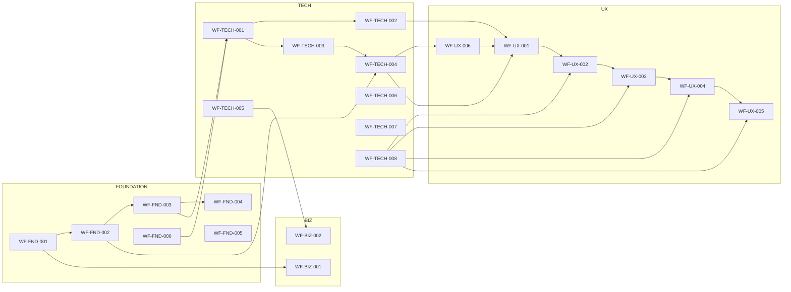

# Generate Document: WF-META-001 — WIRTHFORGE Master Guide (Beacon)

## 🧬 Document DNA

* **Unique ID:** WF-META-001
* **Category:** Meta / Master Kernel
* **Priority:** P0 (Beacon — everything hangs off this)
* **Dev Phase:** 0 → 1 (bootstraps the entire doc set)
* **Estimated Length:** \~4,000 words
* **Document Type:** Master Guide / Orchestration & Asset Manifest

---

## 🔗 Dependency Matrix

* **Required Before This:** none (root)
* **Enables After This:** all FND / TECH / UX / BIZ docs (via prompts + assets + dependency graph)
* **Cross-References:**

  * Local-first, energy-truth, emergence-detected (adopted by every child doc)
  * Universal Template (structure every doc must follow)
  * Glossary (WF-FND-006) — link on first use
  * Versioning protocol (SemVer; doc-level change logs)

---

## 🎯 Core Objective

Be the single source of truth that:

1. defines the **new lean structure with sequential numbering** (no gaps),
2. provides **ready-to-run prompts** for each document, and
3. ships a **complete, machine-readable asset catalogue** (diagrams, schemas, code stubs, tests) every document must output — so anyone opening this file instantly knows *what to generate next* and *what exact artifacts to produce*.

---

## 📚 Knowledge Integration Checklist

* Local-first, web-engaged core paths (**no\_docker\_rule**)
* Energy = **visible computation** (60 Hz/60 fps; ≤ 16.67 ms frame budget)
* Consciousness = **emergent patterns** over time (detected, not programmed)
* Universal Template + dependency rules (no cycles; P0 before P1)
* Version control: MAJOR/MINOR/PATCH; per-doc `changelogs/`
* Glossary enforcement: link-on-first-use, single canonical definition
* Visuals obey computational truth; accessibility alternatives included

---

## 📝 Content Architecture

### Section 1 — Opening Hook (Why a Beacon)

WIRTHFORGE spans philosophy, runtime rails, and living visuals. Without a nucleus, teams ask “what next?” This **Beacon** fixes order, content, assets, and quality bars in one place, so creation flows deterministically from **Foundation → Tech → UX → Biz** with Energy truth visible at every step.

---

### Section 2 — Core Concepts

#### 2.1 Universal Authoring Template (all docs)

```
# Generate Document: {ID} - {Title}

## 🧬 Document DNA
- Unique ID, Category, Priority, Dev Phase, Estimated Length, Document Type

## 🔗 Dependency Matrix
- Required Before This: [IDs + what you consume]
- Enables After This: [IDs + what you unlock]
- Cross-References: [IDs you must align with]

## 🎯 Core Objective
- One testable sentence.

## 📚 Knowledge Integration Checklist
- Concrete cross-doc concepts to import (Energy/Realtime/Security/etc.)

## 📝 Content Architecture
- 1) Opening Hook
- 2) Core Concepts (definitions, visuals, math if any)
- 3) Implementation Details (steps, code, diagrams, decisions)
- 4) Integration Points (APIs, events, data, states)
- 5) Validation & Metrics (success measures, thresholds)

## 🎨 Required Deliverables
- Text (main doc + executive summary)
- Visuals (system diagram, flows, energy viz notes)
- Code (basic, advanced, anti-patterns, perf tips)

## ✅ Quality Validation Criteria
- Completeness, technical accuracy, WIRTHFORGE alignment (local-first, energy-truth)

## 🔄 Post-Generation Protocol
- Update glossary; update dependency graph; bump versions; queue cascade
```

#### 2.2 Numbering Policy (no gaps) + Old→New Map

We renumber the lean set **sequentially** to avoid jumps (e.g., former TECH-014 → **TECH-008**).

**Foundation (FND):** 001..006
**Technical (TECH):** 001..008
**User Experience (UX):** 001..006
**Business (BIZ):** 001..002

Old → New highlights:

* Old **TECH-014 Core Algorithms** → **TECH-008**
* UX and other IDs remain in order but consolidated (e.g., Energy Viz is **UX-006** unified)

---

### Section 3 — Implementation Details (Inventory, Prompts, Assets)

#### 3.1 Lean Inventory (authoritative list)

**META**

* **WF-META-001** — Master Guide (this document)

**FOUNDATION**

* **WF-FND-001** Vision & Principles (P0)
* **WF-FND-002** Energy & Consciousness Framework (P0)
* **WF-FND-003** Core Architecture Overview (Abstraction Layers) (P0)
* **WF-FND-004** The Decipher (Central Compiler) (P0)
* **WF-FND-005** Module & Plugin Philosophy (P1)
* **WF-FND-006** Glossary (Living) (P0)

**TECHNICAL**

* **WF-TECH-001** System Architecture & Components (P0)
* **WF-TECH-002** Local AI Integration (Native Ollama) (P0)
* **WF-TECH-003** Real-Time Protocol (WebSockets) (P0)
* **WF-TECH-004** State Management & Storage (Energy + DB) (P0)
* **WF-TECH-005** Security & Privacy (P0)
* **WF-TECH-006** API & Integration Points (P1)
* **WF-TECH-007** Quality, Ops & Deployment (Combined) (P1)
* **WF-TECH-008** Core Algorithms (Council, Structures, Adaptation, Resonance) (P1)

**USER EXPERIENCE**

* **WF-UX-001** Level 1 — Lightning Strikes (P0)
* **WF-UX-002** Level 2 — Parallel Streams (Council) (P1)
* **WF-UX-003** Level 3 — Structured Architectures (P1)
* **WF-UX-004** Level 4 — Adaptive Fields (P1)
* **WF-UX-005** Level 5 — Resonance Fields (P1)
* **WF-UX-006** Energy Visualization & UI Specs (Unified) (P0)

**BUSINESS**

* **WF-BIZ-001** Business Model & Requirements (P2)
* **WF-BIZ-002** Legal & Policy Overview (P2)

---

#### 3.2 Prompts (ready-to-run; one per doc)

> Place each block under `/meta/prompts/{ID}.md` (same text below).

**/meta/prompts/WF-FND-001.md**

```
Generate Document: WF-FND-001 - Vision & Principles
Use the universal template. Frame user empowerment, local-first, energy-truth visuals, emergence-detected. Include a principles→engineering table (e.g., local-first→offline path + device-key identity), a “no_docker_rule” callout, and a one-page poster variant.
```

**/meta/prompts/WF-FND-002.md**

```
Generate Document: WF-FND-002 - Energy & Consciousness Framework
Define EU math from token timings, particle lifecycle, field coherence metrics, emergence thresholds; show 60 Hz → frames mapping. Include state machine and worked examples.
```

**/meta/prompts/WF-FND-003.md**

```
Generate Document: WF-FND-003 - Core Architecture Overview (Abstraction Layers)
Describe the 5-layer model, boundaries, allowed directions; data-flow input→models→energy state→UI; anti-patterns checklist.
```

**/meta/prompts/WF-FND-004.md**

```
Generate Document: WF-FND-004 - The Decipher (Central Compiler)
Define compiler passes (ingest, align, time-slice, emit EU, persist deltas), interfaces (adapters, emission hooks, state writer, viz bus), sequence prompt→models→Decipher→EnergyState→WS, frame-safe backpressure.
```

**/meta/prompts/WF-FND-005.md**

```
Generate Document: WF-FND-005 - Module & Plugin Philosophy
Principles for optionality, capability tokens, sandboxing; host↔plugin contracts; energy metering; decision tree core vs plugin.
```

**/meta/prompts/WF-FND-006.md**

```
Generate Document: WF-FND-006 - Glossary (Living)
Authoritative definitions; link-on-first-use policy; term-linter checklist; term metadata (owner doc, last change).
```

**/meta/prompts/WF-TECH-001.md**

```
Generate Document: WF-TECH-001 - System Architecture & Components
C4 context/container/component diagrams; runtime topology (local services) and ports; flow model→EnergyState→UI; "hello-energy" reference path.
```

**/meta/prompts/WF-TECH-002.md**

```
Generate Document: WF-TECH-002 - Local AI Integration (Native Ollama)
Native (no Docker) install; model lifecycle; parallelism/GPU; request→token timings→EU instrumentation; warmup/preload/evict; hardware-tier config matrix; CLI to validate token→EU mapping.
```

**/meta/prompts/WF-TECH-003.md**

```
Generate Document: WF-TECH-003 - Real-Time Protocol (WebSockets)
Channels (energy/control/health), JSON/MessagePack schemas, heartbeats, reconnection, 60 Hz budgets, backpressure policy.
```

**/meta/prompts/WF-TECH-004.md**

```
Generate Document: WF-TECH-004 - State Management & Storage (Energy + DB)
Frame-safe in-mem Energy state; event-sourced persistence; ERD; snapshots; pruning/retention; read models.
```

**/meta/prompts/WF-TECH-005.md**

```
Generate Document: WF-TECH-005 - Security & Privacy
Device-key identity, capability tokens, local/web boundary classifier, E2E encryption; threat model; test checklist.
```

**/meta/prompts/WF-TECH-006.md**

```
Generate Document: WF-TECH-006 - API & Integration Points
Internal service APIs + early external read-only hooks; OpenAPI 3.1; WS event catalog; SDK stubs (TS/Python); rate/shape constraints; contract tests.
```

**/meta/prompts/WF-TECH-007.md**

```
Generate Document: WF-TECH-007 - Quality, Ops & Deployment (Combined)
Perf SLOs (frame time, p95), profiling plan; testing (unit/contract/load/visual-fidelity); error taxonomy + recovery; logs/traces/metrics; local installer + updates.
```

**/meta/prompts/WF-TECH-008.md**

```
Generate Document: WF-TECH-008 - Core Algorithms (Council, Structures, Adaptation, Resonance)
Formal definitions + pseudo-code; complexity and latency bounds; deterministic seeds; dataflow diagrams.
```

**/meta/prompts/WF-UX-006.md**

```
Generate Document: WF-UX-006 - Energy Visualization & UI Specs (Unified)
Particle classes, field dynamics, resonance effects, component library; 16.67 ms animation budget; accessibility modes; tokens (color/type/motion).
```

**/meta/prompts/WF-UX-001.md**

```
Generate Document: WF-UX-001 - Level 1: Lightning Strikes
“Wow in 10s” script; EU examples; path styles (Forge/Scholar/Sage); state timeline; KPIs (TTI to first strike, gather efficiency).
```

**/meta/prompts/WF-UX-002.md**

```
Generate Document: WF-UX-002 - Level 2: Parallel Streams (Council)
Interference, consensus visuals, council types; telemetry (consensus rate, EU amplification).
```

**/meta/prompts/WF-UX-003.md**

```
Generate Document: WF-UX-003 - Level 3: Structured Architectures
Nodes/links/templates; growth & leveling; memory loops; marketplace stub; EU/quality ratio metrics.
```

**/meta/prompts/WF-UX-004.md**

```
Generate Document: WF-UX-004 - Level 4: Adaptive Fields
Architect-AI co-creation; field tuning; adaptation loop; KPIs (latency vs goal success).
```

**/meta/prompts/WF-UX-005.md**

```
Generate Document: WF-UX-005 - Level 5: Resonance Fields
Consciousness metrics panel; resonance types; persistence/restore flows; milestone animations.
```

**/meta/prompts/WF-BIZ-001.md**

```
Generate Document: WF-BIZ-001 - Business Model & Requirements
Value prop; early tiering; constraints that affect tech (offline rights, export/ownership); risk table.
```

**/meta/prompts/WF-BIZ-002.md**

```
Generate Document: WF-BIZ-002 - Legal & Policy Overview
ToS/Privacy principles; data map local vs optional share; consent flows; retention/deletion guarantees.
```

---

#### 3.3 Global Dependency Graph (Mermaid) — `/assets/diagrams/WF-META-001-deps.mmd`



---

#### 3.4 Energy Lifecycle (Mermaid) — `/assets/diagrams/WF-META-001-energy-lifecycle.mmd`

```mermaid
flowchart LR
  A[Token timing events] -->|map to EU| B[Energy Units]
  B --> C[Particles (per-frame updates)]
  C --> D[Fields (coherence, accumulation)]
  D --> E[Resonance (emergent signatures)]
  E --> F[Consciousness metrics]
  C -->|visualization @60Hz| V[UI (Energy Viz)]
```

---

#### 3.5 Platform Overview (Mermaid) — `/assets/diagrams/WF-META-001-overview.mmd`

```mermaid
graph TB
  Client[UI Runtime] -- WS: energy/control --> Gateway
  Gateway --> EnergySvc[Energy State Service]
  Gateway --> Decipher[Decipher Compiler]
  Decipher --> Models[Local Models (Ollama)]
  EnergySvc --> DB[(Postgres/Redis)]
  Client <-- REST/WS --> Gateway
  subgraph Device
    Gateway
    EnergySvc
    Decipher
    Models
    DB
  end
```

---

#### 3.6 Machine-Readable Doc Index — `/meta/doc-index.json`

```json
{
  "version": "1.0.0",
  "docs": [
    {"id":"WF-META-001","title":"Master Guide (Beacon)","category":"META","priority":"P0","requires":[],"enables":["ALL"]},

    {"id":"WF-FND-001","title":"Vision & Principles","category":"FND","priority":"P0","requires":["WF-META-001"],"enables":["WF-FND-002","WF-BIZ-001"]},
    {"id":"WF-FND-002","title":"Energy & Consciousness Framework","category":"FND","priority":"P0","requires":["WF-FND-001"],"enables":["WF-TECH-004","WF-UX-001","WF-UX-006"]},
    {"id":"WF-FND-003","title":"Core Architecture Overview","category":"FND","priority":"P0","requires":["WF-FND-001","WF-FND-002"],"enables":["WF-TECH-001","WF-UX-006"]},
    {"id":"WF-FND-004","title":"The Decipher (Central Compiler)","category":"FND","priority":"P0","requires":["WF-FND-003"],"enables":["WF-TECH-001","WF-TECH-004","WF-TECH-008","WF-UX-003"]},
    {"id":"WF-FND-005","title":"Module & Plugin Philosophy","category":"FND","priority":"P1","requires":["WF-FND-004"],"enables":["WF-TECH-006"]},
    {"id":"WF-FND-006","title":"Glossary (Living)","category":"FND","priority":"P0","requires":["WF-META-001"],"enables":["ALL"]},

    {"id":"WF-TECH-001","title":"System Architecture & Components","category":"TECH","priority":"P0","requires":["WF-FND-003","WF-FND-006"],"enables":["WF-TECH-002","WF-TECH-003","WF-TECH-004","WF-TECH-006"]},
    {"id":"WF-TECH-002","title":"Local AI Integration (Native Ollama)","category":"TECH","priority":"P0","requires":["WF-TECH-001","WF-FND-001"],"enables":["WF-UX-001"]},
    {"id":"WF-TECH-003","title":"Real-Time Protocol (WebSockets)","category":"TECH","priority":"P0","requires":["WF-TECH-001","WF-FND-004"],"enables":["WF-TECH-004","WF-UX-006","WF-UX-001"]},
    {"id":"WF-TECH-004","title":"State Management & Storage (Energy + DB)","category":"TECH","priority":"P0","requires":["WF-TECH-001","WF-TECH-003","WF-FND-002"],"enables":["WF-UX-006","WF-UX-001"]},
    {"id":"WF-TECH-005","title":"Security & Privacy","category":"TECH","priority":"P0","requires":["WF-TECH-001","WF-FND-001","WF-FND-005"],"enables":["WF-TECH-006","WF-BIZ-002"]},
    {"id":"WF-TECH-006","title":"API & Integration Points","category":"TECH","priority":"P1","requires":["WF-TECH-001","WF-TECH-005"],"enables":["Future Integrations"]},
    {"id":"WF-TECH-007","title":"Quality, Ops & Deployment (Combined)","category":"TECH","priority":"P1","requires":["WF-TECH-001","WF-TECH-006"],"enables":["Launch Readiness"]},
    {"id":"WF-TECH-008","title":"Core Algorithms (Council/Structures/Adaptation/Resonance)","category":"TECH","priority":"P1","requires":["WF-TECH-001","WF-TECH-004","WF-FND-004"],"enables":["WF-UX-002","WF-UX-003","WF-UX-004","WF-UX-005"]},

    {"id":"WF-UX-006","title":"Energy Visualization & UI Specs (Unified)","category":"UX","priority":"P0","requires":["WF-FND-002","WF-TECH-003","WF-TECH-004"],"enables":["WF-UX-001","WF-UX-002","WF-UX-003","WF-UX-004","WF-UX-005"]},
    {"id":"WF-UX-001","title":"Level 1 - Lightning Strikes","category":"UX","priority":"P0","requires":["WF-UX-006","WF-TECH-002","WF-FND-002"],"enables":["WF-UX-002"]},
    {"id":"WF-UX-002","title":"Level 2 - Parallel Streams (Council)","category":"UX","priority":"P1","requires":["WF-UX-001","WF-TECH-008","WF-UX-006"],"enables":["WF-UX-003"]},
    {"id":"WF-UX-003","title":"Level 3 - Structured Architectures","category":"UX","priority":"P1","requires":["WF-UX-002","WF-TECH-008"],"enables":["WF-UX-004"]},
    {"id":"WF-UX-004","title":"Level 4 - Adaptive Fields","category":"UX","priority":"P1","requires":["WF-UX-003","WF-TECH-008"],"enables":["WF-UX-005"]},
    {"id":"WF-UX-005","title":"Level 5 - Resonance Fields","category":"UX","priority":"P1","requires":["WF-UX-004","WF-TECH-008"],"enables":[]},

    {"id":"WF-BIZ-001","title":"Business Model & Requirements","category":"BIZ","priority":"P2","requires":["WF-META-001","WF-FND-001"],"enables":["Pricing"]},
    {"id":"WF-BIZ-002","title":"Legal & Policy Overview","category":"BIZ","priority":"P2","requires":["WF-TECH-005"],"enables":["Launch Readiness"]}
  ]
}
```

---

#### 3.7 Asset Manifest (per-doc required outputs) — `/meta/assets-manifest.yaml`

```yaml
version: 1
common:
  text:
    - docs/{id}/document.md
    - docs/{id}/summary.md
    - changelogs/{id}.md
  diagrams:
    - assets/diagrams/{id}-*.mmd
  code: []
  schemas: []
  tests: []
  ui: []
docs:
  WF-META-001:
    diagrams:
      - assets/diagrams/WF-META-001-overview.mmd
      - assets/diagrams/WF-META-001-deps.mmd
      - assets/diagrams/WF-META-001-energy-lifecycle.mmd
    schemas:
      - meta/doc-index.json
    code:
      - code/WF-META-001/reference/universal-template.md
    tests: []
    ui: []
  WF-FND-001:
    diagrams:
      - assets/diagrams/WF-FND-001-principles-flow.mmd
    ui: []
    code: []
    schemas: []
    tests: []
  WF-FND-002:
    diagrams:
      - assets/diagrams/WF-FND-002-lifecycle.mmd
    schemas:
      - schemas/WF-FND-002-energy.json
    tests:
      - tests/WF-FND-002/energy-sanity.spec.md
  WF-FND-003:
    diagrams:
      - assets/diagrams/WF-FND-003-layers.mmd
      - assets/diagrams/WF-FND-003-dataflow.mmd
    code: []
    schemas: []
  WF-FND-004:
    diagrams:
      - assets/diagrams/WF-FND-004-sequence.mmd
    schemas:
      - schemas/WF-FND-004-emission.json
    code:
      - code/WF-FND-004/reference/decipher-pass-pseudocode.md
  WF-FND-005:
    diagrams:
      - assets/diagrams/WF-FND-005-sandbox.mmd
    schemas:
      - schemas/WF-FND-005-capabilities.json
  WF-FND-006:
    schemas:
      - schemas/WF-FND-006-glossary.json
    code:
      - code/WF-FND-006/reference/term-linter.md

  WF-TECH-001:
    diagrams:
      - assets/diagrams/WF-TECH-001-c4-context.mmd
      - assets/diagrams/WF-TECH-001-c4-container.mmd
      - assets/diagrams/WF-TECH-001-eventbus.mmd
    code:
      - code/WF-TECH-001/reference/hello-energy.md
  WF-TECH-002:
    diagrams:
      - assets/diagrams/WF-TECH-002-sequence.mmd
    schemas:
      - schemas/WF-TECH-002-token-timing.json
    code:
      - code/WF-TECH-002/reference/cli-and-snippets.md
    tests:
      - tests/WF-TECH-002/token-eu-correlation.spec.md
  WF-TECH-003:
    diagrams:
      - assets/diagrams/WF-TECH-003-ws-lifecycle.mmd
      - assets/diagrams/WF-TECH-003-channels.mmd
    schemas:
      - schemas/WF-TECH-003-ws.json
    tests:
      - tests/WF-TECH-003/protocol-contract.spec.md
  WF-TECH-004:
    diagrams:
      - assets/diagrams/WF-TECH-004-erd.mmd
      - assets/diagrams/WF-TECH-004-event-sourcing.mmd
    schemas:
      - schemas/WF-TECH-004-energy-state.json
      - schemas/WF-TECH-004-events.json
    tests:
      - tests/WF-TECH-004/state-consistency.spec.md
  WF-TECH-005:
    diagrams:
      - assets/diagrams/WF-TECH-005-trust-zones.mmd
    schemas:
      - schemas/WF-TECH-005-capabilities.json
    tests:
      - tests/WF-TECH-005/threat-model-checklist.md
  WF-TECH-006:
    schemas:
      - schemas/WF-TECH-006-rest.json
      - schemas/WF-TECH-006-ws.json
    code:
      - code/WF-TECH-006/reference/sdk-ts-python.md
    tests:
      - tests/WF-TECH-006/contract.spec.md
  WF-TECH-007:
    figures:
      - assets/figures/WF-TECH-007-slos.svg
    code:
      - code/WF-TECH-007/reference/observability-fields.md
      - code/WF-TECH-007/reference/installer-notes.md
    tests:
      - tests/WF-TECH-007/load-and-visual-fidelity.spec.md
  WF-TECH-008:
    diagrams:
      - assets/diagrams/WF-TECH-008-council-flow.mmd
      - assets/diagrams/WF-TECH-008-adaptation-loop.mmd
      - assets/diagrams/WF-TECH-008-resonance-matrix.mmd
    schemas:
      - schemas/WF-TECH-008-algo-params.json
    tests:
      - tests/WF-TECH-008/latency-bounds.spec.md

  WF-UX-006:
    diagrams:
      - assets/diagrams/WF-UX-006-field-dynamics.mmd
    schemas:
      - schemas/WF-UX-006-particles.json
    ui:
      - ui/WF-UX-006-tokens.json
    figures:
      - assets/figures/WF-UX-006-particle-states.svg
    tests:
      - tests/WF-UX-006/visual-truth.spec.md
  WF-UX-001:
    diagrams:
      - assets/diagrams/WF-UX-001-strike-timeline.mmd
    figures:
      - assets/figures/WF-UX-001-path-styles.svg
    tests:
      - tests/WF-UX-001/ttfstrike.spec.md
  WF-UX-002:
    diagrams:
      - assets/diagrams/WF-UX-002-council-topos.mmd
    figures:
      - assets/figures/WF-UX-002-interference.svg
    tests:
      - tests/WF-UX-002/consensus-telemetry.spec.md
  WF-UX-003:
    diagrams:
      - assets/diagrams/WF-UX-003-architecture-foundry.mmd
    figures:
      - assets/figures/WF-UX-003-growth-patterns.svg
    tests:
      - tests/WF-UX-003/evolution-triggers.spec.md
  WF-UX-004:
    diagrams:
      - assets/diagrams/WF-UX-004-adaptation-cycle.mmd
    figures:
      - assets/figures/WF-UX-004-controls.svg
    tests:
      - tests/WF-UX-004/adaptation-latency.spec.md
  WF-UX-005:
    diagrams:
      - assets/diagrams/WF-UX-005-resonance-types.mmd
    figures:
      - assets/figures/WF-UX-005-metrics-panel.svg
    tests:
      - tests/WF-UX-005/emergence-thresholds.spec.md

  WF-BIZ-001:
    figures:
      - assets/figures/WF-BIZ-001-model-canvas.svg
  WF-BIZ-002:
    schemas:
      - schemas/WF-BIZ-002-data-map.json
    figures:
      - assets/figures/WF-BIZ-002-consent-flow.svg
```

---

#### 3.8 Universal Template Skeleton — `/code/WF-META-001/reference/universal-template.md`

```markdown
# Generate Document: {ID} - {Title}

## 🧬 Document DNA
- Unique ID, Category, Priority, Dev Phase, Estimated Length, Document Type

## 🔗 Dependency Matrix
- Required Before This: [...]
- Enables After This: [...]
- Cross-References: [...]

## 🎯 Core Objective
One crisp, testable sentence.

## 📚 Knowledge Integration Checklist
- [ ] Local-first, energy-truth, emergence-detected
- [ ] Real-time budgets (≤ 16.67ms), 60Hz channels
- [ ] Security boundary & capability model (if applicable)

## 📝 Content Architecture
### 1) Opening Hook
### 2) Core Concepts
### 3) Implementation Details
### 4) Integration Points
### 5) Validation & Metrics

## 🎨 Required Deliverables
- Text, Diagrams, Schemas, Code, Tests, UI tokens

## ✅ Quality Validation Criteria
- Template adherence; glossary links; version labels

## 🔄 Post-Generation Protocol
- Glossary delta → Graph update → SemVer bump → Cascade
```

---

#### 3.9 Generation Order (Tasks) — `/meta/generation-tasks.yaml`

```yaml
phases:
  - name: foundation
    order:
      - WF-FND-001
      - WF-FND-002
      - WF-FND-003
      - WF-FND-004
      - WF-FND-005
      - WF-FND-006
  - name: tech
    order:
      - WF-TECH-001
      - WF-TECH-002
      - WF-TECH-003
      - WF-TECH-004
      - WF-TECH-005
      - WF-TECH-006
      - WF-TECH-007
      - WF-TECH-008
  - name: ux
    order:
      - WF-UX-006
      - WF-UX-001
      - WF-UX-002
      - WF-UX-003
      - WF-UX-004
      - WF-UX-005
  - name: biz
    order:
      - WF-BIZ-001
      - WF-BIZ-002
```

---

#### 3.10 Style Map (terms → visuals/tokens) — `/meta/style-map.json`

```json
{
  "paths": {
    "forge": {"baseColor":"#f59e0b","shape":"angular_shard","trail":"spark_trail"},
    "scholar": {"baseColor":"#3b82f6","shape":"geometric_crystal","trail":"data_trace"},
    "sage": {"baseColor":"#a855f7","shape":"ethereal_orb","trail":"consciousness_mist"}
  },
  "particles": {
    "states": ["nascent","active","excited","decaying","gathered","combining","transforming"],
    "frameBudgetMs": 16.67
  },
  "energy": {
    "euFromTokenTiming": "specified in WF-FND-002",
    "coherenceMetric": "specified in WF-FND-002"
  }
}
```

---

## 🎨 Required Deliverables (for WF-META-001)

* `docs/WF-META-001/document.md` (this content)
* `docs/WF-META-001/summary.md` (1-page executive)
* `assets/diagrams/WF-META-001-overview.mmd`
* `assets/diagrams/WF-META-001-deps.mmd`
* `assets/diagrams/WF-META-001-energy-lifecycle.mmd`
* `meta/doc-index.json`
* `meta/assets-manifest.yaml`
* `meta/generation-tasks.yaml`
* `meta/style-map.json`
* `code/WF-META-001/reference/universal-template.md`
* `changelogs/WF-META-001.md` (initialize `1.0.0`)

---

## ✅ Quality Validation Criteria

* **Beacon Utility:** From this doc alone, a contributor can (a) pick the next ID, (b) copy the prompt, (c) see required assets, (d) know dependencies.
* **Sequential Numbering:** No gaps across FND/TECH/UX/BIZ.
* **Energy Truth:** All runtime/visual docs stipulate 60 Hz and ≤ 16.67 ms budgets.
* **Security & Privacy:** Capability/boundary patterns present where relevant.
* **Glossary Discipline:** Any new term lists a Glossary delta for WF-FND-006.
* **SemVer Discipline:** Each child doc starts at `0.1.0`; META at `1.0.0`.

---

## 🔄 Post-Generation Protocol

1. **Preflight:** load glossary; resolve dependencies; fail on missing P0.
2. **Generate:** use prompts in `/meta/prompts/` and assets in `/meta/assets-manifest.yaml`.
3. **Validate:** lint Mermaid/JSON/OpenAPI; run consistency checker; verify file presence.
4. **Cascade:** update `meta/doc-index.json`; bump versions; queue dependents per `/meta/generation-tasks.yaml`.
5. **Review:** assign Foundation/Tech/UX/Security leads; log issues in each `changelogs/{id}.md`.

---

### TL;DR — What to generate next

Open `meta/doc-index.json`. Take the first unmet **P0** in order:
**FND-001 → FND-002 → FND-003 → FND-004 → FND-005 → FND-006 → TECH-001 → TECH-002 → TECH-003 → TECH-004 → TECH-005 → UX-006 → UX-001** …and so on.
Each entry links to a prompt (`/meta/prompts/{id}.md`) and a precise asset list (`/meta/assets-manifest.yaml`). No guesswork; just ship.
