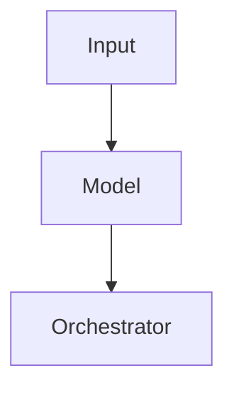
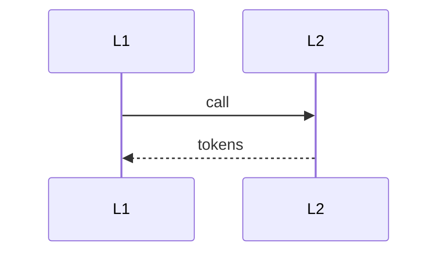

# Mermaid Snippets for WF-FND-003

```mermaid
graph TD
    A[Input] --> B[Model]
    B --> C[Orchestrator]
```

```mermaid
sequenceDiagram
    participant L1
    participant L2
    L1->>L2: call
    L2-->>L1: tokens
```
