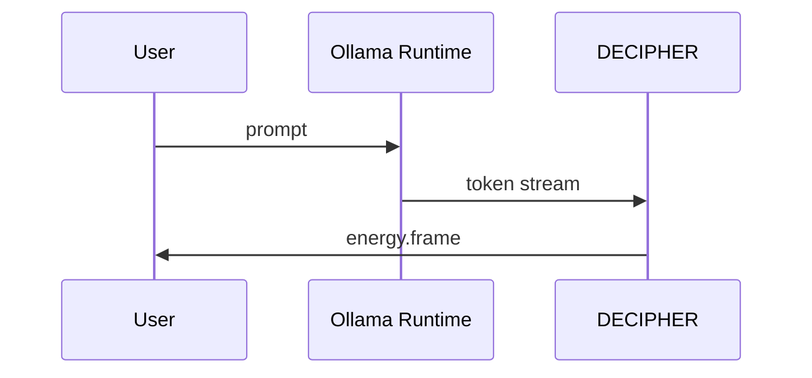

# Generate Document: WF-TECH-002 – Local AI Integration (Native Ollama)

## 🧬 Document DNA
* **Unique ID:** WF-TECH-002
* **Category:** TECH
* **Priority:** P0
* **Dev Phase:** 1
* **Estimated Length:** ~2,000 words
* **Document Type:** Implementation Guide

## 🔗 Dependency Matrix
* **Required Before This:** WF-TECH-001, WF-FND-001
* **Enables After This:** WF-UX-001
* **Cross-References:** WF-FND-002 (energy units)

## 🎯 Core Objective
Integrate Ollama models natively with token→EU mapping and emit 60 Hz frames without Docker.

## 📚 Knowledge Integration Checklist
* Local-first, no-docker policy (WF-FND-001)
* Process seams from WF-TECH-001
* EU mapping and frame budget (WF-FND-002)

## 📝 Content Architecture
### 1) Opening Hook
Offline model pipelines keep first-run experience under ten seconds while respecting user control.

### 2) Core Concepts
Model install, preload cache, execution loop, teardown; EU mapping from token timing.

### 3) Implementation Details
Sequence diagram:

JSON schema for token timing to EU:
```json
{
  "$id": "energy.token_timing",
  "type": "object",
  "properties": {
    "token": {"type": "string"},
    "t_ms": {"type": "number"},
    "eu": {"type": "number"}
  },
  "required": ["token", "t_ms", "eu"]
}
```
Python stub:
```python
import time

def prompt_to_eu(prompt: str) -> list:
    start = time.time()
    tokens = prompt.split()
    out = []
    for t in tokens:
        now = time.time()
        out.append({"token": t, "t_ms": (now-start)*1000, "eu": 1.0})
    return out
```

### 4) Integration Points
Hooks into orchestrator for lifecycle, energy state for frame commit, UX-006 visuals for rendering.

### 5) Validation & Metrics
* Install + preload < 30 s on Tier‑Mid.
* First response < 2 s from prompt.
* EU totals within ±5% of expected energy budget.

## 🎨 Required Deliverables
* Text and summary
* Sequence diagram
* JSON schema `energy.token_timing`
* Python stub `prompt_to_eu`
* CLI snippet reference
* Integration test spec for latency and EU accuracy

## ✅ Quality Validation Criteria
* Runs without network once model downloaded
* Meets 60 Hz frame cadence
* Schema validated against sample traces

## 🔄 Post-Generation Protocol
* Register schema in `schemas/`
* Add stub to `code/`
* Schedule integration tests via generation tasks
