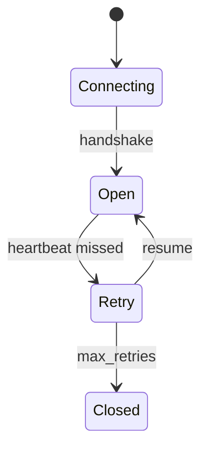

# Generate Document: WF-TECH-003 – Real-Time Protocol (WebSockets)

## 🧬 Document DNA
* **Unique ID:** WF-TECH-003
* **Category:** TECH
* **Priority:** P0
* **Dev Phase:** 1
* **Estimated Length:** ~1,800 words
* **Document Type:** Protocol Specification

## 🔗 Dependency Matrix
* **Required Before This:** WF-TECH-001, WF-FND-004
* **Enables After This:** WF-TECH-004, WF-UX-006, WF-UX-001
* **Cross-References:** WF-FND-005 (council channels)

## 🎯 Core Objective
Define low-latency channels for energy, experience, and council messages with ≤5 ms median overhead.

## 📚 Knowledge Integration Checklist
* DECIPHER output contracts (WF-FND-004)
* Process hooks from WF-TECH-001
* Governance and reconnection rules (WF-FND-006)

## 📝 Content Architecture
### 1) Opening Hook
Without a deterministic protocol, energy frames and experience streams cannot reach the UI in time.

### 2) Core Concepts
Channels: `energy`, `experience`, `council`; message envelopes; heartbeat and jitter control.

### 3) Implementation Details
Protocol lifecycle:

Message schema:
```json
{
  "$id": "wf.protocol.message",
  "type": "object",
  "properties": {
    "channel": {"enum": ["energy", "experience", "council"]},
    "ts": {"type": "number"},
    "payload": {"type": "object"}
  },
  "required": ["channel", "ts", "payload"]
}
```
Contract tests ensure median latency ≤5 ms using loopback harness.

### 4) Integration Points
Boundaries with DECIPHER output, UX renderers, and state persistence; brokered connections remain opt-in.

### 5) Validation & Metrics
* Median overhead ≤5 ms, P99 ≤15 ms.
* Automatic retry completes within 1 s.
* Schema validation passes for all channels.

## 🎨 Required Deliverables
* Protocol lifecycle diagram
* Message schema `wf.protocol.message`
* Contract test verifying ≤5 ms overhead
* Summary text

## ✅ Quality Validation Criteria
* Handles jitter and reconnects without data loss
* Schemas versioned and backward compatible
* Latency budget proven with test harness

## 🔄 Post-Generation Protocol
* Publish schema in `schemas/`
* Add latency test to `tests/`
* Notify UX team of channel names
