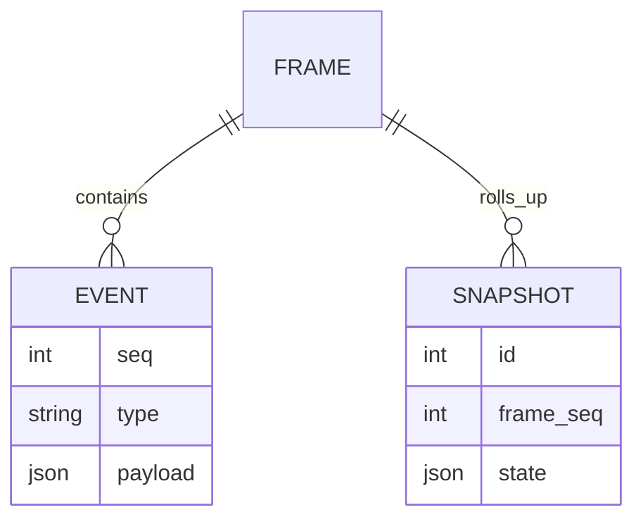

# Generate Document: WF-TECH-004 – State Management & Storage (Energy + DB)

## 🧬 Document DNA
* **Unique ID:** WF-TECH-004
* **Category:** TECH
* **Priority:** P0
* **Dev Phase:** 1
* **Estimated Length:** ~2,200 words
* **Document Type:** Data Specification

## 🔗 Dependency Matrix
* **Required Before This:** WF-TECH-001, WF-TECH-003, WF-FND-002
* **Enables After This:** WF-UX-006, WF-UX-001
* **Cross-References:** WF-OPS-003 (export)

## 🎯 Core Objective
Maintain frame-safe in-memory state with event log and snapshots ensuring energy-truth persistence.

## 📚 Knowledge Integration Checklist
* EU metrics and coherence checks (WF-FND-002)
* Protocol contracts (WF-TECH-003)
* Startup sequence from WF-TECH-001

## 📝 Content Architecture
### 1) Opening Hook
Energy is only truthful if it can be replayed; state management captures every frame for audit and recovery.

### 2) Core Concepts
Event sourcing, snapshotting, integrity hashing, and replay tooling.

### 3) Implementation Details
Entity relationship diagram:

JSON schema for `energy.event`:
```json
{
  "$id": "energy.event",
  "type": "object",
  "properties": {
    "seq": {"type": "integer"},
    "type": {"type": "string"},
    "payload": {"type": "object"}
  },
  "required": ["seq", "type", "payload"]
}
```
Integrity check logic:
```rust
fn verify_frame(seq: u64, events: &[Event]) -> bool {
    events.iter().all(|e| e.seq == seq)
}
```

### 4) Integration Points
Receives protocol messages from WF-TECH-003, exposes snapshot API for OPS-003, feeds UX visuals.

### 5) Validation & Metrics
* 10k events persisted < 50 ms.
* Snapshot creation < 200 ms.
* Replay yields identical EU totals.

## 🎨 Required Deliverables
* ERD diagram
* Schemas `energy.event`, `energy.snapshot`
* Integrity check code snippet
* Replay tool spec

## ✅ Quality Validation Criteria
* No event gaps allowed
* Snapshots deterministic and verified
* Replay matches live session within ±1% energy

## 🔄 Post-Generation Protocol
* Register schemas
* Add replay tests
* Update asset manifest with ERD
