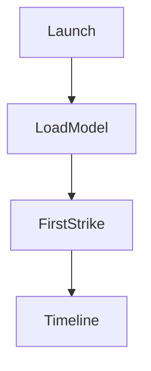

# Generate Document: WF-UX-001 – Level 1: Lightning Strikes

## 🧬 Document DNA
* **Unique ID:** WF-UX-001
* **Category:** UX
* **Priority:** P0
* **Dev Phase:** 1
* **Estimated Length:** ~1,800 words
* **Document Type:** Experience Spec

## 🔗 Dependency Matrix
* **Required Before This:** WF-UX-006, WF-TECH-002, WF-FND-002
* **Enables After This:** WF-UX-002
* **Cross-References:** WF-FND-001 (vision), WF-OPS-001 (release checks)

## 🎯 Core Objective
Deliver a first-run experience with a single energy stream and time-to-first-strike under 10 s.

## 📚 Knowledge Integration Checklist
* Energy mapping rules (WF-FND-002)
* Local model feed (WF-TECH-002)
* Visual tokens (WF-UX-006)
* Onboarding hooks for Doors

## 📝 Content Architecture
### 1) Opening Hook
Users launch WirthForge and witness their first lightning strike before they can blink—setting the bar for trust.

### 2) Core Concepts
First-run flow, strike timeline, minimal controls, TTFS KPI.

### 3) Implementation Details
User flow diagram:

Strike timeline:

```mermaid
gantt
    dateFormat  X
    section Strike
    Boot :0,2
    Prompt :2,4
    Render :4,10
```

Mock frame snippet:
```json
{
  "frame": 1,
  "particles": ["spark", "spark"],
  "eu": 2.0
}
```
TTFS KPI spec: measure time from launch to first `energy.frame` render; must be <10 s.
A11y notes: high-contrast palette and reduced motion option toggled via system setting.

### 4) Integration Points
Pulls frames from TECH-002, visuals from UX-006, exposes door selection events to UX-008.

### 5) Validation & Metrics
* TTFS <10 s on Tier‑Mid.
* UI thread remains at 60 fps.
* Door event logged on completion.

## 🎨 Required Deliverables
* User flow diagram
* Strike timeline diagram
* Mock frames
* TTFS KPI spec
* Accessibility notes

## ✅ Quality Validation Criteria
* First strike reproducible with sample prompt
* KPI instrumentation tested
* A11y modes verified

## 🔄 Post-Generation Protocol
* Hand off door events to onboarding spec (UX-008)
* Add TTFS test to harness
* Update glossary with new UI terms
