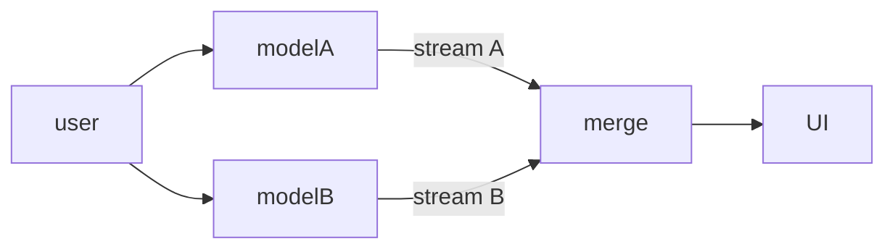

# WF-UX-002: Level 2 – Parallel Streams

## Document Metadata
- **Document ID**: WF-UX-002
- **Title**: Level 2 – Parallel Streams
- **Version**: 1.0.0
- **Date**: 2025-01-12
- **Status**: Draft
- **Dependencies**: WF-UX-001, WF-UX-006, WF-TECH-003
- **Enables**: WF-UX-003

## Executive Summary
Level 2 introduces council mode where multiple local models emit energy in parallel. The user witnesses several synchronized streams and can compare responses, establishing trust through consensus and divergence visualization.

## Core Concepts
- **Council of Models**: Two or more models answering simultaneously.
- **Stream Labels**: Each stream tagged with colour and identity.
- **Interference View**: Visual overlay highlighting agreement or conflict between streams.

## Implementation Details
Council topology:

Interference overlay is rendered by comparing token parity across streams and colouring nodes when divergence exceeds a threshold.

## Integration Points
- **WF-TECH-003 – Real-Time Protocol** for multiplexed websocket channels.
- **WF-TECH-004 – State Management** to log per-stream outputs.
- **WF-UX-006 – Visualization Spec** for particle colours and overlays.

## Validation & Metrics
- **Consensus Ratio**: Percentage of matching tokens between streams.
- **Stream Latency Spread**: Max difference in response times.
- **User Control**: Ability to mute or pin streams within 1 click.

## 🎨 Required Deliverables
- [x] Core document (this file)
- [x] Summary – `docs/WF-UX-002/summary.md`
- [x] Council topology diagram – `assets/diagrams/WF-UX-002-council-topology.mmd`
- [x] Interference figure – `assets/figures/WF-UX-002-interference.svg`
- [x] Telemetry test – `tests/WF-UX-002/consensus-telemetry.spec.js`
- [x] Version control changelog

## ✅ Quality Criteria
- Streams render within 50 ms of each other.
- Consensus ratio computed deterministically.
- UI clearly indicates which model produced each token.
- All assets conform to naming and numbering policy.
