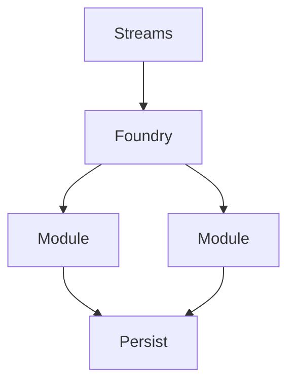

# WF-UX-003: Level 3 – Structured Architectures

## Document Metadata
- **Document ID**: WF-UX-003
- **Title**: Level 3 – Structured Architectures
- **Version**: 1.0.0
- **Date**: 2025-01-12
- **Status**: Draft
- **Dependencies**: WF-UX-002, WF-TECH-004
- **Enables**: WF-UX-004

## Executive Summary
Level 3 empowers users to sculpt persistent structures from energy streams, assembling modules and pathways that reflect long-lived reasoning patterns.

## Core Concepts
- **Architecture Foundry**: Workspace for arranging components.
- **Growth Patterns**: Rules for expanding or pruning structures.
- **Persistence**: Layouts saved and reloadable from state store.

## Implementation Details
Architecture foundry diagram:

Growth patterns are expressed as simple JSON rules applied on each 60 Hz tick.

## Integration Points
- **WF-TECH-004 – State Management** for saving and restoring layouts.
- **WF-UX-007 – Component Library** supplying reusable modules.
- **WF-UX-006 – Visualization** defining visual tokens for modules.

## Validation & Metrics
- **Save/Load Fidelity**: Structures round-trip without loss.
- **Growth Rule Coverage**: All rule types exercised in tests.
- **Render Budget**: Maintaining 60 fps with up to 50 modules.

## 🎨 Required Deliverables
- [x] Core document (this file)
- [x] Summary – `docs/WF-UX-003/summary.md`
- [x] Architecture foundry diagram – `assets/diagrams/WF-UX-003-architecture-foundry.mmd`
- [x] Growth patterns figure – `assets/figures/WF-UX-003-growth-patterns.svg`
- [x] Evolution triggers test – `tests/WF-UX-003/evolution-triggers.spec.js`
- [x] Version control changelog

## ✅ Quality Criteria
- Foundry interactions deterministic across sessions.
- Growth rules validated against schema.
- Diagrams and figures render without external assets.
- Naming conforms to WF-META-001 numbering.
