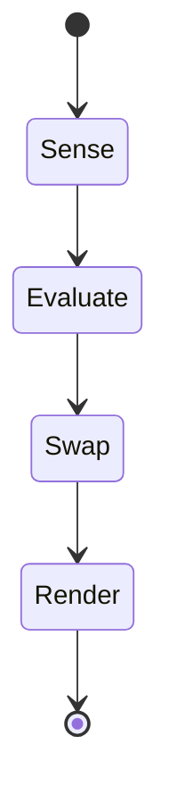

# WF-UX-004: Level 4 – Adaptive Fields

## Document Metadata
- **Document ID**: WF-UX-004
- **Title**: Level 4 – Adaptive Fields
- **Version**: 1.0.0
- **Date**: 2025-01-12
- **Status**: Draft
- **Dependencies**: WF-UX-003, WF-TECH-002
- **Enables**: WF-UX-005

## Executive Summary
Adaptive Fields introduce dynamic model swapping and field modulation based on user intent and energy flow. Layouts bend and adapt, reflecting real-time learning.

## Core Concepts
- **Adaptive Cycle**: Sense, evaluate, swap, render.
- **Control UI**: User lever toggles that influence model selection.
- **Feedback Loop**: Energy metrics driving adaptation decisions.

## Implementation Details
Adaptation cycle diagram:

Control UI exposes sliders for responsiveness and a graph of recent model swaps.

## Integration Points
- **WF-TECH-002 – Local AI Integration** for hot-swapping models.
- **WF-TECH-004 – State Management** to record adaptation history.
- **WF-UX-007 – Component Library** for control UI elements.

## Validation & Metrics
- **Adaptation Latency**: Model swap under 200 ms.
- **User Override**: Manual control takes effect within one frame.
- **History Depth**: Minimum 100 swaps retained for audit.

## 🎨 Required Deliverables
- [x] Core document (this file)
- [x] Summary – `docs/WF-UX-004/summary.md`
- [x] Adaptation cycle diagram – `assets/diagrams/WF-UX-004-adaptation-cycle.mmd`
- [x] Control UI figure – `assets/figures/WF-UX-004-controls.svg`
- [x] Adaptation latency test – `tests/WF-UX-004/adaptation-latency.spec.js`
- [x] Version control changelog

## ✅ Quality Criteria
- Swaps do not drop frames.
- Control UI accessible via keyboard.
- History log verifiable via state replay.
- Assets comply with naming conventions.
