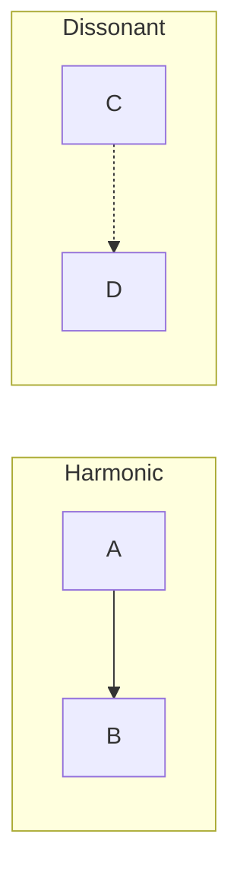

# WF-UX-005: Level 5 – Resonance Fields

## Document Metadata
- **Document ID**: WF-UX-005
- **Title**: Level 5 – Resonance Fields
- **Version**: 1.0.0
- **Date**: 2025-01-12
- **Status**: Draft
- **Dependencies**: WF-UX-004, WF-TECH-003
- **Enables**: WF-UX-007

## Executive Summary
Resonance Fields reveal emergent behaviour from multiple adaptive fields interacting. Users observe harmonics when models align and dissonance when they diverge, guiding refinement of the entire system.

## Core Concepts
- **Resonance Types**: Harmonic, dissonant, chaotic.
- **Metrics Panel**: Displays coherence scores and energy usage.
- **Emergence Thresholds**: Conditions when resonance becomes visible.

## Implementation Details
Resonance types diagram:

Metrics panel renders running averages of coherence and latency across fields.

## Integration Points
- **WF-TECH-003 – Real-Time Protocol** for synchronizing field data.
- **WF-UX-006 – Visualization** to render resonance overlays.
- **WF-TECH-008 – Observability** for long-term metrics.

## Validation & Metrics
- **Emergence Detection**: Harmonics flagged within 3 frames.
- **Coherence Score**: 0–1 scale with ≥0.7 considered stable.
- **Resource Ceiling**: Resonance rendering stays within 20% CPU.

## 🎨 Required Deliverables
- [x] Core document (this file)
- [x] Summary – `docs/WF-UX-005/summary.md`
- [x] Resonance types diagram – `assets/diagrams/WF-UX-005-resonance-types.mmd`
- [x] Metrics panel figure – `assets/figures/WF-UX-005-metrics-panel.svg`
- [x] Emergence thresholds test – `tests/WF-UX-005/emergence-thresholds.spec.js`
- [x] Version control changelog

## ✅ Quality Criteria
- Resonance computation reproducible.
- Metrics panel accessible and refreshes at 60 Hz.
- Diagram and figure load without external resources.
- Naming follows WF-META-001 conventions.
