# Generate Document: WF-UX-006 – Energy Visualization & UI Specs (Unified)

## 🧬 Document DNA
* **Unique ID:** WF-UX-006
* **Category:** UX
* **Priority:** P0
* **Dev Phase:** 1
* **Estimated Length:** ~2,300 words
* **Document Type:** Design Specification

## 🔗 Dependency Matrix
* **Required Before This:** WF-FND-002, WF-TECH-003, WF-TECH-004
* **Enables After This:** WF-UX-001..WF-UX-005, WF-UX-007
* **Cross-References:** WF-FND-001 (vision)

## 🎯 Core Objective
Define particle and field visual language bound to energy frames with accessibility-aware budgets.

## 📚 Knowledge Integration Checklist
* Energy math and metrics from WF-FND-002
* Protocol events from WF-TECH-003
* State schemas from WF-TECH-004
* Accessibility principles (a11y tokens)

## 📝 Content Architecture
### 1) Opening Hook
A unified visual system lets users see computation; without it, energy remains abstract numbers.

### 2) Core Concepts
Particle taxonomy, field gradients, render budgets, and a11y modes (contrast, reduced motion).

### 3) Implementation Details
Token → particle mapping:
```json
{
  "token": "hello",
  "particle": "spark",
  "eu": 1.0
}
```
Design tokens:
```json
{
  "color.energy": "#FFEE00",
  "motion.frame": "16.67ms",
  "font.body": "Inter 14"
}
```
Frame timing diagram:

```mermaid
gantt
dateFormat  X
section Frame
Compile   :0, 5
Render    :5, 16.67
```

Visual-truth test plan verifies that every visual element links to an energy metric.

### 4) Integration Points
Consumes state snapshots, renders protocol frames, supplies component tokens to UX-007 library.

### 5) Validation & Metrics
* Render budget 16.67 ms per frame.
* All visuals have a11y alternatives.
* Token mapping coverage ≥95% of DECIPHER outputs.

## 🎨 Required Deliverables
- [x] Core document (this file)
- [x] Summary – `docs/WF-UX-006/summary.md`
- [x] Token→particle table – `ui/WF-UX-006-token-map.json`
- [x] Design token JSON – `ui/WF-UX-006-design-tokens.json`
- [x] Frame timing diagram – in document
- [x] Visual truth test – `tests/WF-UX-006/visual-truth.spec.js`

## ✅ Quality Validation Criteria
* 1:1 mapping between visuals and energy metrics
* Design tokens validated by linter
* Test plan covers accessibility toggles

## 🔄 Post-Generation Protocol
* Update design tokens in `ui/`
* Sync with component library (UX-007)
* Register test plan in QA harness
