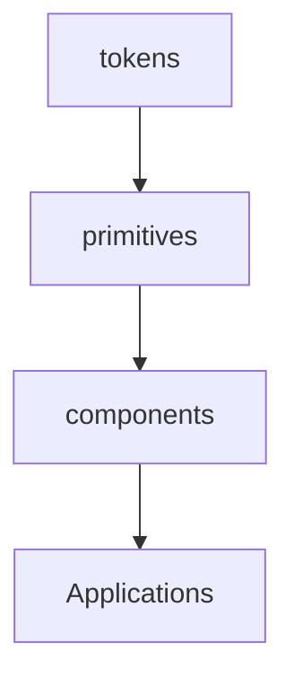

# WF-UX-007: UI Component Library

## Document Metadata
- **Document ID**: WF-UX-007
- **Title**: UI Component Library
- **Version**: 1.0.0
- **Date**: 2025-01-12
- **Status**: Draft
- **Dependencies**: WF-UX-006, WF-UX-001
- **Enables**: WF-UX-008, WF-UX-009, WF-UX-010

## Executive Summary
The component library provides reusable, energy-aware UI elements built to sustain 60 fps and accessibility requirements. Tokens and references ensure visual consistency across levels.

## Core Concepts
- **Energy-bound Widgets**: Components render only within the given energy budget.
- **Design Tokens**: Shared colour, spacing, and motion variables.
- **Dependency Flow**: Components depend on base primitives and can be extended in plugins.

## Implementation Details
Dependency flow diagram:

Example button component:
```javascript
import tokens from '../../ui/WF-UX-007-design-tokens.json';
export function Button(label){
  return `<button style="background:${tokens.primary}" aria-label="${label}">${label}</button>`;
}
```

## Integration Points
- **WF-UX-006 – Visualization** for token definitions.
- **WF-TECH-003 – Protocol** for interactive components listening to events.
- **WF-FND-006 – Glossary** ensuring naming discipline.

## Validation & Metrics
- **60 fps Rendering**: Stress test with 100 buttons.
- **A11y Compliance**: Buttons operable via keyboard and screen reader.
- **Token Integrity**: Design tokens validated by JSON schema.

## 🎨 Required Deliverables
- [x] Core document (this file)
- [x] Summary – `docs/WF-UX-007/summary.md`
- [x] Dependency flow diagram – `assets/diagrams/WF-UX-007-dependency-flow.mmd`
- [x] Design tokens – `ui/WF-UX-007-design-tokens.json`
- [x] Example component code – `code/WF-UX-007/example-button.js`
- [x] A11y 60fps test – `tests/WF-UX-007/a11y-60fps.spec.js`
- [x] Version control changelog

## ✅ Quality Criteria
- Components render with no dropped frames under test.
- Tokens shared across all components without duplication.
- Code examples lint-free and documented.
- File naming aligns with WF-META-001.
