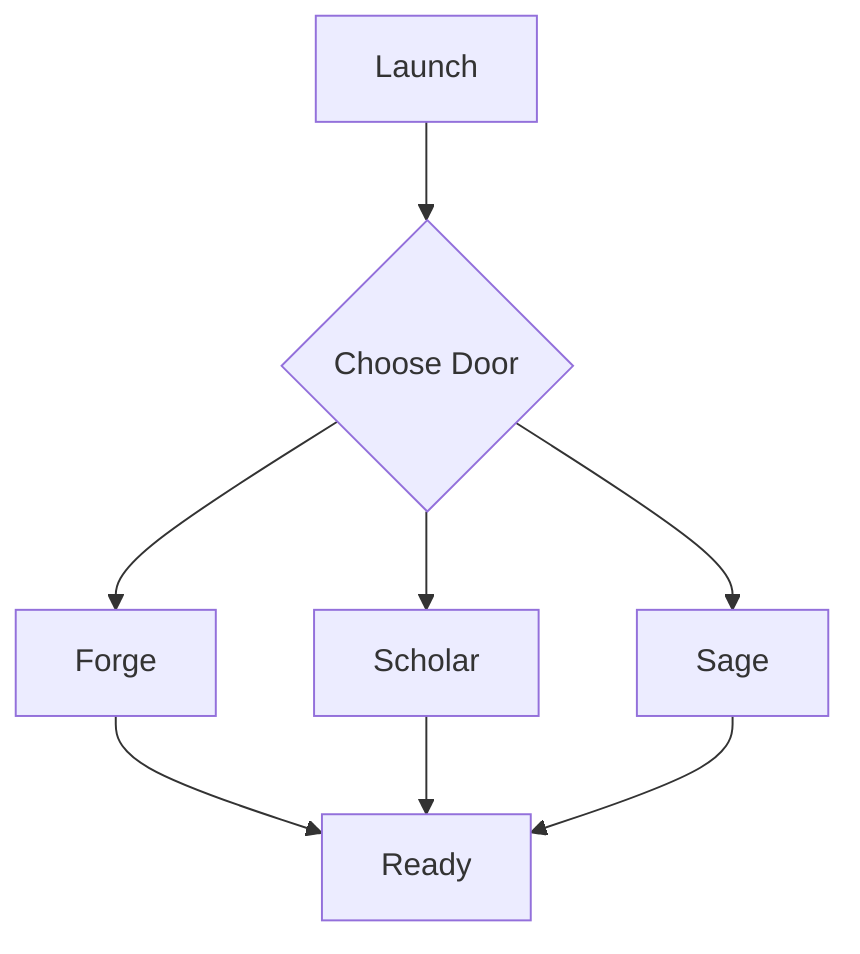

# WF-UX-008: Onboarding & Doors

## Document Metadata
- **Document ID**: WF-UX-008
- **Title**: Onboarding & Doors
- **Version**: 1.0.0
- **Date**: 2025-01-12
- **Status**: Draft
- **Dependencies**: WF-UX-001, WF-UX-007
- **Enables**: WF-UX-002, WF-BIZ-003

## Executive Summary
The onboarding flow guides new users through the Three Doors—Forge, Scholar, and Sage—configuring preferences and establishing trust before Level 1 gameplay begins.

## Core Concepts
- **Door Selection**: Users pick a path aligned with their goals.
- **Event Logging**: Every choice emits structured events for analytics.
- **Progressive Disclosure**: Interface reveals complexity gradually.

## Implementation Details
Onboarding flow diagram:

Events schema:
```json
{
  "event": "door_chosen",
  "door": "forge",
  "timestamp": 0
}
```
Screen illustrations depict each door with iconography matching the energy metaphor.

## Integration Points
- **WF-UX-001 – Level 1** for initial strike experience.
- **WF-BIZ-001 – Business Model** to tailor upsell prompts.
- **WF-FND-006 – Governance** for logging policy compliance.

## Validation & Metrics
- **Completion Rate**: Percentage of users reaching finish screen.
- **Time to Door**: <5 s from launch to door choice.
- **Event Integrity**: All events conform to schema.

## 🎨 Required Deliverables
- [x] Core document (this file)
- [x] Summary – `docs/WF-UX-008/summary.md`
- [x] Onboarding flow diagram – `assets/diagrams/WF-UX-008-onboarding-flow.mmd`
- [x] Door events schema – `schemas/WF-UX-008-events.json`
- [x] Screen illustrations – `assets/figures/WF-UX-008-screens.svg`
- [x] Onboarding flow test – `tests/WF-UX-008/onboarding-flow.spec.js`
- [x] Version control changelog

## ✅ Quality Criteria
- Flow completes within 10 s on mid-tier hardware.
- Schema validated before events stored.
- Illustrations meet accessibility contrast requirements.
- All assets named according to WF-META-001.
