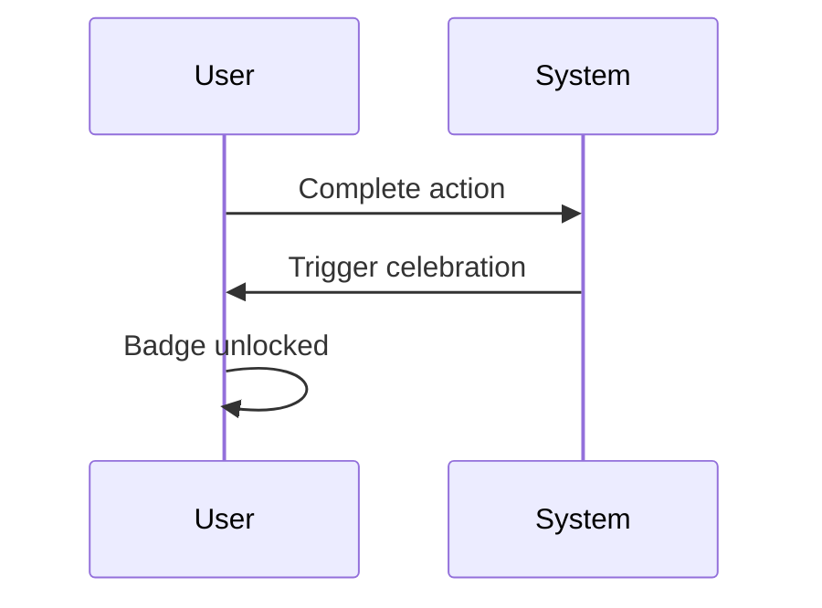

# WF-UX-009: Gamification & Achievements

## Document Metadata
- **Document ID**: WF-UX-009
- **Title**: Gamification & Achievements
- **Version**: 1.0.0
- **Date**: 2025-01-12
- **Status**: Draft
- **Dependencies**: WF-UX-007, WF-UX-008
- **Enables**: WF-UX-010, WF-BIZ-003

## Executive Summary
Gamification layers persistent rewards and badges atop energy interactions, celebrating user progress and encouraging exploration of advanced levels.

## Core Concepts
- **Achievement Schema**: Defines conditions and rewards.
- **Celebration Flow**: Animated sequence reinforcing success.
- **Badge Gallery**: Visual collection of earned milestones.

## Implementation Details
Celebration flow diagram:

Achievements schema outlines id, description, and condition formula.

## Integration Points
- **WF-UX-007 – Component Library** for badge components.
- **WF-BIZ-001 – Business Model** to map achievements to offerings.
- **WF-UX-010 – Accessibility** to ensure celebrations respect user settings.

## Validation & Metrics
- **Trigger Accuracy**: Achievements unlock only once per condition.
- **Celebration Duration**: Animation ≤3 s with skip option.
- **Badge Persistence**: Stored and reloadable across sessions.

## 🎨 Required Deliverables
- [x] Core document (this file)
- [x] Summary – `docs/WF-UX-009/summary.md`
- [x] Celebration flow diagram – `assets/diagrams/WF-UX-009-celebration-flow.mmd`
- [x] Achievements schema – `schemas/WF-UX-009-achievements.json`
- [x] Badges figure – `assets/figures/WF-UX-009-badges.svg`
- [x] Awards system test – `tests/WF-UX-009/awards.spec.js`
- [x] Version control changelog

## ✅ Quality Criteria
- Achievements defined via schema pass validation.
- Celebrations respect reduced-motion settings.
- Badge assets optimized under 5 KB each.
- Naming follows WF-META-001 conventions.
