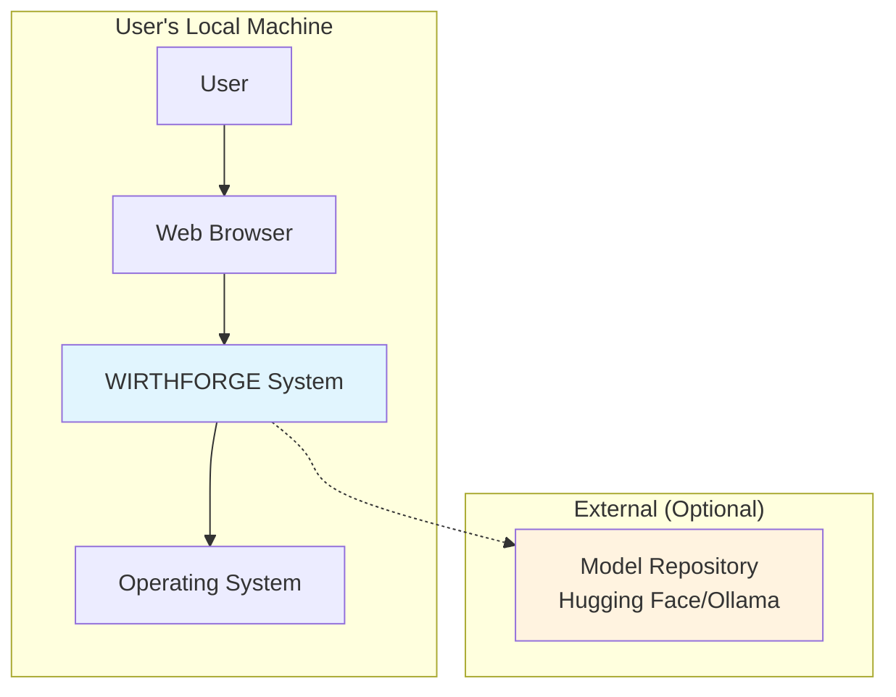
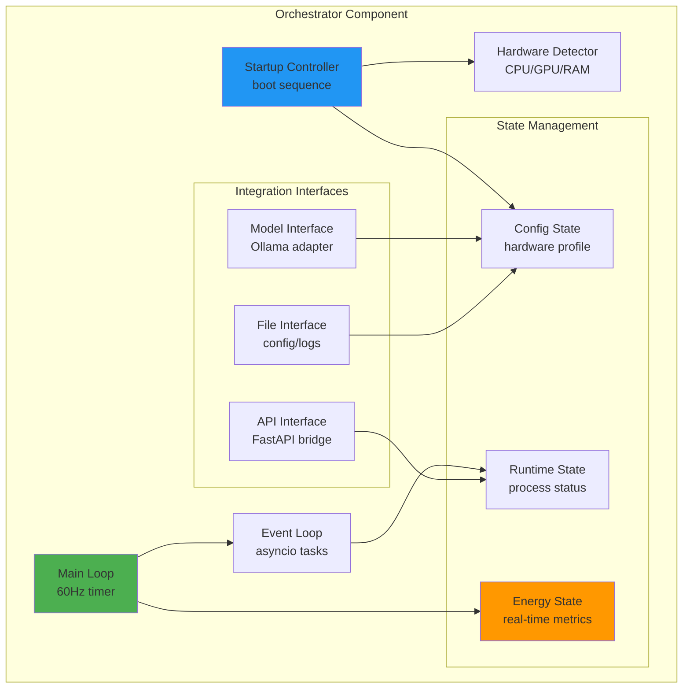

# WF-TECH-001-C4-DIAGRAMS: System Architecture Views

## C4 Context Diagram: System Boundaries

## C4 Container Diagram: Internal Architecture

```mermaid
graph TB
    subgraph "WIRTHFORGE Application"
        subgraph "Core Engine (Python)"
            O[Orchestrator<br/>asyncio main loop]
            ES[Energy State Manager<br/>in-memory + SQLite]
            DC[DECIPHER Compiler<br/>token→energy mapping]
        end
        
        subgraph "Transport Layer"
            API[FastAPI Server<br/>REST + WebSocket]
            WS[WebSocket Handler<br/>real-time streams]
        end
        
        subgraph "External Integrations"
            OL[Ollama Client<br/>HTTP/streaming]
            FS[File System<br/>config/models/logs]
        end
    end
    
    subgraph "External Processes"
        M[Ollama Server<br/>model inference]
        UI[Web Browser<br/>React/TypeScript UI]
    end
    
    O --> ES
    O --> DC
    O --> API
    API --> WS
    O --> OL
    O --> FS
    OL --> M
    WS --> UI
    
    style O fill:#c8e6c9
    style API fill:#e3f2fd
    style M fill:#fff9c4
    style UI fill:#fce4ec
```

## C4 Component Diagram: Orchestrator Internals

## Architecture Notes

- **Context Level**: Shows WIRTHFORGE as a local-first system with optional external model downloads
- **Container Level**: Reveals internal Python components and external Ollama process
- **Component Level**: Details orchestrator internals with clear separation of concerns
- **Web-Engaged**: All user interaction through browser interface
- **Local-Core**: All computation happens on user's device
