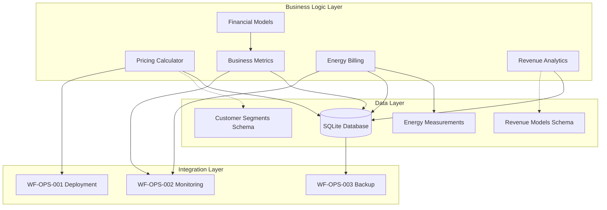

# WF-BIZ-001 Business Model & Value Proposition Integration Guide

## Overview

This integration guide provides comprehensive instructions for implementing and integrating the WF-BIZ-001 Business Model & Value Proposition assets within the WIRTHFORGE ecosystem. All components are designed to align with WIRTHFORGE's core principles of local-first operation, privacy preservation, and energy transparency.

## Asset Architecture

### Component Relationships



## Quick Start Guide

### 1. Environment Setup

```bash
# Verify Python version
python --version  # Should be 3.8+

# Install required dependencies
pip install psutil

# Create directory structure
mkdir -p data/business_metrics
mkdir -p data/energy_billing
mkdir -p data/revenue_analytics
mkdir -p config
```

### 2. Database Initialization

```python
from business_metrics import BusinessMetrics
from energy_billing import EnergyBillingEngine
from revenue_analytics import RevenueAnalytics

# Initialize business metrics database
metrics = BusinessMetrics("data/business_metrics/metrics.db")

# Initialize energy billing database
billing = EnergyBillingEngine("data/energy_billing/billing.db")

# Initialize revenue analytics database
analytics = RevenueAnalytics("data/revenue_analytics/revenue.db")
```

### 3. Basic Usage Example

```python
from pricing_calculator import PricingCalculator, UsageMetrics, TierType

# Initialize pricing calculator
calculator = PricingCalculator()

# Define user usage pattern
usage = UsageMetrics(
    daily_hours=4.0,
    monthly_tokens=8000,
    monthly_storage_gb=10.0,
    concurrent_sessions=3,
    marketplace_purchases=1,
    monthly_energy_kwh=50.0
)

# Get tier recommendation
recommended_tier, costs = calculator.recommend_tier(usage)
monthly_cost = costs[recommended_tier]

print(f"Recommended tier: {recommended_tier}")
print(f"Monthly cost: ${monthly_cost:.2f}")
```

## Component Integration

### Pricing Calculator Integration

The `PricingCalculator` serves as the central component for all pricing-related operations:

```python
# Integration with business metrics
from pricing_calculator import PricingCalculator
from business_metrics import BusinessMetrics, UserEvent

calculator = PricingCalculator()
metrics = BusinessMetrics("data/metrics.db")

# Record pricing events
def handle_tier_recommendation(user_id, usage):
    tier, costs = calculator.recommend_tier(usage)
    
    # Record the recommendation event
    event = UserEvent(
        user_id=user_id,
        event_type="tier_recommendation",
        timestamp=time.time(),
        properties={
            "recommended_tier": tier.value,
            "monthly_cost": costs[tier],
            "usage_pattern": usage.__dict__
        },
        session_id=f"session_{user_id}_{int(time.time())}",
        tier=tier.value
    )
    metrics.record_user_event(event)
    
    return tier, costs
```

### Energy Billing Integration

Energy billing integrates with hardware monitoring and business metrics:

```python
from energy_billing import EnergyBillingEngine
from business_metrics import BusinessMetrics

billing = EnergyBillingEngine("data/billing.db")
metrics = BusinessMetrics("data/metrics.db")

# Real-time energy monitoring integration
def monitor_and_bill_energy(user_id, tier):
    # Measure current energy usage
    measurement = billing.measure_energy_usage(user_id)
    
    # Calculate monthly bill
    bill = billing.calculate_monthly_bill(user_id, tier)
    
    # Record billing metrics
    metrics.record_metric({
        "type": "energy_billing",
        "user_id": user_id,
        "energy_kwh": measurement.total_energy_kwh,
        "bill_amount": bill["total_cost"],
        "transparency_score": bill["transparency_report"]["score"]
    })
    
    return bill
```

### Revenue Analytics Integration

Revenue analytics connects with all revenue-generating components:

```python
from revenue_analytics import RevenueAnalytics, RevenueEvent
from pricing_calculator import PricingCalculator

analytics = RevenueAnalytics("data/revenue.db")
calculator = PricingCalculator()

# Integrated revenue tracking
def process_subscription_payment(user_id, tier, amount):
    # Record revenue event
    event = RevenueEvent(
        user_id=user_id,
        event_type="subscription_payment",
        amount=amount,
        currency="USD",
        timestamp=time.time(),
        metadata={
            "tier": tier.value,
            "billing_cycle": "monthly",
            "payment_method": "local_processing"
        }
    )
    analytics.record_revenue_event(event)
    
    # Update customer LTV
    ltv = analytics.calculate_customer_ltv(user_id)
    
    return {"payment_recorded": True, "customer_ltv": ltv}
```

## Schema Integration

### Customer Segments Schema Usage

```python
import json

# Load customer segments schema
with open("schemas/WF-BIZ/WF-BIZ-001/customer-segments.json", "r") as f:
    customer_schema = json.load(f)

# Validate customer data against schema
def validate_customer_segment(customer_data):
    # Implementation would use jsonschema library
    # This ensures customer data conforms to business model
    pass

# Use schema for customer classification
def classify_customer(usage_metrics, demographics):
    # Logic to classify customer based on schema definitions
    if usage_metrics.daily_hours < 2.0:
        return "privacy_conscious_individual"
    elif usage_metrics.daily_hours < 8.0:
        return "creative_professional"
    else:
        return "power_user_business"
```

### Revenue Models Schema Integration

```python
# Load revenue models schema
with open("schemas/WF-BIZ/WF-BIZ-001/revenue-models.json", "r") as f:
    revenue_schema = json.load(f)

# Configure pricing based on schema
def configure_pricing_from_schema():
    pricing_config = revenue_schema["properties"]["pricing_models"]
    
    # Extract tier configurations
    tiers = pricing_config["properties"]["tiers"]["items"]["properties"]
    
    # Configure calculator with schema-defined tiers
    calculator = PricingCalculator()
    # Implementation would update calculator configuration
    
    return calculator
```

## WF-OPS Integration

### WF-OPS-001 Deployment Integration

```python
# deployment_config.py
BUSINESS_SERVICES = {
    "pricing_calculator": {
        "module": "pricing_calculator",
        "class": "PricingCalculator",
        "config": "config/pricing_config.json"
    },
    "business_metrics": {
        "module": "business_metrics", 
        "class": "BusinessMetrics",
        "database": "data/business_metrics/metrics.db"
    },
    "energy_billing": {
        "module": "energy_billing",
        "class": "EnergyBillingEngine",
        "database": "data/energy_billing/billing.db"
    }
}

def deploy_business_services():
    """Deploy all business model services"""
    for service_name, config in BUSINESS_SERVICES.items():
        # Deployment logic per WF-OPS-001 standards
        deploy_service(service_name, config)
```

### WF-OPS-002 Monitoring Integration

```python
# monitoring_integration.py
from business_metrics import BusinessMetrics

def setup_business_monitoring():
    """Integrate business metrics with WF-OPS-002 monitoring"""
    metrics = BusinessMetrics("data/metrics.db")
    
    # Define business KPIs for monitoring
    business_kpis = [
        "customer_acquisition_rate",
        "monthly_recurring_revenue",
        "customer_lifetime_value",
        "energy_billing_accuracy",
        "pricing_competitiveness"
    ]
    
    # Register KPIs with monitoring system
    for kpi in business_kpis:
        register_kpi_monitor(kpi, metrics.calculate_kpi)
```

### WF-OPS-003 Backup Integration

```python
# backup_integration.py
def backup_business_data():
    """Backup business data per WF-OPS-003 procedures"""
    business_databases = [
        "data/business_metrics/metrics.db",
        "data/energy_billing/billing.db", 
        "data/revenue_analytics/revenue.db"
    ]
    
    for db_path in business_databases:
        # Backup using WF-OPS-003 backup engine
        create_encrypted_backup(db_path, user_consent=True)
```

## Testing Integration

### Running All Test Suites

```bash
# Run business model validation tests
python -m pytest assets/tests/WF-BIZ/WF-BIZ-001/test-business-model-validation.py -v

# Run financial projections tests  
python -m pytest assets/tests/WF-BIZ/WF-BIZ-001/test-financial-projections.py -v

# Run market analysis tests
python -m pytest assets/tests/WF-BIZ/WF-BIZ-001/test-market-analysis.py -v

# Run all tests with coverage
python -m pytest assets/tests/WF-BIZ/WF-BIZ-001/ --cov=assets/code/WF-BIZ/WF-BIZ-001/ --cov-report=html
```

### Continuous Integration

```python
# ci_integration.py
def run_business_validation_suite():
    """Run comprehensive business model validation"""
    test_results = {
        "pricing_validation": run_pricing_tests(),
        "financial_projections": run_financial_tests(),
        "market_analysis": run_market_tests(),
        "integration_tests": run_integration_tests()
    }
    
    # Validate all tests pass
    all_passed = all(result["success"] for result in test_results.values())
    
    if not all_passed:
        raise Exception("Business model validation failed")
    
    return test_results
```

## Configuration Management

### Configuration Files

Create the following configuration files:

**config/pricing_config.json**
```json
{
  "base_energy_rate": 0.12,
  "energy_markup": 0.15,
  "tier_configurations": {
    "free": {"energy_allowance": 5.0, "base_price": 0.0},
    "personal": {"energy_allowance": 25.0, "base_price": 9.99},
    "professional": {"energy_allowance": 100.0, "base_price": 29.99},
    "enterprise": {"energy_allowance": 500.0, "base_price": 99.99}
  }
}
```

**config/business_metrics_config.json**
```json
{
  "collection_interval": 300,
  "retention_period": 2592000,
  "privacy_settings": {
    "anonymize_after_days": 90,
    "require_consent": true,
    "local_storage_only": true
  }
}
```

### Environment Variables

```bash
# .env file
WIRTHFORGE_DATA_DIR=./data
WIRTHFORGE_CONFIG_DIR=./config
WIRTHFORGE_LOG_LEVEL=INFO
WIRTHFORGE_PRIVACY_MODE=STRICT
WIRTHFORGE_ENERGY_MONITORING=ENABLED
```

## API Integration

### REST API Endpoints

```python
# api_integration.py
from flask import Flask, request, jsonify
from pricing_calculator import PricingCalculator, UsageMetrics

app = Flask(__name__)
calculator = PricingCalculator()

@app.route("/api/pricing/recommend", methods=["POST"])
def recommend_pricing():
    """API endpoint for tier recommendations"""
    usage_data = request.json
    usage = UsageMetrics(**usage_data)
    
    tier, costs = calculator.recommend_tier(usage)
    
    return jsonify({
        "recommended_tier": tier.value,
        "monthly_cost": costs[tier],
        "all_tier_costs": {t.value: cost for t, cost in costs.items()}
    })

@app.route("/api/energy/bill", methods=["POST"])
def calculate_energy_bill():
    """API endpoint for energy billing"""
    billing_data = request.json
    user_id = billing_data["user_id"]
    tier = billing_data["tier"]
    
    bill = billing.calculate_monthly_bill(user_id, tier)
    
    return jsonify(bill)
```

## Performance Optimization

### Database Optimization

```python
# performance_optimization.py
def optimize_business_databases():
    """Optimize database performance for business operations"""
    
    # Create indexes for common queries
    business_indexes = [
        "CREATE INDEX IF NOT EXISTS idx_user_events_timestamp ON user_events(timestamp)",
        "CREATE INDEX IF NOT EXISTS idx_revenue_events_user_id ON revenue_events(user_id)",
        "CREATE INDEX IF NOT EXISTS idx_energy_measurements_user_id ON energy_measurements(user_id)"
    ]
    
    # Apply optimizations to all business databases
    for db_path in ["metrics.db", "billing.db", "revenue.db"]:
        apply_database_optimizations(db_path, business_indexes)
```

### Caching Strategy

```python
# caching_strategy.py
from functools import lru_cache

class OptimizedPricingCalculator(PricingCalculator):
    """Optimized pricing calculator with caching"""
    
    @lru_cache(maxsize=1000)
    def calculate_monthly_cost(self, tier, usage_hash):
        """Cached pricing calculation"""
        return super().calculate_monthly_cost(tier, usage_hash)
    
    @lru_cache(maxsize=100)
    def compare_with_competitors(self, usage_hash):
        """Cached competitive analysis"""
        return super().compare_with_competitors(usage_hash)
```

## Security Considerations

### Data Privacy

```python
# privacy_controls.py
def ensure_privacy_compliance():
    """Ensure all business operations comply with privacy requirements"""
    
    privacy_checks = [
        verify_local_storage_only(),
        verify_user_consent_tracking(),
        verify_data_anonymization(),
        verify_no_external_tracking()
    ]
    
    if not all(privacy_checks):
        raise Exception("Privacy compliance validation failed")
```

### Energy Transparency

```python
# transparency_controls.py
def ensure_energy_transparency():
    """Ensure energy billing transparency"""
    
    transparency_requirements = [
        verify_real_time_measurement(),
        verify_component_breakdown(),
        verify_no_hidden_costs(),
        verify_transparent_markup()
    ]
    
    if not all(transparency_requirements):
        raise Exception("Energy transparency validation failed")
```

## Troubleshooting

### Common Issues

1. **Database Connection Errors**
   - Verify SQLite database permissions
   - Check database file paths in configuration
   - Ensure data directories exist

2. **Energy Monitoring Issues**
   - Verify psutil installation
   - Check hardware monitoring permissions
   - Validate energy measurement accuracy

3. **Pricing Calculation Errors**
   - Verify tier configuration files
   - Check usage metrics validation
   - Validate competitive data sources

### Diagnostic Tools

```python
# diagnostics.py
def run_business_diagnostics():
    """Run comprehensive business system diagnostics"""
    
    diagnostics = {
        "database_health": check_database_health(),
        "pricing_accuracy": validate_pricing_calculations(),
        "energy_monitoring": test_energy_measurement(),
        "integration_status": check_ops_integration()
    }
    
    return diagnostics
```

## Maintenance Procedures

### Regular Maintenance Tasks

```python
# maintenance.py
def daily_maintenance():
    """Daily business system maintenance"""
    cleanup_old_metrics()
    validate_energy_measurements()
    update_competitive_data()
    run_health_checks()

def weekly_maintenance():
    """Weekly business system maintenance"""
    run_full_test_suite()
    backup_business_data()
    update_financial_projections()
    review_pricing_competitiveness()

def monthly_maintenance():
    """Monthly business system maintenance"""
    comprehensive_audit()
    update_market_analysis()
    review_customer_segmentation()
    validate_business_model_assumptions()
```

## Support and Documentation

### Additional Resources

- **WF-BIZ-001 Business Model Document**: Core business model documentation
- **WF-META-007 Generation Prompts**: Asset generation specifications
- **Asset Manifest**: Complete asset inventory and metadata
- **Test Suite Documentation**: Comprehensive testing procedures

### Getting Help

For integration support:
1. Review test suite outputs for validation errors
2. Check diagnostic tools for system health
3. Verify configuration files and environment setup
4. Consult WF-OPS integration documentation

---

This integration guide ensures seamless implementation of the WF-BIZ-001 business model assets while maintaining WIRTHFORGE's core principles of privacy, transparency, and local-first operation.
