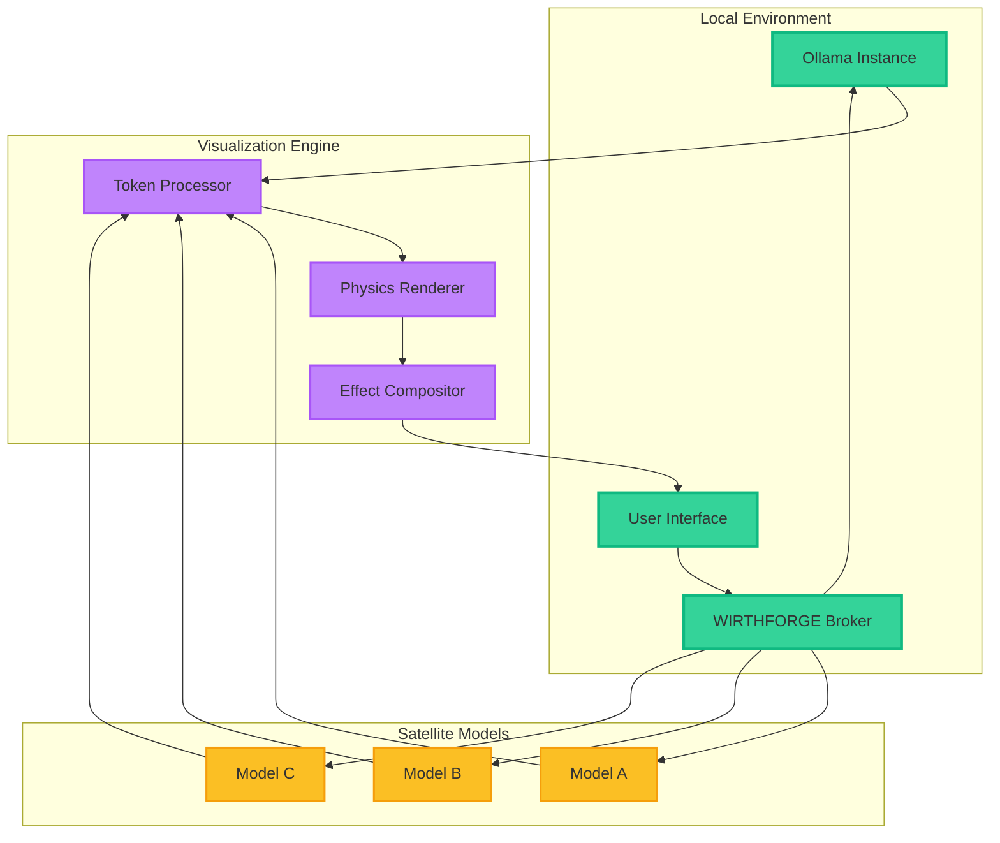
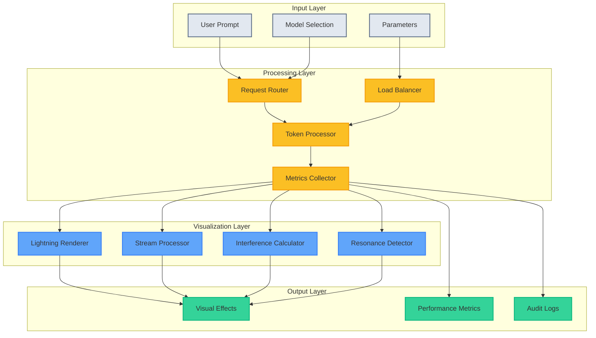

# WF-FND-002 Mermaid Diagram Code Snippets

## Document Information
- **Document**: WF-FND-002 Output Physics & Progressive Levels
- **Version**: 1.0.0
- **Date**: 2025-01-12
- **Purpose**: Reusable Mermaid diagram components for physics visualization

## Usage Guidelines

These code snippets are designed to be:
- **Modular**: Each snippet can be used independently or combined
- **Consistent**: Following WIRTHFORGE visual standards and color schemes
- **Scientific**: Every visual element corresponds to measurable data
- **Accessible**: WCAG 2.2 AA compliant with alternative representations

## 1. Progressive Levels Overview

```mermaid
graph TD
    A[User Entry] --> B{Experience Level}
    
    B -->|Beginner| L1[Level 1: Lightning ⚡]
    B -->|Intermediate| L2[Level 2: Streams 🌊]  
    B -->|Advanced| L3[Level 3: Structure 🏗️]
    B -->|Expert| L4[Level 4: Fields 🌌]
    B -->|Master| L5[Level 5: Resonance 🎵]
    
    L1 --> L1A[Token-by-Token Visualization]
    L2 --> L2A[Parallel Model Streams]
    L3 --> L3A[Pipeline Architecture]
    L4 --> L4A[Adaptive UI Systems]
    L5 --> L5A[Multi-Model Orchestra]
    
    classDef level1 fill:#fbbf24,stroke:#f59e0b,stroke-width:3px,color:#000
    classDef level2 fill:#60a5fa,stroke:#3b82f6,stroke-width:3px,color:#fff
    classDef level3 fill:#c084fc,stroke:#a855f7,stroke-width:3px,color:#fff
    classDef level4 fill:#34d399,stroke:#10b981,stroke-width:3px,color:#000
    classDef level5 fill:#f87171,stroke:#ef4444,stroke-width:3px,color:#fff
    
    class L1,L1A level1
    class L2,L2A level2
    class L3,L3A level3
    class L4,L4A level4
    class L5,L5A level5
```

## 2. Physics Mapping System

```mermaid
graph LR
    subgraph "Computational Events"
        A1[Token Speed]
        A2[TTFT Delay]
        A3[Throughput]
        A4[Uncertainty]
    end
    
    subgraph "Visual Physics"
        V1[⚡ Lightning Thickness]
        V2[🔥 Buildup Effect]
        V3[🌊 Stream Width]
        V4[✨ Particle Density]
    end
    
    subgraph "Measurements"
        M1[ms/token]
        M2[initial latency]
        M3[tokens/second]
        M4[entropy bits]
    end
    
    A1 --> M1 --> V1
    A2 --> M2 --> V2
    A3 --> M3 --> V3
    A4 --> M4 --> V4
    
    classDef computational fill:#fbbf24,stroke:#f59e0b,stroke-width:2px
    classDef visual fill:#60a5fa,stroke:#3b82f6,stroke-width:2px
    classDef metric fill:#34d399,stroke:#10b981,stroke-width:2px
    
    class A1,A2,A3,A4 computational
    class V1,V2,V3,V4 visual
    class M1,M2,M3,M4 metric
```

## 3. Broker Architecture Flow

## 4. Token Generation Timeline

```mermaid
gantt
    title Token Generation Physics Timeline
    dateFormat X
    axisFormat %s
    
    section Model A
    Processing    :active, proc1, 0, 120
    Token 1       :milestone, t1, 120, 0
    Token 2       :milestone, t2, 145, 0
    Token 3       :milestone, t3, 170, 0
    
    section Model B
    Processing    :active, proc2, 0, 95
    Token 1       :milestone, t1b, 95, 0
    Token 2       :milestone, t2b, 118, 0
    Token 3       :milestone, t3b, 141, 0
    
    section Interference
    Sync Point    :crit, sync1, 120, 25
    Resonance     :crit, res1, 170, 10
```

## 5. Level Progression State Machine

```mermaid
stateDiagram-v2
    [*] --> Lightning
    
    Lightning --> Streams : Parallel Models Unlocked
    Streams --> Structure : Pipeline Builder Unlocked
    Structure --> Fields : Adaptive UI Unlocked
    Fields --> Resonance : Multi-Model Sync Unlocked
    
    Lightning : Level 1: Lightning ⚡
    Lightning : Single model token visualization
    Lightning : Basic timing metrics
    
    Streams : Level 2: Streams 🌊
    Streams : Parallel model comparison
    Streams : Interference patterns
    
    Structure : Level 3: Structure 🏗️
    Structure : Pipeline architecture
    Structure : Node-based building
    
    Fields : Level 4: Fields 🌌
    Fields : Adaptive backgrounds
    Fields : Usage pattern learning
    
    Resonance : Level 5: Resonance 🎵
    Resonance : Multi-model orchestra
    Resonance : Celebration effects
    
    Resonance --> [*] : Master Level Achieved
```

## 6. Data Flow Architecture

## Validation Checklist

### Visual Consistency
- [ ] All diagrams use WIRTHFORGE color palette
- [ ] Lightning: Golden yellow (#fbbf24)
- [ ] Streams: Blue spectrum (#60a5fa)
- [ ] Interference: Purple (#c084fc)
- [ ] Resonance: Multi-color spectrum
- [ ] System: Dark theme (#1f2937)

### Content Accuracy
- [ ] Every visual element corresponds to measurable data
- [ ] No fabricated effects for aesthetic purposes
- [ ] Scientific terminology is accurate
- [ ] Performance metrics are realistic
- [ ] Progressive complexity is maintained

### Accessibility Standards
- [ ] Color-blind safe color combinations
- [ ] Alternative text descriptions provided
- [ ] High contrast ratios maintained
- [ ] Screen reader compatible structure
- [ ] Keyboard navigation support

### Technical Requirements
- [ ] Mermaid syntax is valid
- [ ] Diagrams render correctly in all supported browsers
- [ ] Performance impact is minimal
- [ ] Responsive design considerations
- [ ] Integration points are clearly defined

## Usage Examples

### Basic Lightning Visualization

```mermaid
graph LR
    A[Token Request] --> B[Processing ⏳]
    B --> C[⚡ Lightning Bolt]
    C --> D[Token Output]
    
    classDef processing fill:#f59e0b,stroke:#d97706
    classDef lightning fill:#fbbf24,stroke:#f59e0b
    
    class B processing
    class C lightning
```

### Parallel Stream Comparison

```mermaid
graph TD
    A[Prompt] --> B[Model A 🌊]
    A --> C[Model B 🌊]
    
    B --> D[Stream A: 45.2 t/s]
    C --> E[Stream B: 38.7 t/s]
    
    D --> F[🌀 Interference]
    E --> F
    
    classDef stream fill:#60a5fa,stroke:#3b82f6
    classDef interference fill:#c084fc,stroke:#a855f7
    
    class B,C,D,E stream
    class F interference
```

---

*These snippets support the WF-FND-002 Output Physics visualization system, ensuring consistent, scientific, and accessible representation of AI model behavior.*
