# WF-BIZ-001 Business Model Canvas
## Local-First AI Platform Business Architecture

```mermaid
flowchart TB
    subgraph "Key Partners"
        KP1[Hardware Manufacturers<br/>GPU/CPU Optimization]
        KP2[Open Source AI Models<br/>Licensing & Integration]
        KP3[Content Creator Community<br/>Co-marketing & Advocacy]
        KP4[Educational Institutions<br/>Research & Validation]
        KP5[Privacy Advocacy Groups<br/>Standards & Compliance]
    end
    
    subgraph "Key Activities"
        KA1[Local AI Engine Development<br/>Model Integration & Optimization]
        KA2[Web UI/UX Development<br/>Energy Visualization & Controls]
        KA3[Community Building<br/>Forums, Support, Events]
        KA4[Privacy Engineering<br/>Local-First Architecture]
        KA5[Energy Accounting<br/>Transparent Billing Systems]
    end
    
    subgraph "Key Resources"
        KR1[AI Engineering Team<br/>Local Inference Expertise]
        KR2[Web Development Team<br/>Progressive Web Apps]
        KR3[Community Platform<br/>Forums & Marketplace]
        KR4[Energy Measurement Tech<br/>Real-time Monitoring]
        KR5[Privacy-First Brand<br/>Trust & Reputation]
    end
    
    subgraph "Value Propositions"
        VP1[Data Sovereignty<br/>100% Local Processing]
        VP2[Energy-Honest Pricing<br/>Pay Only What You Compute]
        VP3[Zero Latency AI<br/>No Network Dependencies]
        VP4[Privacy by Design<br/>No Cloud Data Harvesting]
        VP5[Community Ownership<br/>User-Driven Ecosystem]
    end
    
    subgraph "Customer Relationships"
        CR1[Self-Service Platform<br/>Web-Based Onboarding]
        CR2[Community Support<br/>Peer-to-Peer Help]
        CR3[Professional Services<br/>Enterprise Consulting]
        CR4[Developer Ecosystem<br/>Plugin Marketplace]
        CR5[Educational Content<br/>Privacy & AI Literacy]
    end
    
    subgraph "Channels"
        CH1[WIRTHFORGE Web Portal<br/>Primary User Interface]
        CH2[Developer Community<br/>GitHub & Forums]
        CH3[Privacy Conferences<br/>Industry Events]
        CH4[Educational Partnerships<br/>Universities & Schools]
        CH5[Social Media<br/>Privacy-Focused Platforms]
    end
    
    subgraph "Customer Segments"
        CS1[Individual Creators<br/>Artists, Writers, Hobbyists]
        CS2[Professional Studios<br/>SMEs & Agencies]
        CS3[Enterprise & Research<br/>Data-Sensitive Organizations]
        CS4[Developers & Partners<br/>Plugin & Tool Creators]
        CS5[Privacy Advocates<br/>Early Adopters & Influencers]
    end
    
    subgraph "Cost Structure"
        CST1[R&D Investment<br/>AI Model Licensing & Integration]
        CST2[Web Development<br/>UI/UX & Energy Visualization]
        CST3[Community Operations<br/>Support, Events, Moderation]
        CST4[Marketing & Sales<br/>Content, Events, Partnerships]
        CST5[Infrastructure<br/>Minimal Static Hosting]
    end
    
    subgraph "Revenue Streams"
        RS1[Subscription Tiers<br/>Progressive Feature Access]
        RS2[Energy-Based Usage<br/>Micro-charges for Compute]
        RS3[Marketplace Commission<br/>15-20% on Plugin Sales]
        RS4[Professional Services<br/>Enterprise Support & Training]
        RS5[Premium Features<br/>Advanced Workflows & Tools]
    end
    
    %% Relationships
    KP1 --> KA1
    KP2 --> KA1
    KP3 --> KA3
    KP4 --> KA1
    KP5 --> KA4
    
    KA1 --> VP1
    KA1 --> VP3
    KA2 --> VP2
    KA3 --> VP5
    KA4 --> VP4
    KA5 --> VP2
    
    KR1 --> KA1
    KR2 --> KA2
    KR3 --> KA3
    KR4 --> KA5
    KR5 --> VP4
    
    VP1 --> CS3
    VP2 --> CS1
    VP3 --> CS2
    VP4 --> CS5
    VP5 --> CS4
    
    CR1 --> CH1
    CR2 --> CH2
    CR3 --> CH4
    CR4 --> CH2
    CR5 --> CH3
    
    CH1 --> CS1
    CH1 --> CS2
    CH2 --> CS4
    CH3 --> CS5
    CH4 --> CS3
    CH5 --> CS1
    
    CS1 --> RS1
    CS1 --> RS2
    CS2 --> RS4
    CS3 --> RS4
    CS4 --> RS3
    CS5 --> RS1
    
    KA1 --> CST1
    KA2 --> CST2
    KA3 --> CST3
    KA4 --> CST1
    KA5 --> CST2
    
    %% Styling
    classDef keyPartners fill:#e1f5fe
    classDef keyActivities fill:#f3e5f5
    classDef keyResources fill:#e8f5e8
    classDef valueProps fill:#fff3e0
    classDef customerRel fill:#fce4ec
    classDef channels fill:#e0f2f1
    classDef customerSeg fill:#f1f8e9
    classDef costStruct fill:#ffebee
    classDef revenueStream fill:#e8f5e8
    
    class KP1,KP2,KP3,KP4,KP5 keyPartners
    class KA1,KA2,KA3,KA4,KA5 keyActivities
    class KR1,KR2,KR3,KR4,KR5 keyResources
    class VP1,VP2,VP3,VP4,VP5 valueProps
    class CR1,CR2,CR3,CR4,CR5 customerRel
    class CH1,CH2,CH3,CH4,CH5 channels
    class CS1,CS2,CS3,CS4,CS5 customerSeg
    class CST1,CST2,CST3,CST4,CST5 costStruct
    class RS1,RS2,RS3,RS4,RS5 revenueStream
```

## Business Model Canvas Analysis

### Core Value Proposition
WIRTHFORGE's business model centers on **data sovereignty** and **energy-honest pricing**. Unlike cloud-based AI platforms that harvest user data, WIRTHFORGE processes everything locally while providing transparent energy-based billing.

### Customer Segment Alignment
- **Individual Creators**: Value privacy and cost transparency
- **Professional Studios**: Need reliable local processing without data exposure
- **Enterprise & Research**: Require absolute data control and compliance
- **Developers**: Want to build on privacy-preserving platform
- **Privacy Advocates**: Early adopters driving community growth

### Revenue Model Innovation
The revenue streams avoid traditional data monetization:
1. **Subscription Tiers**: Progressive feature access without data compromise
2. **Energy-Based Usage**: Direct correlation between compute cost and pricing
3. **Marketplace Commission**: Revenue from ecosystem value creation
4. **Professional Services**: High-value enterprise support and training

### Cost Structure Optimization
Costs focus on value creation rather than infrastructure:
- **R&D Investment**: Core differentiator in local AI capabilities
- **Community Operations**: Growth driver through user advocacy
- **Minimal Infrastructure**: Local-first architecture reduces server costs

### Competitive Differentiation
- **Zero Data Harvesting**: Fundamental architectural difference
- **Energy Transparency**: Users see and control computational costs
- **Local Performance**: No network latency or availability dependencies
- **Community Ownership**: User-driven ecosystem development

This business model canvas demonstrates how WIRTHFORGE creates sustainable revenue while maintaining its core principles of privacy, local-first architecture, and energy honesty.
