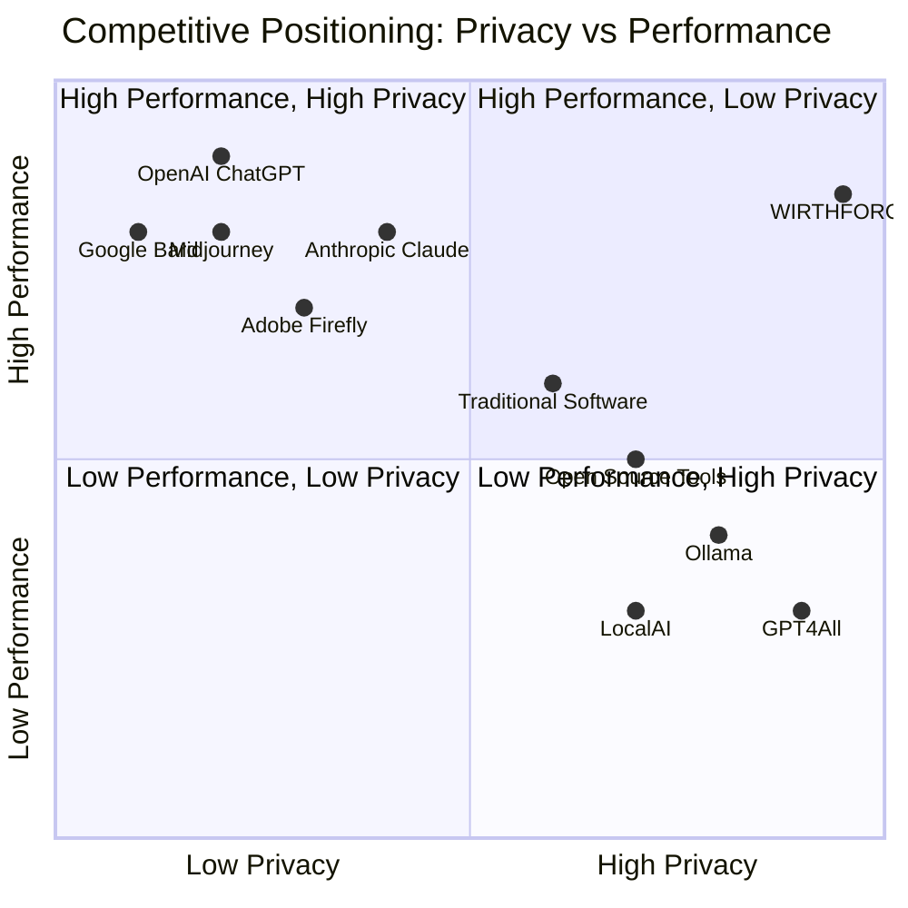

# WF-BIZ-001 Competitive Landscape
## Local-First AI Platform Market Positioning

```mermaid
flowchart TD
    subgraph "Cloud-Based AI Platforms"
        CB1[OpenAI ChatGPT<br/>High Performance<br/>Data Harvesting<br/>Subscription Model]
        CB2[Google Bard<br/>Free Access<br/>Ad-Supported<br/>Data Collection]
        CB3[Adobe Firefly<br/>Creative Focus<br/>Cloud Processing<br/>Subscription Tiers]
        CB4[Midjourney<br/>Art Generation<br/>Discord Integration<br/>Community Model]
        CB5[Anthropic Claude<br/>Safety Focus<br/>API Access<br/>Enterprise Pricing]
    end
    
    subgraph "Local AI Tools"
        LA1[Ollama<br/>Technical Users<br/>Command Line<br/>Model Management]
        LA2[LocalAI<br/>API Compatible<br/>Self-Hosted<br/>Developer Focus]
        LA3[GPT4All<br/>Desktop App<br/>Model Collection<br/>Basic UI]
        LA4[LM Studio<br/>Model Testing<br/>Local Inference<br/>Technical Interface]
    end
    
    subgraph "Traditional Creative Software"
        TC1[Adobe Creative Suite<br/>Industry Standard<br/>Subscription Model<br/>Plugin Ecosystem]
        TC2[Blender<br/>Open Source<br/>3D Focus<br/>Community Driven]
        TC3[GIMP<br/>Free Alternative<br/>Basic Features<br/>Limited AI]
        TC4[Figma<br/>Web-Based<br/>Collaboration<br/>Design Focus]
    end
    
    subgraph "WIRTHFORGE Positioning"
        WF[WIRTHFORGE<br/>Local-First AI<br/>Privacy by Design<br/>Energy-Honest Pricing<br/>Web-Engaged UX<br/>Community Ecosystem]
    end
    
    subgraph "Competitive Advantages"
        CA1[Data Sovereignty<br/>100% Local Processing]
        CA2[Energy Transparency<br/>Honest Pricing Model]
        CA3[Zero Latency<br/>No Network Dependencies]
        CA4[Privacy Compliance<br/>GDPR/CCPA Ready]
        CA5[Community Ownership<br/>User-Driven Development]
    end
    
    subgraph "Market Gaps"
        MG1[Privacy-Preserving AI<br/>Consumer-Friendly]
        MG2[Transparent Pricing<br/>Energy-Based Billing]
        MG3[Local Performance<br/>Professional Quality]
        MG4[Web UX<br/>Local Processing]
        MG5[Community Ecosystem<br/>Privacy-First]
    end
    
    %% Competitive Relationships
    CB1 -.-> MG1
    CB2 -.-> MG1
    CB3 -.-> MG2
    CB4 -.-> MG5
    CB5 -.-> MG1
    
    LA1 -.-> MG4
    LA2 -.-> MG4
    LA3 -.-> MG4
    LA4 -.-> MG4
    
    TC1 -.-> MG1
    TC2 -.-> MG2
    TC3 -.-> MG3
    TC4 -.-> MG3
    
    %% WIRTHFORGE Advantages
    WF --> CA1
    WF --> CA2
    WF --> CA3
    WF --> CA4
    WF --> CA5
    
    %% Market Gap Filling
    CA1 --> MG1
    CA2 --> MG2
    CA3 --> MG3
    CA4 --> MG1
    CA5 --> MG5
    
    %% Styling
    classDef cloud fill:#ffebee
    classDef local fill:#e8f5e8
    classDef traditional fill:#e3f2fd
    classDef wirthforge fill:#fff3e0
    classDef advantage fill:#f1f8e9
    classDef gap fill:#fce4ec
    
    class CB1,CB2,CB3,CB4,CB5 cloud
    class LA1,LA2,LA3,LA4 local
    class TC1,TC2,TC3,TC4 traditional
    class WF wirthforge
    class CA1,CA2,CA3,CA4,CA5 advantage
    class MG1,MG2,MG3,MG4,MG5 gap
```

## Competitive Analysis

### Cloud-Based AI Platforms

#### Strengths
- **High Performance**: Access to powerful cloud infrastructure
- **Continuous Updates**: Regular model improvements and new features
- **Scalability**: Handle large workloads without local hardware limits
- **Convenience**: No local setup or maintenance required

#### Weaknesses
- **Privacy Concerns**: User data processed on external servers
- **Data Harvesting**: Business models often rely on user data collection
- **Network Dependencies**: Require internet connectivity for operation
- **Hidden Costs**: Pricing often opaque with potential for surprise charges
- **Vendor Lock-in**: Data and workflows tied to specific platforms

#### Market Position
- **OpenAI ChatGPT**: Market leader with broad capabilities but privacy concerns
- **Google Bard**: Free access but heavy data collection and ad integration
- **Adobe Firefly**: Creative focus but subscription fatigue and cloud dependency
- **Midjourney**: Strong community but Discord-only access and limited control
- **Anthropic Claude**: Safety focus but still cloud-based with data concerns

### Local AI Tools

#### Strengths
- **Privacy Protection**: All processing happens locally
- **No Network Dependencies**: Work offline and without internet
- **Data Control**: Users maintain complete ownership of their data
- **Cost Predictability**: No surprise cloud charges or usage fees

#### Weaknesses
- **Technical Complexity**: Require significant technical knowledge to setup
- **Limited UI/UX**: Often command-line or basic interfaces
- **Hardware Requirements**: Performance limited by local hardware
- **Maintenance Burden**: Users responsible for updates and troubleshooting
- **Fragmented Ecosystem**: Limited integration and community

#### Market Position
- **Ollama**: Strong technical tool but command-line interface limits adoption
- **LocalAI**: API compatibility but requires developer knowledge
- **GPT4All**: Desktop app with basic UI but limited features
- **LM Studio**: Model testing focus but not production-ready for creators

### Traditional Creative Software

#### Strengths
- **Industry Standards**: Established workflows and professional acceptance
- **Feature Completeness**: Comprehensive tools for creative work
- **Ecosystem Integration**: Plugins, extensions, and third-party support
- **Professional Support**: Training, certification, and enterprise services

#### Weaknesses
- **Limited AI Integration**: AI features often basic or cloud-dependent
- **Subscription Fatigue**: Monthly fees without clear value correlation
- **Complexity**: Steep learning curves and feature overload
- **Legacy Architecture**: Not designed for AI-first workflows

#### Market Position
- **Adobe Creative Suite**: Industry standard but expensive and AI-limited
- **Blender**: Open source but complex and 3D-focused
- **GIMP**: Free alternative but limited features and poor UX
- **Figma**: Web-based collaboration but design-only focus

### WIRTHFORGE Competitive Positioning

#### Unique Value Proposition
WIRTHFORGE occupies the **High Privacy, High Performance** quadrant that no competitor currently serves effectively:

1. **Privacy + Performance**: Combines local processing privacy with professional-quality AI
2. **Transparency + Power**: Energy-honest pricing with full-featured AI capabilities
3. **Simplicity + Control**: Web-based UX with complete local data control
4. **Community + Innovation**: User-driven ecosystem with privacy-first principles

#### Market Gap Analysis

**Gap 1: Privacy-Preserving Consumer AI**
- Cloud platforms sacrifice privacy for convenience
- Local tools sacrifice usability for privacy
- WIRTHFORGE provides both privacy and usability

**Gap 2: Transparent AI Pricing**
- Cloud platforms use opaque usage-based pricing
- Traditional software uses subscription models unrelated to usage
- WIRTHFORGE provides energy-honest pricing tied to actual costs

**Gap 3: Professional Local AI**
- Local tools are often hobbyist-focused with limited capabilities
- Professional tools require cloud dependencies
- WIRTHFORGE provides professional-quality local AI processing

**Gap 4: Web UX with Local Processing**
- Web apps typically require cloud processing
- Local apps typically have poor user interfaces
- WIRTHFORGE combines web UX with local processing

### Competitive Strategy

#### Differentiation Pillars

1. **Data Sovereignty**: Absolute user control over data and processing
2. **Energy Honesty**: Transparent pricing reflecting actual computational costs
3. **Performance Parity**: Local processing that matches cloud performance
4. **Community Ownership**: User-driven development and ecosystem growth
5. **Privacy by Design**: Architecture that makes data harvesting impossible

#### Market Entry Strategy

1. **Privacy-Conscious Early Adopters**: Target users already concerned about data privacy
2. **Professional Creators**: Serve users needing reliable local AI for sensitive work
3. **Educational Institutions**: Partner with schools teaching AI ethics and privacy
4. **Developer Community**: Build ecosystem of privacy-focused AI tool creators
5. **Enterprise Compliance**: Serve organizations with strict data governance requirements

#### Defensive Moats

1. **Architectural Advantage**: Local-first design cannot be easily replicated by cloud platforms
2. **Community Network Effects**: User and developer ecosystem creates switching costs
3. **Privacy Brand**: Trust and reputation in privacy-conscious market segments
4. **Energy Transparency**: Honest pricing model builds user loyalty and trust
5. **Technical Expertise**: Deep knowledge of local AI optimization and energy measurement

This competitive analysis demonstrates WIRTHFORGE's unique market position and sustainable competitive advantages in the evolving AI platform landscape.
