# WF-BIZ-001 Revenue Flows
## Local-First AI Platform Revenue Architecture

```mermaid
flowchart TD
    subgraph "Customer Segments"
        CS1[Individual Creators<br/>Free & Paid Tiers]
        CS2[Professional Studios<br/>Premium Features]
        CS3[Enterprise & Research<br/>Custom Solutions]
        CS4[Developers & Partners<br/>Marketplace Participants]
    end
    
    subgraph "Revenue Streams"
        RS1[Subscription Revenue<br/>Monthly/Annual Tiers]
        RS2[Energy-Based Usage<br/>Micro-transactions]
        RS3[Marketplace Commission<br/>Plugin & Asset Sales]
        RS4[Professional Services<br/>Consulting & Training]
        RS5[Premium Features<br/>Advanced Capabilities]
    end
    
    subgraph "Pricing Tiers"
        PT1[Free Tier<br/>€0/month<br/>Single Model<br/>Limited Energy]
        PT2[Novice Tier<br/>€9.42/month<br/>Multiple Models<br/>Standard Energy]
        PT3[Adept Tier<br/>€24.99/month<br/>Advanced Features<br/>High Energy Limits]
        PT4[Master Tier<br/>€49.99/month<br/>Professional Tools<br/>Unlimited Energy]
        PT5[Enterprise<br/>Custom Pricing<br/>Dedicated Support<br/>Custom Integration]
    end
    
    subgraph "Energy-Based Billing"
        EB1[Real-Time Monitoring<br/>CPU/GPU Usage Tracking]
        EB2[Energy Calculation<br/>Transparent Cost Computation]
        EB3[Usage Billing<br/>Pay-Per-Compute Model]
        EB4[Budget Controls<br/>User-Set Limits]
    end
    
    subgraph "Marketplace Revenue"
        MR1[Plugin Sales<br/>15-20% Commission]
        MR2[AI Model Marketplace<br/>Revenue Sharing]
        MR3[Creative Assets<br/>Community Contributions]
        MR4[Professional Tools<br/>Third-Party Integrations]
    end
    
    subgraph "Revenue Processing"
        RP1[Local Payment Processing<br/>Privacy-Preserving Billing]
        RP2[Energy Cost Allocation<br/>Transparent Accounting]
        RP3[Commission Distribution<br/>Creator Revenue Sharing]
        RP4[Service Revenue<br/>Professional Consulting]
    end
    
    subgraph "Financial Flows"
        FF1[Monthly Recurring Revenue<br/>Subscription Base]
        FF2[Variable Usage Revenue<br/>Energy Consumption]
        FF3[Marketplace Revenue<br/>Ecosystem Growth]
        FF4[Service Revenue<br/>High-Value Consulting]
    end
    
    %% Customer to Revenue Stream Connections
    CS1 --> RS1
    CS1 --> RS2
    CS2 --> RS1
    CS2 --> RS5
    CS3 --> RS4
    CS3 --> RS5
    CS4 --> RS3
    
    %% Revenue Stream to Pricing Tier Connections
    RS1 --> PT1
    RS1 --> PT2
    RS1 --> PT3
    RS1 --> PT4
    RS1 --> PT5
    
    %% Energy-Based Billing Flow
    RS2 --> EB1
    EB1 --> EB2
    EB2 --> EB3
    EB3 --> EB4
    
    %% Marketplace Revenue Flow
    RS3 --> MR1
    RS3 --> MR2
    RS3 --> MR3
    RS3 --> MR4
    
    %% Revenue Processing Flow
    RS1 --> RP1
    RS2 --> RP2
    RS3 --> RP3
    RS4 --> RP4
    
    %% Financial Flow Aggregation
    RP1 --> FF1
    RP2 --> FF2
    RP3 --> FF3
    RP4 --> FF4
    
    %% Styling
    classDef customer fill:#e1f5fe
    classDef revenue fill:#e8f5e8
    classDef pricing fill:#fff3e0
    classDef energy fill:#f3e5f5
    classDef marketplace fill:#e0f2f1
    classDef processing fill:#fce4ec
    classDef financial fill:#f1f8e9
    
    class CS1,CS2,CS3,CS4 customer
    class RS1,RS2,RS3,RS4,RS5 revenue
    class PT1,PT2,PT3,PT4,PT5 pricing
    class EB1,EB2,EB3,EB4 energy
    class MR1,MR2,MR3,MR4 marketplace
    class RP1,RP2,RP3,RP4 processing
    class FF1,FF2,FF3,FF4 financial
```

## Revenue Flow Analysis

### Subscription Revenue Model

#### Tiered Pricing Structure
- **Free Tier (€0/month)**: Gateway for user acquisition and community building
- **Novice Tier (€9.42/month)**: Core features with reasonable energy allocation
- **Adept Tier (€24.99/month)**: Advanced features for professional creators
- **Master Tier (€49.99/month)**: Full feature access for power users
- **Enterprise (Custom)**: Tailored solutions with dedicated support

#### Revenue Characteristics
- **Predictable Monthly Recurring Revenue (MRR)**: Stable income foundation
- **Progressive Value Delivery**: Higher tiers unlock more capabilities
- **Energy-Honest Pricing**: Tiers reflect actual computational costs
- **Community-Driven Conversion**: Free users become advocates and converters

### Energy-Based Usage Revenue

#### Real-Time Energy Accounting
- **Transparent Monitoring**: Users see exact computational costs
- **Fair Billing**: Pay only for actual energy consumed
- **Budget Controls**: User-set limits prevent surprise charges
- **Performance Incentives**: Efficient usage reduces costs

#### Billing Innovation
- **Micro-transaction Model**: Small charges for actual compute usage
- **No Hidden Fees**: All costs directly tied to energy consumption
- **Local Processing**: No cloud markup or data transfer costs
- **User Control**: Complete visibility and control over spending

### Marketplace Commission Revenue

#### Ecosystem Revenue Sharing
- **Plugin Sales**: 15-20% commission on third-party tools
- **AI Model Marketplace**: Revenue sharing with model creators
- **Creative Assets**: Community-generated content monetization
- **Professional Tools**: Enterprise-grade third-party integrations

#### Growth Multiplier Effect
- **Developer Incentives**: Fair revenue sharing attracts creators
- **Network Effects**: More plugins increase platform value
- **Community Ownership**: Users have stake in ecosystem success
- **Quality Curation**: Commission model ensures value delivery

### Professional Services Revenue

#### High-Value Consulting
- **Enterprise Integration**: Custom deployment and configuration
- **Training Programs**: AI literacy and platform optimization
- **Custom Development**: Specialized tools and workflows
- **Ongoing Support**: Dedicated technical assistance

#### Service Characteristics
- **High Margin**: Expertise-based pricing with premium rates
- **Relationship Building**: Long-term enterprise partnerships
- **Knowledge Transfer**: Educational component builds loyalty
- **Scalable Delivery**: Standardized methodologies and tools

### Revenue Flow Optimization

#### Customer Lifetime Value (CLV)
- **Free-to-Paid Conversion**: Community engagement drives upgrades
- **Tier Progression**: Users naturally upgrade as needs grow
- **Marketplace Participation**: Revenue sharing creates retention
- **Service Upselling**: Professional relationships expand over time

#### Revenue Diversification
- **Multiple Streams**: Reduces dependency on single revenue source
- **Aligned Incentives**: All revenue tied to user value delivery
- **Sustainable Growth**: Community-driven expansion reduces acquisition costs
- **Privacy Preservation**: No revenue from data monetization

### Financial Flow Management

#### Revenue Recognition
- **Subscription Revenue**: Monthly recurring recognition
- **Usage Revenue**: Real-time recognition based on consumption
- **Marketplace Revenue**: Recognition upon transaction completion
- **Service Revenue**: Project-based or hourly recognition

#### Cash Flow Optimization
- **Predictable Base**: Subscription revenue provides stability
- **Variable Growth**: Usage and marketplace revenue scale with adoption
- **High-Value Services**: Professional consulting improves margins
- **Community Investment**: Revenue reinvestment drives ecosystem growth

This revenue flow model demonstrates how WIRTHFORGE creates sustainable income while maintaining its core principles of privacy, energy honesty, and community ownership.
