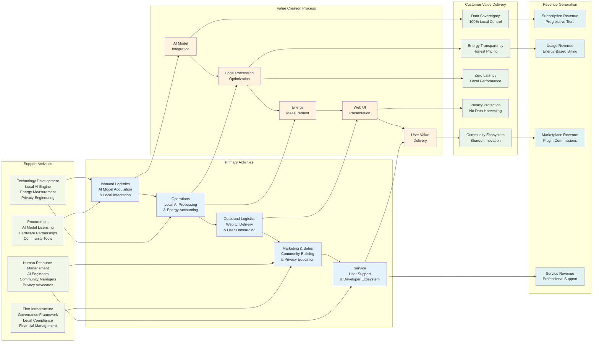

# WF-BIZ-001 Value Chain Analysis
## Local-First AI Platform Value Creation Flow

## Value Chain Analysis

### Primary Activities

#### 1. Inbound Logistics - AI Model Acquisition
- **Local Integration Focus**: Acquiring and optimizing AI models for local execution
- **Privacy Compliance**: Ensuring models respect local-first principles
- **Performance Optimization**: Adapting models for consumer hardware
- **Cost Management**: Licensing models cost-effectively for local deployment

#### 2. Operations - Local AI Processing
- **Core Differentiation**: All AI processing happens on user devices
- **Energy Accounting**: Real-time measurement and transparent billing
- **Performance Optimization**: Maximizing efficiency on local hardware
- **Quality Assurance**: Ensuring consistent local AI performance

#### 3. Outbound Logistics - Web UI Delivery
- **Progressive Web App**: Rich web interface for local AI control
- **User Onboarding**: Seamless setup and configuration
- **Energy Visualization**: Transparent display of computational costs
- **Cross-Platform Delivery**: Web-based universal access

#### 4. Marketing & Sales - Community Building
- **Privacy Education**: Teaching benefits of local-first AI
- **Community Growth**: Building ecosystem of users and developers
- **Trust Building**: Demonstrating commitment to privacy principles
- **Value Communication**: Explaining energy-honest pricing benefits

#### 5. Service - User Support & Ecosystem
- **Community Support**: Peer-to-peer help and knowledge sharing
- **Developer Ecosystem**: Supporting plugin and tool development
- **Professional Services**: Enterprise consulting and training
- **Continuous Improvement**: User feedback integration

### Support Activities

#### Technology Development
- **Local AI Engine**: Core technology for on-device AI processing
- **Energy Measurement**: Precise computational cost tracking
- **Privacy Engineering**: Architectural privacy by design
- **Web Technology**: Progressive web app development

#### Human Resource Management
- **AI Engineers**: Specialists in local AI optimization
- **Community Managers**: Building and nurturing user communities
- **Privacy Advocates**: Ensuring compliance with privacy principles
- **Web Developers**: Creating engaging local-first interfaces

#### Firm Infrastructure
- **Governance Framework**: Policies ensuring local-first compliance
- **Legal Compliance**: Privacy law adherence and model licensing
- **Financial Management**: Energy-honest pricing and transparent billing
- **Quality Systems**: Ensuring consistent value delivery

#### Procurement
- **AI Model Licensing**: Acquiring rights for local deployment
- **Hardware Partnerships**: Optimizing for consumer devices
- **Community Tools**: Platforms for user engagement and support
- **Development Tools**: Technologies for local-first development

### Value Creation Unique Aspects

1. **Local-First Architecture**: Unlike cloud platforms, all value creation happens locally
2. **Energy Transparency**: Direct correlation between computational cost and user value
3. **Privacy by Design**: Value creation process never compromises user data
4. **Community-Driven**: Users and developers co-create ecosystem value
5. **Sustainable Economics**: Revenue model aligns with actual resource consumption

### Competitive Advantages

- **Data Sovereignty**: Users maintain complete control over their data
- **Performance Predictability**: No network dependencies or cloud outages
- **Cost Transparency**: Energy-honest pricing shows true computational costs
- **Privacy Compliance**: Architecture inherently respects privacy regulations
- **Community Ownership**: Users have stake in platform development and success

This value chain demonstrates how WIRTHFORGE creates unique value through local-first AI processing while building sustainable revenue streams that respect user privacy and energy consumption.
