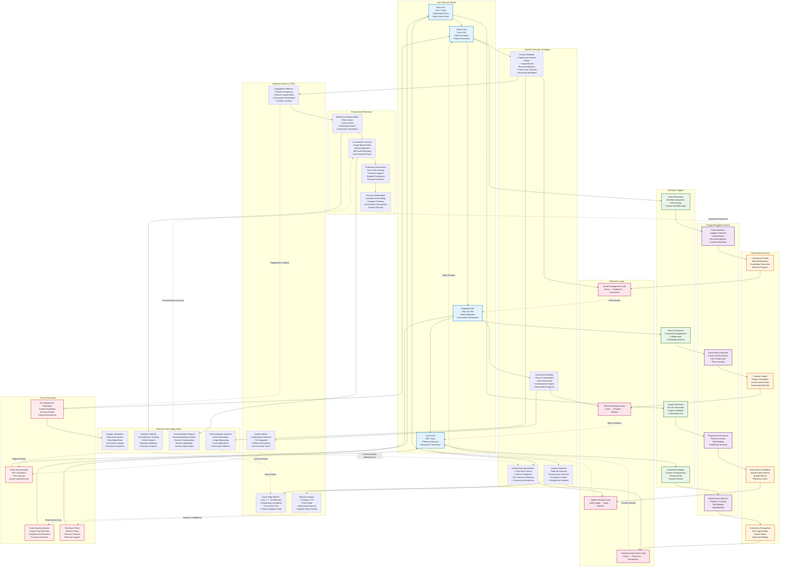

# WF-BIZ-002 Retention Loops Diagram

## Overview
This diagram illustrates WIRTHFORGE's customer retention and engagement loops, showing how different touchpoints and value delivery mechanisms create sustainable user engagement and reduce churn.

## Mermaid Diagram

## Retention Loop Strategy Analysis

### Core Retention Philosophy

**Habit Formation Through Value**
- **Daily Touchpoints**: Regular interaction patterns that become routine
- **Incremental Value**: Each session delivers meaningful progress or results
- **Friction Reduction**: Streamlined workflows that encourage repeated use
- **Positive Reinforcement**: Success feedback that motivates continued engagement

**Community-Driven Retention**
- **Social Connections**: Relationships formed through shared interests and collaboration
- **Knowledge Sharing**: Learning from and teaching others creates mutual value
- **Recognition Systems**: Community acknowledgment drives continued participation
- **Collaborative Projects**: Shared goals and outcomes strengthen platform bonds

### Lifecycle-Specific Retention Strategies

**New User Retention (Days 1-7)**
- **Quick Wins**: Immediate value demonstration within first session
- **Guided Discovery**: Progressive feature introduction without overwhelming
- **Success Milestones**: Clear achievements that build confidence and momentum
- **Community Welcome**: Early introduction to supportive community members

**Active User Retention (Days 8-90)**
- **Habit Formation**: Daily/weekly usage patterns through valuable workflows
- **Feature Depth**: Progressive complexity that matches growing skill levels
- **Personal Investment**: Customization and configuration that increases switching costs
- **Social Integration**: Community participation and relationship building

**Engaged User Retention (Days 91-365)**
- **Advanced Capabilities**: Power user features that provide professional value
- **Community Leadership**: Opportunities to mentor and guide newer users
- **Platform Influence**: Input on product direction and feature development
- **Creative Showcase**: Platforms to display and share accomplished work

**Loyal User Retention (365+ Days)**
- **Ecosystem Contribution**: Plugin development and marketplace participation
- **Thought Leadership**: Recognition as platform expert and community influencer
- **Strategic Partnership**: Collaboration on platform evolution and growth
- **Legacy Building**: Long-term projects and contributions that define user identity

### Behavioral Retention Loops

**Habit Formation Loop**
1. **Trigger**: Daily workflow need or creative inspiration
2. **Action**: Use WIRTHFORGE to accomplish specific task
3. **Reward**: Successful completion with quality results
4. **Investment**: Time saved and skills developed reinforce future use

**Social Engagement Loop**
1. **Creation**: User generates content or solves interesting problem
2. **Sharing**: Posts results or insights to community platform
3. **Recognition**: Receives feedback, appreciation, or collaboration requests
4. **Connection**: Builds relationships that encourage continued participation

**Skill Development Loop**
1. **Challenge**: Encounters complex problem or creative opportunity
2. **Learning**: Discovers new features, techniques, or approaches
3. **Mastery**: Successfully applies new knowledge to achieve better results
4. **Teaching**: Shares knowledge with community, reinforcing learning

**Creative Achievement Loop**
1. **Vision**: Conceives ambitious creative or professional project
2. **Creation**: Uses platform capabilities to bring vision to reality
3. **Showcase**: Displays completed work to community and professional networks
4. **Recognition**: Receives acknowledgment that validates platform choice

### Churn Prevention and Recovery

**Early Warning Detection**
- **Usage Pattern Analysis**: Identifying declining engagement before churn
- **Behavioral Indicators**: Reduced session frequency, feature abandonment
- **Support Interactions**: Frustration signals in help requests or feedback
- **Competitive Activity**: Monitoring for signs of platform switching

**Proactive Intervention Strategies**
- **Personalized Outreach**: Direct communication addressing specific user needs
- **Value Demonstration**: Showcasing unused features that could provide value
- **Success Story Sharing**: Examples of similar users achieving their goals
- **Temporary Premium Access**: Trial of advanced features to demonstrate value

**Win-Back Campaigns**
- **Special Offers**: Pricing incentives for returning users
- **Feature Updates**: Highlighting new capabilities since last usage
- **Community Highlights**: Showing vibrant community activity and opportunities
- **Personal Support**: One-on-one assistance to overcome previous obstacles

### Retention Measurement and Optimization

**Key Retention Metrics**
- **Cohort Retention**: Day 1, 7, 30, 90, 365 retention rates by user segment
- **Feature Stickiness**: Correlation between specific features and retention
- **Community Engagement**: Participation rates and relationship formation
- **Value Realization Time**: Speed to first meaningful success

**Retention Optimization Process**
1. **Data Collection**: Comprehensive user behavior and outcome tracking
2. **Cohort Analysis**: Segmented retention analysis by user characteristics
3. **Intervention Testing**: A/B testing of retention strategies and messaging
4. **Continuous Improvement**: Iterative refinement based on performance data

**Personalization and Segmentation**
- **Behavioral Segments**: Grouping users by usage patterns and preferences
- **Value-Based Segments**: Categorizing by primary value drivers and goals
- **Lifecycle Segments**: Tailoring strategies to user maturity and experience
- **Predictive Segments**: Using ML to identify churn risk and intervention opportunities

### Technology-Enabled Retention

**Analytics and Intelligence**
- **Real-time Dashboards**: Monitoring retention metrics and trends
- **Predictive Modeling**: Machine learning for churn prediction and intervention
- **Cohort Tracking**: Automated analysis of user group performance over time
- **Behavioral Insights**: Deep analysis of usage patterns and success factors

**Automated Engagement Systems**
- **Trigger-Based Messaging**: Contextual communication based on user actions
- **Progressive Disclosure**: Automated feature introduction based on readiness
- **Achievement Recognition**: Automatic celebration of milestones and successes
- **Recommendation Engine**: Personalized suggestions for features and content

This comprehensive retention system ensures that WIRTHFORGE builds lasting relationships with users through continuous value delivery, community engagement, and personalized experiences that evolve with user needs and growth.
