# WF-BIZ-002 Value Delivery Diagram

## Overview
This diagram illustrates WIRTHFORGE's comprehensive value delivery system, showing how different user segments receive value through tiered features, community engagement, and continuous platform improvement.

## Mermaid Diagram

```mermaid
graph TB
    subgraph "User Segments & Value Alignment"
        US1[Privacy-Conscious Users<br/>• Data Sovereignty<br/>• Local Processing<br/>• Transparent Operations]
        US2[Creative Professionals<br/>• Performance Tools<br/>• Advanced Features<br/>• Marketplace Access]
        US3[Enterprise Users<br/>• Custom Solutions<br/>• Dedicated Support<br/>• On-premise Deployment]
        US4[Developer Community<br/>• SDK Access<br/>• Revenue Sharing<br/>• Platform Integration]
    end
    
    subgraph "Core Value Propositions"
        VP1[Privacy & Control<br/>100% Local Processing<br/>No Data Harvesting<br/>User Sovereignty]
        VP2[Performance Excellence<br/>60Hz Real-time<br/>Optimized Hardware<br/>Consistent Experience]
        VP3[Energy Transparency<br/>Real-time Monitoring<br/>Fair Pricing<br/>No Hidden Costs]
        VP4[Community Ecosystem<br/>Plugin Marketplace<br/>Creator Economy<br/>Open Development]
    end
    
    subgraph "Feature Delivery Matrix"
        FD1[Free Tier Features<br/>• Basic AI Models<br/>• Local Processing<br/>• Privacy Protection<br/>• Community Access]
        FD2[Personal Tier Features<br/>• Enhanced Patterns<br/>• Cloud Sync<br/>• Priority Support<br/>• Advanced UI]
        FD3[Professional Features<br/>• Advanced Orchestrator<br/>• API Access<br/>• Custom Integrations<br/>• Analytics Dashboard]
        FD4[Enterprise Features<br/>• On-premise Deployment<br/>• Dedicated Support<br/>• Custom Development<br/>• SLA Guarantees]
    end
    
    subgraph "Value Delivery Mechanisms"
        VDM1[Product Excellence<br/>Continuous Updates<br/>Performance Optimization<br/>Feature Development]
        VDM2[Community Building<br/>User Forums<br/>Educational Content<br/>Developer Resources]
        VDM3[Support Systems<br/>Documentation<br/>Tutorials<br/>Customer Service]
        VDM4[Marketplace Value<br/>Plugin Discovery<br/>Creator Tools<br/>Revenue Sharing]
    end
    
    subgraph "Engagement & Retention"
        ER1[Onboarding Experience<br/>Progressive Disclosure<br/>Tutorial System<br/>Quick Wins]
        ER2[Usage Analytics<br/>Personal Insights<br/>Optimization Tips<br/>Performance Tracking]
        ER3[Community Participation<br/>Forums & Discussions<br/>Plugin Reviews<br/>Feature Requests]
        ER4[Loyalty Programs<br/>Referral Rewards<br/>Early Access<br/>Community Recognition]
    end
    
    subgraph "Continuous Improvement"
        CI1[User Feedback<br/>Feature Requests<br/>Bug Reports<br/>Usage Patterns]
        CI2[Product Development<br/>Roadmap Planning<br/>Feature Prioritization<br/>Quality Assurance]
        CI3[Platform Evolution<br/>Technology Updates<br/>Performance Improvements<br/>Security Enhancements]
        CI4[Community Growth<br/>Creator Support<br/>Ecosystem Expansion<br/>Partnership Development]
    end
    
    %% User Segment to Value Proposition Mapping
    US1 --> VP1
    US2 --> VP2
    US3 --> VP3
    US4 --> VP4
    
    %% Value Proposition to Feature Delivery
    VP1 --> FD1
    VP2 --> FD2
    VP3 --> FD3
    VP4 --> FD4
    
    %% Feature Delivery to Mechanisms
    FD1 --> VDM1
    FD2 --> VDM2
    FD3 --> VDM3
    FD4 --> VDM4
    
    %% Mechanisms to Engagement
    VDM1 --> ER1
    VDM2 --> ER2
    VDM3 --> ER3
    VDM4 --> ER4
    
    %% Engagement to Improvement
    ER1 --> CI1
    ER2 --> CI2
    ER3 --> CI3
    ER4 --> CI4
    
    %% Improvement Feedback Loop
    CI1 -.->|Feedback Loop| VDM1
    CI2 -.->|Product Updates| FD2
    CI3 -.->|Platform Enhancement| VP2
    CI4 -.->|Ecosystem Growth| US4
    
    subgraph "Value Measurement & Optimization"
        VM1[Customer Satisfaction<br/>NPS Surveys<br/>Usage Metrics<br/>Retention Analysis]
        VM2[Feature Adoption<br/>Usage Analytics<br/>Performance Metrics<br/>Engagement Tracking]
        VM3[Community Health<br/>Active Users<br/>Content Creation<br/>Support Quality]
        VM4[Business Impact<br/>Revenue Growth<br/>Customer LTV<br/>Market Position]
    end
    
    %% Value Measurement Connections
    ER1 --> VM1
    ER2 --> VM2
    ER3 --> VM3
    ER4 --> VM4
    
    VM1 -.->|Satisfaction Data| CI1
    VM2 -.->|Usage Insights| CI2
    VM3 -.->|Community Feedback| CI3
    VM4 -.->|Business Metrics| CI4
    
    subgraph "Personalization & Customization"
        PC1[User Preferences<br/>Interface Customization<br/>Workflow Optimization<br/>Personal Settings]
        PC2[Usage-Based Recommendations<br/>Feature Suggestions<br/>Upgrade Prompts<br/>Content Discovery]
        PC3[Community Matching<br/>Interest Groups<br/>Collaboration Tools<br/>Knowledge Sharing]
        PC4[Professional Services<br/>Custom Solutions<br/>Dedicated Support<br/>Training Programs]
    end
    
    %% Personalization Integration
    FD1 --> PC1
    FD2 --> PC2
    FD3 --> PC3
    FD4 --> PC4
    
    PC1 --> ER1
    PC2 --> ER2
    PC3 --> ER3
    PC4 --> ER4
    
    subgraph "Success Metrics & KPIs"
        SM1[User Activation<br/>Time to First Value<br/>Feature Adoption<br/>Onboarding Completion]
        SM2[Engagement Depth<br/>Session Duration<br/>Feature Usage<br/>Community Participation]
        SM3[Retention & Growth<br/>Subscription Renewal<br/>Tier Upgrades<br/>Referral Rates]
        SM4[Business Value<br/>Revenue per User<br/>Customer LTV<br/>Market Share]
    end
    
    %% Success Metrics Alignment
    ER1 --> SM1
    ER2 --> SM2
    ER3 --> SM3
    ER4 --> SM4
    
    SM1 -.->|Activation Insights| PC1
    SM2 -.->|Engagement Data| PC2
    SM3 -.->|Retention Analysis| PC3
    SM4 -.->|Business Intelligence| PC4
    
    classDef userBox fill:#e3f2fd,stroke:#0277bd,stroke-width:2px
    classDef valueBox fill:#e8f5e8,stroke:#1b5e20,stroke-width:2px
    classDef featureBox fill:#f3e5f5,stroke:#4a148c,stroke-width:2px
    classDef mechanismBox fill:#fff3e0,stroke:#e65100,stroke-width:2px
    classDef engagementBox fill:#fce4ec,stroke:#ad1457,stroke-width:2px
    classDef improvementBox fill:#f1f8e9,stroke:#33691e,stroke-width:2px
    
    class US1,US2,US3,US4 userBox
    class VP1,VP2,VP3,VP4 valueBox
    class FD1,FD2,FD3,FD4 featureBox
    class VDM1,VDM2,VDM3,VDM4 mechanismBox
    class ER1,ER2,ER3,ER4 engagementBox
    class CI1,CI2,CI3,CI4 improvementBox
```

## Value Delivery Strategy Analysis

### Segment-Specific Value Delivery

**Privacy-Conscious Users**
- **Primary Value**: Complete data sovereignty and local processing
- **Key Features**: Zero external data transmission, transparent operations
- **Engagement**: Privacy-focused community, security updates, transparency reports
- **Success Metrics**: Privacy satisfaction scores, local-first adoption rates

**Creative Professionals**
- **Primary Value**: High-performance creative tools with professional features
- **Key Features**: Advanced AI models, real-time processing, marketplace access
- **Engagement**: Creative showcases, professional tutorials, peer collaboration
- **Success Metrics**: Creative output quality, professional adoption, workflow efficiency

**Enterprise Users**
- **Primary Value**: Scalable, secure, customizable AI solutions
- **Key Features**: On-premise deployment, dedicated support, custom integrations
- **Engagement**: Account management, training programs, strategic consulting
- **Success Metrics**: Enterprise satisfaction, contract renewals, expansion revenue

**Developer Community**
- **Primary Value**: Platform extensibility and revenue opportunities
- **Key Features**: Comprehensive SDK, marketplace integration, revenue sharing
- **Engagement**: Developer forums, hackathons, technical documentation
- **Success Metrics**: Plugin quality, developer earnings, ecosystem growth

### Multi-Tier Value Architecture

**Free Tier Value Delivery**
- **Core Experience**: Full privacy and local processing capabilities
- **Feature Access**: Essential AI models and basic functionality
- **Community Value**: Access to plugins, forums, and educational content
- **Conversion Strategy**: Usage-based upgrade prompts and feature previews

**Personal Tier Enhancement**
- **Advanced Features**: Enhanced patterns, cloud sync, priority support
- **Performance Boost**: Increased energy allocation and parallel processing
- **Premium Experience**: Advanced UI, personalization, analytics dashboard
- **Community Status**: Enhanced profile, early access to features

**Professional Tier Differentiation**
- **Power User Tools**: Advanced orchestrator, API access, custom integrations
- **Business Features**: Team collaboration, usage analytics, export capabilities
- **Priority Support**: Dedicated support channels, faster response times
- **Professional Network**: Access to professional community and resources

**Enterprise Tier Customization**
- **Tailored Solutions**: Custom development, on-premise deployment options
- **Dedicated Resources**: Account management, training, strategic consulting
- **SLA Guarantees**: Performance commitments, uptime guarantees
- **Strategic Partnership**: Co-development opportunities, roadmap influence

### Engagement and Retention Mechanisms

**Progressive Onboarding**
- **Guided Discovery**: Step-by-step introduction to key features
- **Quick Wins**: Immediate value demonstration within first session
- **Skill Building**: Progressive complexity with educational scaffolding
- **Community Integration**: Early connection to relevant user groups

**Continuous Value Delivery**
- **Regular Updates**: Monthly feature releases and performance improvements
- **Personalized Insights**: Usage analytics and optimization recommendations
- **Community Content**: User-generated tutorials, showcases, best practices
- **Proactive Support**: Anticipatory help based on usage patterns

**Loyalty and Recognition Programs**
- **Referral Rewards**: Credits and benefits for successful referrals
- **Community Contributions**: Recognition for helpful forum participation
- **Early Access**: Beta features and preview access for engaged users
- **Achievement System**: Badges and milestones for platform mastery

### Value Measurement and Optimization

**Customer Satisfaction Tracking**
- **Net Promoter Score (NPS)**: Quarterly surveys measuring recommendation likelihood
- **Customer Satisfaction (CSAT)**: Feature-specific satisfaction measurements
- **Customer Effort Score (CES)**: Ease of use and support interaction quality
- **Retention Analysis**: Cohort-based retention and churn analysis

**Feature Value Assessment**
- **Adoption Rates**: Percentage of users utilizing specific features
- **Usage Depth**: Frequency and intensity of feature engagement
- **Value Correlation**: Feature usage correlation with retention and upgrades
- **Performance Impact**: Feature contribution to overall user satisfaction

**Business Impact Measurement**
- **Customer Lifetime Value (LTV)**: Revenue potential per customer segment
- **Average Revenue Per User (ARPU)**: Monthly and annual revenue metrics
- **Expansion Revenue**: Upgrade and cross-sell success rates
- **Market Position**: Competitive analysis and market share tracking

### Continuous Improvement Framework

**Feedback Collection Systems**
- **In-App Feedback**: Contextual feedback collection during feature usage
- **Community Forums**: Open discussion and feature request platforms
- **User Interviews**: Deep-dive conversations with representative users
- **Usage Analytics**: Behavioral data analysis for improvement insights

**Product Development Prioritization**
- **Impact vs Effort Matrix**: Feature prioritization based on value and resources
- **User Vote System**: Community-driven feature request prioritization
- **Business Alignment**: Strategic goal alignment with user value delivery
- **Technical Feasibility**: Development capacity and technical constraints

**Platform Evolution Strategy**
- **Technology Roadmap**: Long-term platform capability development
- **Performance Optimization**: Continuous improvement in speed and efficiency
- **Security Enhancement**: Ongoing security and privacy improvements
- **Ecosystem Expansion**: New integrations and partnership opportunities

This comprehensive value delivery system ensures that WIRTHFORGE consistently delivers exceptional value to all user segments while building sustainable engagement and loyalty through continuous improvement and community-driven development.
