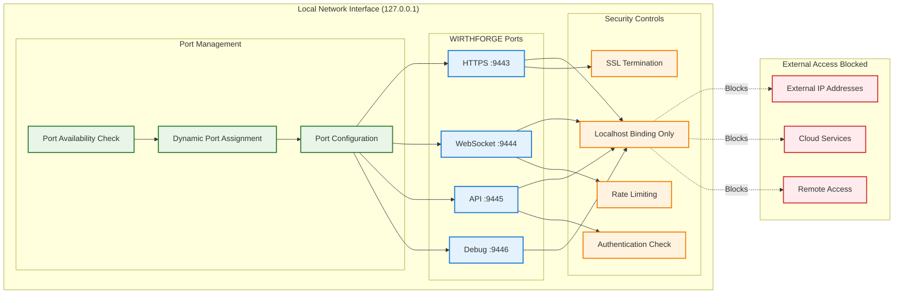

# WF-OPS-001 Deployment Architecture Diagram

## Local Deployment System Architecture
This diagram shows the complete local deployment architecture for WIRTHFORGE, emphasizing zero cloud dependencies and local-first operation.

```mermaid
graph TB
    subgraph "User's Local Machine"
        subgraph "Application Layer"
            WEB_UI[WIRTHFORGE Web UI]
            BROWSER[Web Browser]
            DESKTOP[Desktop Shortcuts]
        end
        
        subgraph "Local Web Server"
            HTTP_SERVER[HTTPS Server :9443]
            WS_SERVER[WebSocket Server]
            STATIC_FILES[Static File Server]
            API_ENDPOINTS[REST API Endpoints]
        end
        
        subgraph "Core Application"
            CORE_ENGINE[WIRTHFORGE Core Engine]
            AI_ENGINE[Local AI Engine]
            WORKFLOW_MGR[Workflow Manager]
            PLUGIN_MGR[Plugin Manager]
        end
        
        subgraph "Data Layer"
            SQLITE_DB[(SQLite Database)]
            CONFIG_FILES[Configuration Files]
            USER_DATA[User Data Storage]
            CACHE_STORAGE[Cache Storage]
        end
        
        subgraph "AI Models"
            OLLAMA[Ollama Engine]
            MODEL_FILES[Model Files (.bin)]
            MODEL_CACHE[Model Cache]
        end
        
        subgraph "File System Structure"
            BIN_DIR[/bin/ - Executables]
            WEB_DIR[/web-ui/ - UI Assets]
            DATA_DIR[/data/ - User Data]
            MODELS_DIR[/models/ - AI Models]
            LOGS_DIR[/logs/ - System Logs]
            CONFIG_DIR[/config/ - Configuration]
        end
        
        subgraph "Security Layer"
            SSL_CERTS[SSL Certificates]
            LOCAL_AUTH[Local Authentication]
            FIREWALL[Firewall Rules]
            SANDBOX[Plugin Sandbox]
        end
        
        subgraph "System Integration"
            OS_SERVICES[OS Service Integration]
            STARTUP[Auto-startup Scripts]
            SHORTCUTS[System Shortcuts]
            REGISTRY[System Registry/Config]
        end
    end
    
    subgraph "Network Boundary"
        LOCALHOST[127.0.0.1 Only]
        NO_EXTERNAL[No External Connections]
    end
    
    %% User Interface Connections
    BROWSER -->|HTTPS :9443| HTTP_SERVER
    BROWSER -->|WSS| WS_SERVER
    DESKTOP --> CORE_ENGINE
    WEB_UI --> BROWSER
    
    %% Server Layer Connections
    HTTP_SERVER --> STATIC_FILES
    HTTP_SERVER --> API_ENDPOINTS
    WS_SERVER --> CORE_ENGINE
    API_ENDPOINTS --> CORE_ENGINE
    STATIC_FILES --> WEB_DIR
    
    %% Core Application Connections
    CORE_ENGINE --> AI_ENGINE
    CORE_ENGINE --> WORKFLOW_MGR
    CORE_ENGINE --> PLUGIN_MGR
    AI_ENGINE --> OLLAMA
    PLUGIN_MGR --> SANDBOX
    
    %% Data Connections
    CORE_ENGINE --> SQLITE_DB
    CORE_ENGINE --> CONFIG_FILES
    CORE_ENGINE --> USER_DATA
    WORKFLOW_MGR --> CACHE_STORAGE
    
    %% AI Model Connections
    OLLAMA --> MODEL_FILES
    OLLAMA --> MODEL_CACHE
    AI_ENGINE --> MODEL_CACHE
    
    %% File System Connections
    CORE_ENGINE --> BIN_DIR
    HTTP_SERVER --> WEB_DIR
    SQLITE_DB --> DATA_DIR
    CONFIG_FILES --> CONFIG_DIR
    USER_DATA --> DATA_DIR
    MODEL_FILES --> MODELS_DIR
    CACHE_STORAGE --> LOGS_DIR
    
    %% Security Connections
    HTTP_SERVER --> SSL_CERTS
    API_ENDPOINTS --> LOCAL_AUTH
    CORE_ENGINE --> FIREWALL
    PLUGIN_MGR --> SANDBOX
    
    %% System Integration Connections
    CORE_ENGINE --> OS_SERVICES
    STARTUP --> CORE_ENGINE
    SHORTCUTS --> CORE_ENGINE
    OS_SERVICES --> REGISTRY
    
    %% Network Boundary
    HTTP_SERVER -.-> LOCALHOST
    WS_SERVER -.-> LOCALHOST
    LOCALHOST -.-> NO_EXTERNAL
    
    classDef ui fill:#e3f2fd,stroke:#1976d2,stroke-width:2px
    classDef server fill:#e8f5e8,stroke:#2e7d32,stroke-width:2px
    classDef core fill:#fff3e0,stroke:#f57c00,stroke-width:2px
    classDef data fill:#f3e5f5,stroke:#7b1fa2,stroke-width:2px
    classDef ai fill:#e0f2f1,stroke:#00695c,stroke-width:2px
    classDef filesystem fill:#fff8e1,stroke:#f9a825,stroke-width:2px
    classDef security fill:#ffebee,stroke:#d32f2f,stroke-width:2px
    classDef system fill:#f5f5f5,stroke:#424242,stroke-width:2px
    classDef network fill:#fce4ec,stroke:#c2185b,stroke-width:2px
    
    class WEB_UI,BROWSER,DESKTOP ui
    class HTTP_SERVER,WS_SERVER,STATIC_FILES,API_ENDPOINTS server
    class CORE_ENGINE,AI_ENGINE,WORKFLOW_MGR,PLUGIN_MGR core
    class SQLITE_DB,CONFIG_FILES,USER_DATA,CACHE_STORAGE data
    class OLLAMA,MODEL_FILES,MODEL_CACHE ai
    class BIN_DIR,WEB_DIR,DATA_DIR,MODELS_DIR,LOGS_DIR,CONFIG_DIR filesystem
    class SSL_CERTS,LOCAL_AUTH,FIREWALL,SANDBOX security
    class OS_SERVICES,STARTUP,SHORTCUTS,REGISTRY system
    class LOCALHOST,NO_EXTERNAL network
```

## Port Configuration and Network Security



## File System Layout and Permissions

```mermaid
graph TB
    subgraph "WIRTHFORGE Installation Directory"
        ROOT[/opt/wirthforge/ or C:\Program Files\WIRTHFORGE\]
        
        subgraph "Executable Files"
            BIN[bin/]
            CORE_EXE[wf-core]
            MANAGER_EXE[wf-manager]
            UPDATER_EXE[wf-updater]
        end
        
        subgraph "Web Interface"
            WEB[web-ui/]
            HTML_FILES[*.html]
            CSS_FILES[*.css]
            JS_FILES[*.js]
            ASSETS[assets/]
        end
        
        subgraph "Configuration"
            CONFIG[config/]
            MAIN_CONFIG[wirthforge.json]
            SERVER_CONFIG[server.json]
            AI_CONFIG[ai-models.json]
        end
        
        subgraph "Data Storage"
            DATA[data/]
            DATABASE[wirthforge.db]
            USER_PREFS[user-preferences.json]
            SESSIONS[sessions/]
        end
        
        subgraph "AI Models"
            MODELS[models/]
            MODEL_BIN[*.bin files]
            MODEL_META[*.json metadata]
            MODEL_CACHE[cache/]
        end
        
        subgraph "Security"
            CERTS[certs/]
            SSL_CERT[localhost.crt]
            SSL_KEY[localhost.key]
            CA_CERT[ca.crt]
        end
        
        subgraph "Logs & Temp"
            LOGS[logs/]
            INSTALL_LOG[install.log]
            RUNTIME_LOG[runtime.log]
            ERROR_LOG[error.log]
            TEMP[temp/]
        end
    end
    
    %% Directory structure
    ROOT --> BIN
    ROOT --> WEB
    ROOT --> CONFIG
    ROOT --> DATA
    ROOT --> MODELS
    ROOT --> CERTS
    ROOT --> LOGS
    
    BIN --> CORE_EXE
    BIN --> MANAGER_EXE
    BIN --> UPDATER_EXE
    
    WEB --> HTML_FILES
    WEB --> CSS_FILES
    WEB --> JS_FILES
    WEB --> ASSETS
    
    CONFIG --> MAIN_CONFIG
    CONFIG --> SERVER_CONFIG
    CONFIG --> AI_CONFIG
    
    DATA --> DATABASE
    DATA --> USER_PREFS
    DATA --> SESSIONS
    
    MODELS --> MODEL_BIN
    MODELS --> MODEL_META
    MODELS --> MODEL_CACHE
    
    CERTS --> SSL_CERT
    CERTS --> SSL_KEY
    CERTS --> CA_CERT
    
    LOGS --> INSTALL_LOG
    LOGS --> RUNTIME_LOG
    LOGS --> ERROR_LOG
    LOGS --> TEMP
    
    %% Permission annotations
    BIN -.->|755 (rwxr-xr-x)| PERM_BIN[Executable]
    WEB -.->|644 (rw-r--r--)| PERM_WEB[Read-only]
    CONFIG -.->|600 (rw-------)| PERM_CONFIG[Owner only]
    DATA -.->|700 (rwx------)| PERM_DATA[Private]
    MODELS -.->|644 (rw-r--r--)| PERM_MODELS[Read-only]
    CERTS -.->|600 (rw-------)| PERM_CERTS[Secure]
    LOGS -.->|644 (rw-r--r--)| PERM_LOGS[Readable]
    
    classDef directory fill:#e8f5e8,stroke:#2e7d32,stroke-width:2px
    classDef executable fill:#e3f2fd,stroke:#1976d2,stroke-width:2px
    classDef web fill:#fff3e0,stroke:#f57c00,stroke-width:2px
    classDef config fill:#f3e5f5,stroke:#7b1fa2,stroke-width:2px
    classDef data fill:#e0f2f1,stroke:#00695c,stroke-width:2px
    classDef security fill:#ffebee,stroke:#d32f2f,stroke-width:2px
    classDef logs fill:#fff8e1,stroke:#f9a825,stroke-width:2px
    classDef permissions fill:#f5f5f5,stroke:#424242,stroke-width:1px
    
    class ROOT,BIN,WEB,CONFIG,DATA,MODELS,CERTS,LOGS directory
    class CORE_EXE,MANAGER_EXE,UPDATER_EXE executable
    class HTML_FILES,CSS_FILES,JS_FILES,ASSETS web
    class MAIN_CONFIG,SERVER_CONFIG,AI_CONFIG,USER_PREFS config
    class DATABASE,SESSIONS data
    class SSL_CERT,SSL_KEY,CA_CERT security
    class INSTALL_LOG,RUNTIME_LOG,ERROR_LOG,TEMP logs
    class PERM_BIN,PERM_WEB,PERM_CONFIG,PERM_DATA,PERM_MODELS,PERM_CERTS,PERM_LOGS permissions
```

## Key Architecture Principles

### 1. **Local-First Operation**
- All services run on localhost (127.0.0.1) only
- No external network dependencies for core functionality
- SSL certificates generated locally for secure communication
- All data stored locally on user's device

### 2. **Zero Cloud Dependencies**
- No cloud APIs required for installation or operation
- AI models run locally using Ollama engine
- Configuration and data management entirely local
- Updates can be performed offline with local packages

### 3. **Security by Design**
- HTTPS-only communication even for local services
- Localhost-only binding prevents external access
- Plugin sandboxing for third-party code execution
- Minimal privilege requirements for operation

### 4. **Cross-Platform Consistency**
- Unified file system layout across all platforms
- Same port configuration and network setup
- Consistent security model and permissions
- Platform-specific adaptations handled transparently

### 5. **Resource Efficiency**
- Lightweight local web server for UI
- Efficient SQLite database for data storage
- Model caching for improved AI performance
- Minimal system resource requirements

This deployment architecture ensures WIRTHFORGE operates entirely locally while providing a modern web-based interface and maintaining security, privacy, and performance standards.
