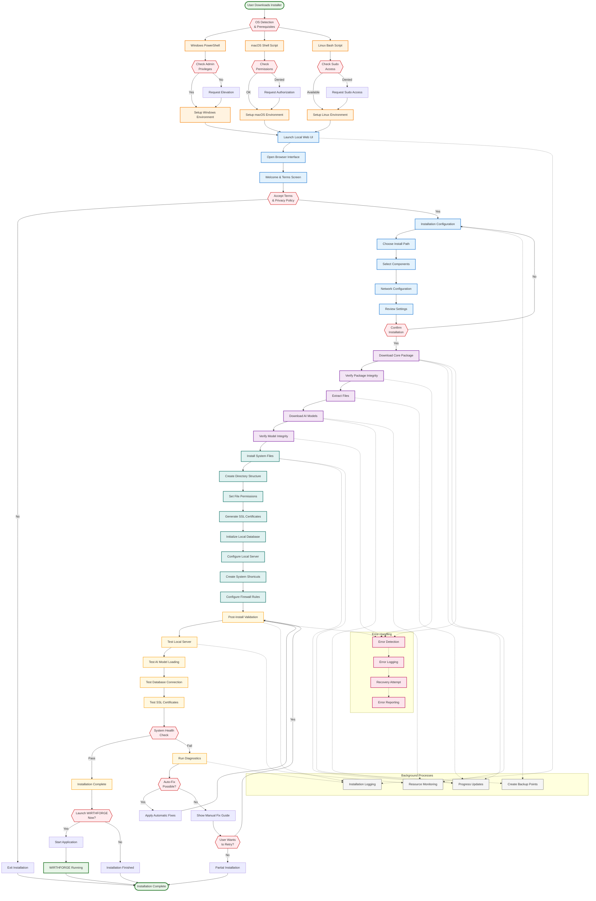

# WF-OPS-001 Installation Flow Diagram

## Local-First Installation Process
This diagram shows the complete installation workflow for WIRTHFORGE, emphasizing local-first principles with web-based management interfaces.

## Key Installation Principles

### 1. **Local-First Architecture**
- All installation files downloaded and verified locally
- No cloud dependencies for core functionality
- Local web server provides installation interface
- All data remains on user's device

### 2. **Cross-Platform Consistency**
- Unified web-based installation experience
- Platform-specific scripts handle OS differences
- Consistent file layout and permissions
- Same validation and testing procedures

### 3. **Security & Privacy**
- Package integrity verification with checksums
- SSL certificate generation for local HTTPS
- Minimal privilege requirements
- No external data transmission during install

### 4. **Reliability & Recovery**
- Comprehensive validation at each step
- Automatic error detection and recovery
- Backup points for rollback capability
- Detailed logging for troubleshooting

### 5. **User Experience**
- Web-based interface for familiar interaction
- Real-time progress updates and feedback
- Clear error messages and fix guidance
- Optional immediate launch after installation

## Installation Components

### **Core Package Components**
- WIRTHFORGE core application binaries
- Web UI assets (HTML, CSS, JavaScript)
- Configuration templates and defaults
- SSL certificate generation tools
- Database initialization scripts

### **AI Model Components**
- Local AI model files (Ollama integration)
- Model verification checksums
- Model configuration files
- Inference engine binaries

### **System Integration**
- Platform-specific shortcuts and launchers
- Firewall rule configurations
- Service registration (where applicable)
- Uninstaller components

### **Validation & Diagnostics**
- System health check routines
- Network connectivity tests
- Performance benchmark tools
- Error reporting utilities

This installation flow ensures that WIRTHFORGE can be deployed entirely locally while providing a modern, web-based installation experience that works consistently across all supported platforms.
