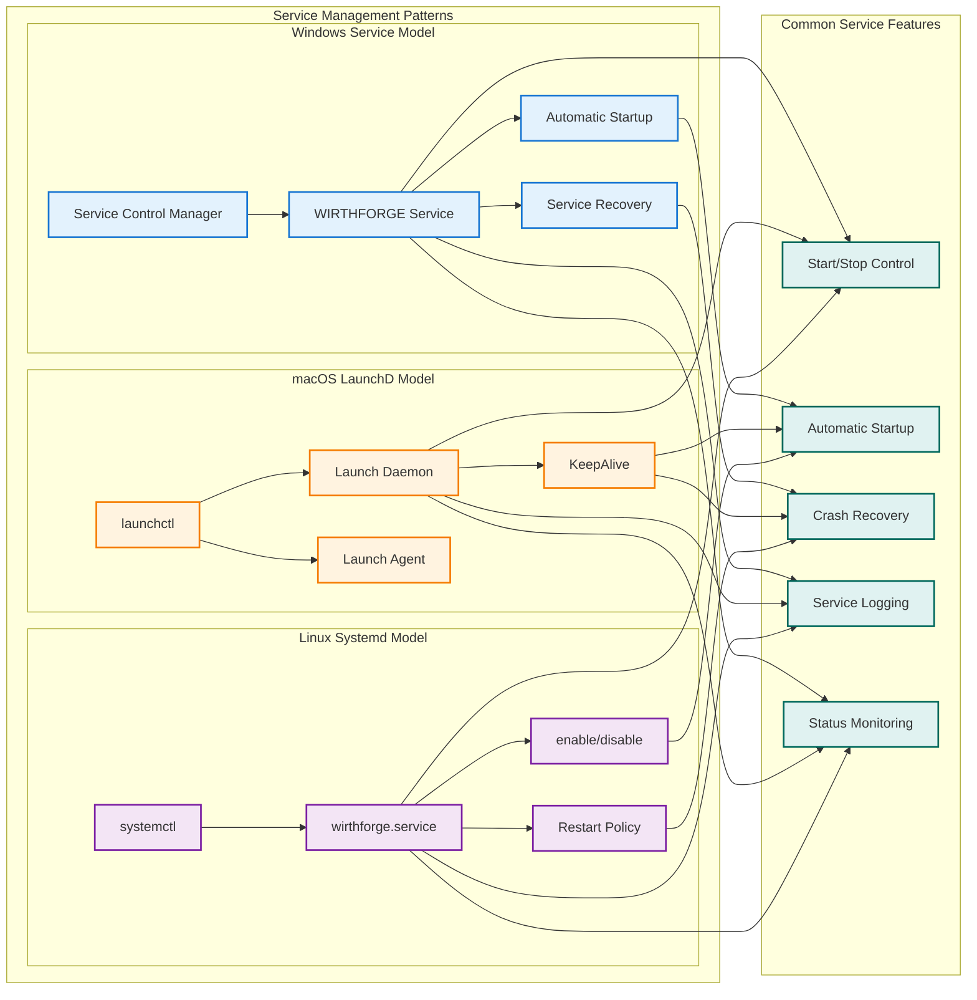
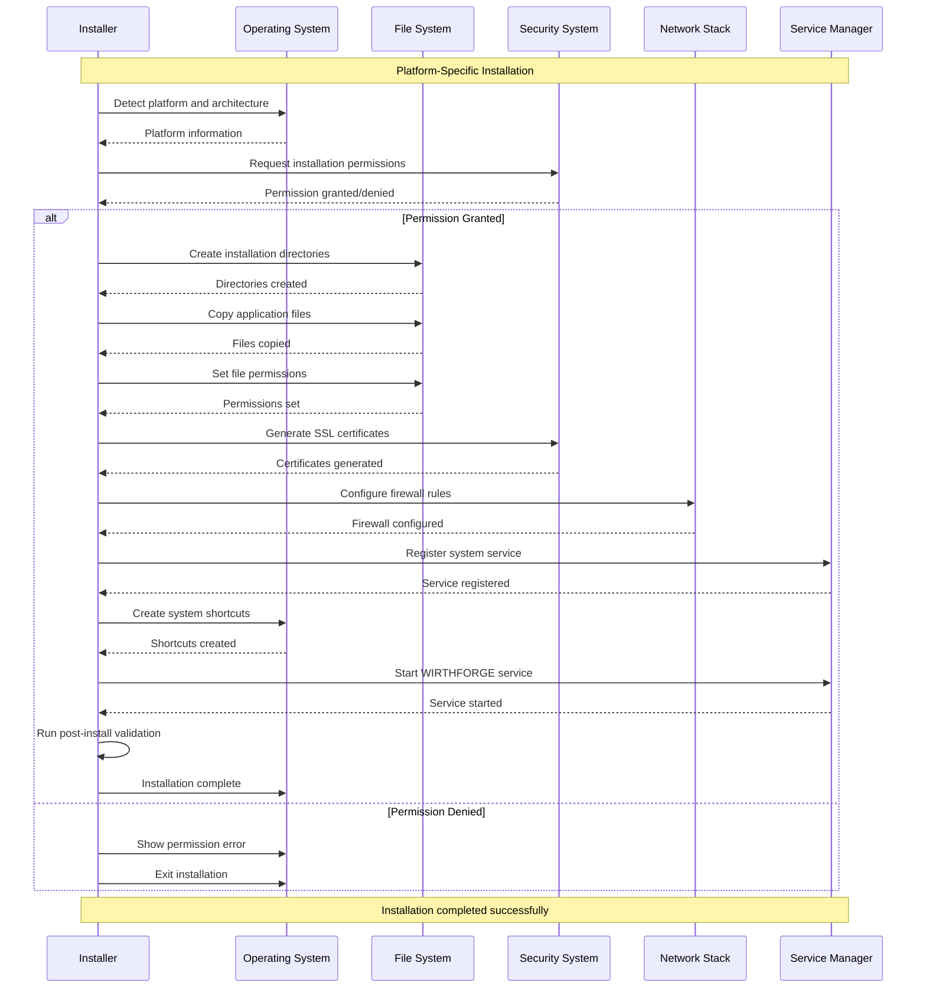

# WF-OPS-001 System Integration Diagram

## Cross-Platform System Integration
This diagram shows how WIRTHFORGE integrates with different operating systems while maintaining consistent local-first operation.

```mermaid
graph TB
    subgraph "WIRTHFORGE Core System"
        CORE[WIRTHFORGE Core Engine]
        WEB_SERVER[Local Web Server]
        AI_ENGINE[Local AI Engine]
        DATA_MGR[Data Manager]
    end
    
    subgraph "Windows Integration"
        WIN_SERVICES[Windows Services]
        WIN_REGISTRY[Windows Registry]
        WIN_FIREWALL[Windows Firewall]
        WIN_SHORTCUTS[Start Menu Shortcuts]
        WIN_AUTOSTART[Startup Programs]
        WIN_CERTS[Certificate Store]
        WIN_POWERSHELL[PowerShell Scripts]
        WIN_WMI[WMI Management]
    end
    
    subgraph "macOS Integration"
        MAC_LAUNCHD[LaunchDaemons/Agents]
        MAC_PLIST[Property Lists]
        MAC_KEYCHAIN[Keychain Access]
        MAC_APPS[Applications Folder]
        MAC_AUTOSTART[Login Items]
        MAC_GATEKEEPER[Gatekeeper]
        MAC_SHELL[Shell Scripts]
        MAC_SPOTLIGHT[Spotlight Integration]
    end
    
    subgraph "Linux Integration"
        LINUX_SYSTEMD[Systemd Services]
        LINUX_DESKTOP[Desktop Files]
        LINUX_AUTOSTART[XDG Autostart]
        LINUX_CERTS[CA Certificates]
        LINUX_FIREWALL[UFW/iptables]
        LINUX_SHELL[Shell Scripts]
        LINUX_DBUS[D-Bus Integration]
        LINUX_APPIMAGE[AppImage Support]
    end
    
    subgraph "Common System APIs"
        FILE_SYSTEM[File System APIs]
        NETWORK[Network APIs]
        PROCESS[Process Management]
        SECURITY[Security APIs]
        NOTIFICATIONS[System Notifications]
        CLIPBOARD[Clipboard Access]
        HARDWARE[Hardware Detection]
    end
    
    subgraph "Installation Components"
        INSTALLER[Platform Installer]
        UNINSTALLER[Uninstaller]
        UPDATER[Update Manager]
        DIAGNOSTICS[System Diagnostics]
        BACKUP[Backup Manager]
    end
    
    %% Core system connections
    CORE --> WEB_SERVER
    CORE --> AI_ENGINE
    CORE --> DATA_MGR
    
    %% Windows connections
    CORE --> WIN_SERVICES
    WEB_SERVER --> WIN_FIREWALL
    INSTALLER --> WIN_REGISTRY
    INSTALLER --> WIN_SHORTCUTS
    INSTALLER --> WIN_AUTOSTART
    WEB_SERVER --> WIN_CERTS
    INSTALLER --> WIN_POWERSHELL
    DIAGNOSTICS --> WIN_WMI
    
    %% macOS connections
    CORE --> MAC_LAUNCHD
    INSTALLER --> MAC_PLIST
    WEB_SERVER --> MAC_KEYCHAIN
    INSTALLER --> MAC_APPS
    INSTALLER --> MAC_AUTOSTART
    INSTALLER --> MAC_GATEKEEPER
    INSTALLER --> MAC_SHELL
    CORE --> MAC_SPOTLIGHT
    
    %% Linux connections
    CORE --> LINUX_SYSTEMD
    INSTALLER --> LINUX_DESKTOP
    INSTALLER --> LINUX_AUTOSTART
    WEB_SERVER --> LINUX_CERTS
    WEB_SERVER --> LINUX_FIREWALL
    INSTALLER --> LINUX_SHELL
    CORE --> LINUX_DBUS
    INSTALLER --> LINUX_APPIMAGE
    
    %% Common API connections
    DATA_MGR --> FILE_SYSTEM
    WEB_SERVER --> NETWORK
    CORE --> PROCESS
    WEB_SERVER --> SECURITY
    CORE --> NOTIFICATIONS
    CORE --> CLIPBOARD
    DIAGNOSTICS --> HARDWARE
    
    %% Installation component connections
    INSTALLER --> CORE
    UNINSTALLER --> INSTALLER
    UPDATER --> INSTALLER
    DIAGNOSTICS --> CORE
    BACKUP --> DATA_MGR
    
    classDef core fill:#e8f5e8,stroke:#2e7d32,stroke-width:3px
    classDef windows fill:#e3f2fd,stroke:#1976d2,stroke-width:2px
    classDef macos fill:#fff3e0,stroke:#f57c00,stroke-width:2px
    classDef linux fill:#f3e5f5,stroke:#7b1fa2,stroke-width:2px
    classDef common fill:#e0f2f1,stroke:#00695c,stroke-width:2px
    classDef install fill:#fff8e1,stroke:#f9a825,stroke-width:2px
    
    class CORE,WEB_SERVER,AI_ENGINE,DATA_MGR core
    class WIN_SERVICES,WIN_REGISTRY,WIN_FIREWALL,WIN_SHORTCUTS,WIN_AUTOSTART,WIN_CERTS,WIN_POWERSHELL,WIN_WMI windows
    class MAC_LAUNCHD,MAC_PLIST,MAC_KEYCHAIN,MAC_APPS,MAC_AUTOSTART,MAC_GATEKEEPER,MAC_SHELL,MAC_SPOTLIGHT macos
    class LINUX_SYSTEMD,LINUX_DESKTOP,LINUX_AUTOSTART,LINUX_CERTS,LINUX_FIREWALL,LINUX_SHELL,LINUX_DBUS,LINUX_APPIMAGE linux
    class FILE_SYSTEM,NETWORK,PROCESS,SECURITY,NOTIFICATIONS,CLIPBOARD,HARDWARE common
    class INSTALLER,UNINSTALLER,UPDATER,DIAGNOSTICS,BACKUP install
```

## Service Management Integration

## Security Integration Patterns

```mermaid
graph TB
    subgraph "Security Integration by Platform"
        subgraph "Windows Security"
            WIN_UAC[UAC Integration]
            WIN_DEFENDER[Windows Defender]
            WIN_CERT_STORE[Certificate Store]
            WIN_FIREWALL_API[Windows Firewall API]
            WIN_CRYPTO[CryptoAPI]
        end
        
        subgraph "macOS Security"
            MAC_CODESIGN[Code Signing]
            MAC_NOTARIZE[Notarization]
            MAC_KEYCHAIN_API[Keychain API]
            MAC_FIREWALL_API[Application Firewall]
            MAC_SECURITY_FRAMEWORK[Security Framework]
        end
        
        subgraph "Linux Security"
            LINUX_APPARMOR[AppArmor/SELinux]
            LINUX_POLKIT[PolicyKit]
            LINUX_KEYRING[Kernel Keyring]
            LINUX_NETFILTER[Netfilter/iptables]
            LINUX_OPENSSL[OpenSSL]
        end
    end
    
    subgraph "Common Security Features"
        LOCAL_CERTS[Local SSL Certificates]
        LOCALHOST_BINDING[Localhost-only Binding]
        SECURE_STORAGE[Secure Configuration Storage]
        PERMISSION_MODEL[Minimal Permissions]
        AUDIT_LOGGING[Security Audit Logs]
    end
    
    subgraph "WIRTHFORGE Security Layer"
        CRYPTO_ENGINE[Cryptographic Engine]
        AUTH_MANAGER[Authentication Manager]
        SECURE_CONFIG[Secure Configuration]
        NETWORK_SECURITY[Network Security]
        DATA_PROTECTION[Data Protection]
    end
    
    %% Windows security connections
    WIN_UAC --> PERMISSION_MODEL
    WIN_DEFENDER --> AUDIT_LOGGING
    WIN_CERT_STORE --> LOCAL_CERTS
    WIN_FIREWALL_API --> LOCALHOST_BINDING
    WIN_CRYPTO --> CRYPTO_ENGINE
    
    %% macOS security connections
    MAC_CODESIGN --> PERMISSION_MODEL
    MAC_NOTARIZE --> AUDIT_LOGGING
    MAC_KEYCHAIN_API --> SECURE_STORAGE
    MAC_FIREWALL_API --> LOCALHOST_BINDING
    MAC_SECURITY_FRAMEWORK --> CRYPTO_ENGINE
    
    %% Linux security connections
    LINUX_APPARMOR --> PERMISSION_MODEL
    LINUX_POLKIT --> AUDIT_LOGGING
    LINUX_KEYRING --> SECURE_STORAGE
    LINUX_NETFILTER --> LOCALHOST_BINDING
    LINUX_OPENSSL --> CRYPTO_ENGINE
    
    %% WIRTHFORGE security connections
    LOCAL_CERTS --> AUTH_MANAGER
    LOCALHOST_BINDING --> NETWORK_SECURITY
    SECURE_STORAGE --> SECURE_CONFIG
    PERMISSION_MODEL --> DATA_PROTECTION
    AUDIT_LOGGING --> SECURE_CONFIG
    
    CRYPTO_ENGINE --> AUTH_MANAGER
    AUTH_MANAGER --> SECURE_CONFIG
    SECURE_CONFIG --> NETWORK_SECURITY
    NETWORK_SECURITY --> DATA_PROTECTION
    
    classDef windows fill:#e3f2fd,stroke:#1976d2,stroke-width:2px
    classDef macos fill:#fff3e0,stroke:#f57c00,stroke-width:2px
    classDef linux fill:#f3e5f5,stroke:#7b1fa2,stroke-width:2px
    classDef common fill:#e0f2f1,stroke:#00695c,stroke-width:2px
    classDef wirthforge fill:#e8f5e8,stroke:#2e7d32,stroke-width:2px
    
    class WIN_UAC,WIN_DEFENDER,WIN_CERT_STORE,WIN_FIREWALL_API,WIN_CRYPTO windows
    class MAC_CODESIGN,MAC_NOTARIZE,MAC_KEYCHAIN_API,MAC_FIREWALL_API,MAC_SECURITY_FRAMEWORK macos
    class LINUX_APPARMOR,LINUX_POLKIT,LINUX_KEYRING,LINUX_NETFILTER,LINUX_OPENSSL linux
    class LOCAL_CERTS,LOCALHOST_BINDING,SECURE_STORAGE,PERMISSION_MODEL,AUDIT_LOGGING common
    class CRYPTO_ENGINE,AUTH_MANAGER,SECURE_CONFIG,NETWORK_SECURITY,DATA_PROTECTION wirthforge
```

## Installation Integration Flow

## Key Integration Principles

### 1. **Platform Abstraction**
- Common core functionality across all platforms
- Platform-specific adapters for OS integration
- Unified configuration and data management
- Consistent user experience regardless of OS

### 2. **Native Integration**
- Uses platform-native service management
- Integrates with platform security systems
- Follows platform-specific conventions
- Respects platform user experience guidelines

### 3. **Minimal System Impact**
- Requires minimal system privileges
- Uses standard system locations and conventions
- Integrates cleanly with system management tools
- Provides standard uninstallation procedures

### 4. **Security Compliance**
- Works within platform security models
- Uses platform-native cryptographic services
- Follows platform security best practices
- Maintains audit trails for security events

### 5. **Maintainability**
- Separates platform-specific code from core logic
- Uses configuration-driven platform adaptation
- Provides consistent diagnostic and logging interfaces
- Enables remote troubleshooting and support

This system integration approach ensures WIRTHFORGE works seamlessly across all supported platforms while maintaining its local-first principles and providing native-quality user experiences.
