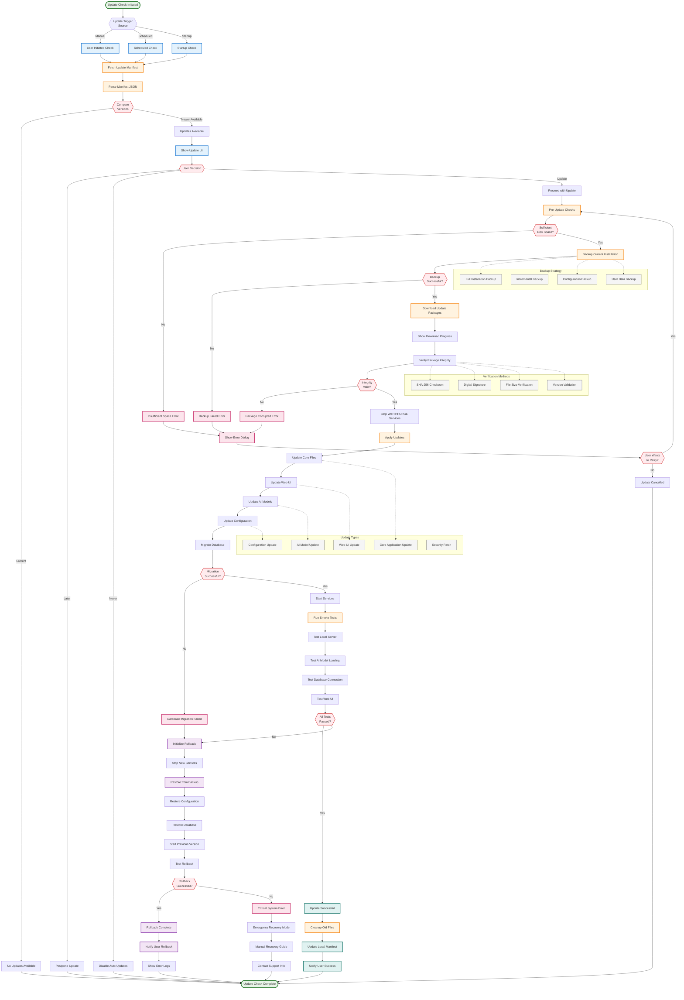
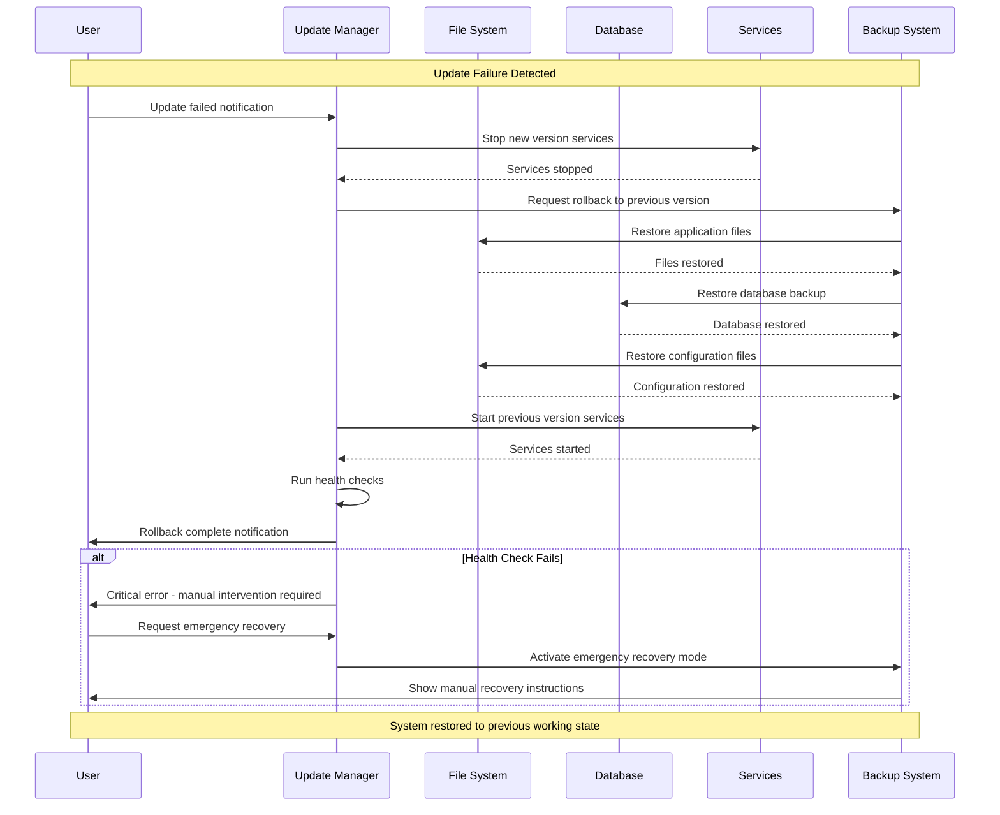

# WF-OPS-001 Update Process Diagram

## Local Update System with Rollback
This diagram shows the comprehensive update process for WIRTHFORGE, emphasizing local control, safety, and rollback capabilities.



## Update Manifest Structure

```mermaid
graph TB
    subgraph "Update Manifest (JSON)"
        MANIFEST[update-manifest.json]
        
        subgraph "Version Information"
            CURRENT_VER[currentVersion]
            LATEST_VER[latestVersion]
            RELEASE_DATE[releaseDate]
            RELEASE_NOTES[releaseNotes]
        end
        
        subgraph "Package Information"
            PACKAGES[packages[]]
            PKG_CORE[core-update.zip]
            PKG_UI[ui-update.zip]
            PKG_MODELS[models-update.zip]
            PKG_CONFIG[config-update.zip]
        end
        
        subgraph "Verification Data"
            CHECKSUMS[checksums{}]
            SHA256[sha256 hashes]
            FILE_SIZES[fileSizes{}]
            SIGNATURES[digitalSignatures{}]
        end
        
        subgraph "Update Metadata"
            UPDATE_TYPE[updateType]
            PRIORITY[priority]
            ROLLBACK_INFO[rollbackInfo]
            DEPENDENCIES[dependencies[]]
        end
        
        subgraph "Compatibility"
            MIN_VERSION[minimumVersion]
            OS_SUPPORT[supportedOS[]]
            ARCH_SUPPORT[supportedArch[]]
            BREAKING_CHANGES[breakingChanges]
        end
    end
    
    MANIFEST --> CURRENT_VER
    MANIFEST --> LATEST_VER
    MANIFEST --> RELEASE_DATE
    MANIFEST --> RELEASE_NOTES
    
    MANIFEST --> PACKAGES
    PACKAGES --> PKG_CORE
    PACKAGES --> PKG_UI
    PACKAGES --> PKG_MODELS
    PACKAGES --> PKG_CONFIG
    
    MANIFEST --> CHECKSUMS
    CHECKSUMS --> SHA256
    CHECKSUMS --> FILE_SIZES
    CHECKSUMS --> SIGNATURES
    
    MANIFEST --> UPDATE_TYPE
    MANIFEST --> PRIORITY
    MANIFEST --> ROLLBACK_INFO
    MANIFEST --> DEPENDENCIES
    
    MANIFEST --> MIN_VERSION
    MANIFEST --> OS_SUPPORT
    MANIFEST --> ARCH_SUPPORT
    MANIFEST --> BREAKING_CHANGES
    
    classDef manifest fill:#e8f5e8,stroke:#2e7d32,stroke-width:2px
    classDef version fill:#e3f2fd,stroke:#1976d2,stroke-width:2px
    classDef packages fill:#fff3e0,stroke:#f57c00,stroke-width:2px
    classDef verification fill:#ffebee,stroke:#d32f2f,stroke-width:2px
    classDef metadata fill:#f3e5f5,stroke:#7b1fa2,stroke-width:2px
    classDef compatibility fill:#e0f2f1,stroke:#00695c,stroke-width:2px
    
    class MANIFEST manifest
    class CURRENT_VER,LATEST_VER,RELEASE_DATE,RELEASE_NOTES version
    class PACKAGES,PKG_CORE,PKG_UI,PKG_MODELS,PKG_CONFIG packages
    class CHECKSUMS,SHA256,FILE_SIZES,SIGNATURES verification
    class UPDATE_TYPE,PRIORITY,ROLLBACK_INFO,DEPENDENCIES metadata
    class MIN_VERSION,OS_SUPPORT,ARCH_SUPPORT,BREAKING_CHANGES compatibility
```

## Rollback Recovery Process



## Key Update Principles

### 1. **Safety First**
- Complete backup before any changes
- Comprehensive verification of all packages
- Smoke testing after updates
- Automatic rollback on failure

### 2. **Local Control**
- User controls update timing and approval
- No forced updates or automatic installations
- Complete offline update capability
- Local manifest and package management

### 3. **Reliability**
- Multiple verification methods (checksums, signatures)
- Incremental update support for large files
- Robust error handling and recovery
- Detailed logging for troubleshooting

### 4. **User Experience**
- Clear progress indication during updates
- Informative error messages and solutions
- Minimal downtime during update process
- Seamless rollback when needed

### 5. **Security**
- Digital signature verification
- Secure download channels
- No elevation of privileges during updates
- Audit trail of all update activities

This update system ensures WIRTHFORGE can evolve safely while maintaining local-first principles and providing users with complete control over their installation.
