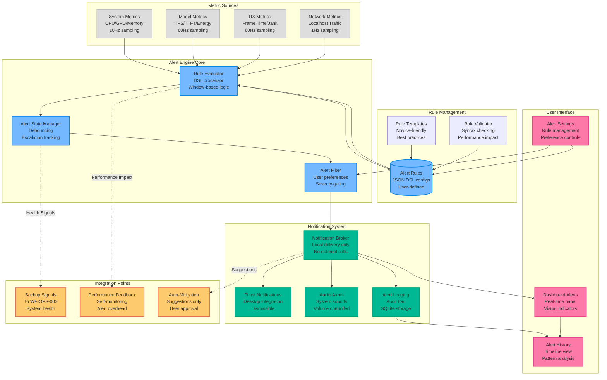
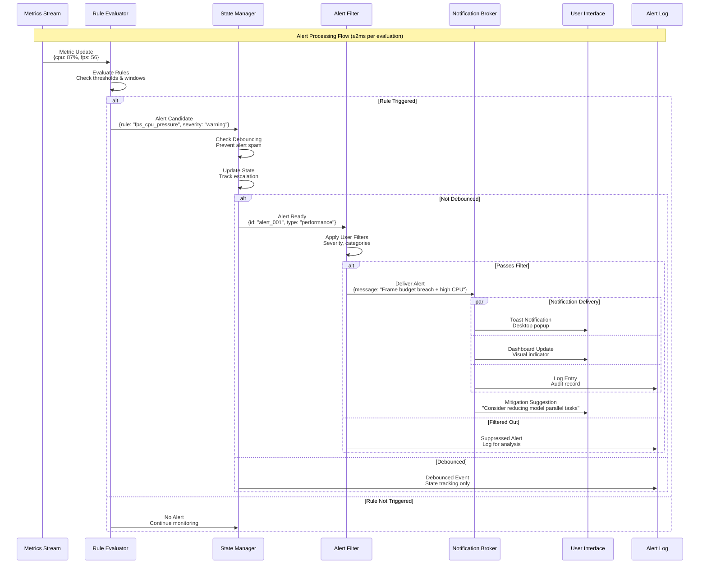
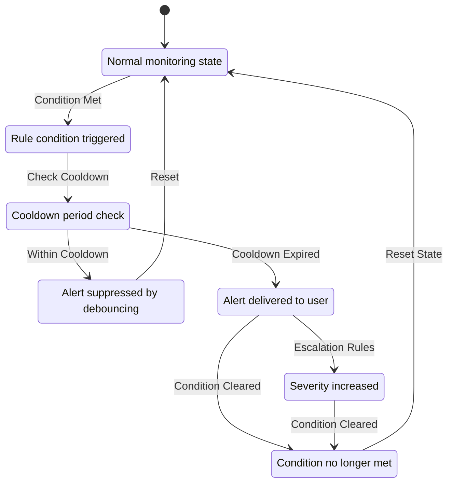
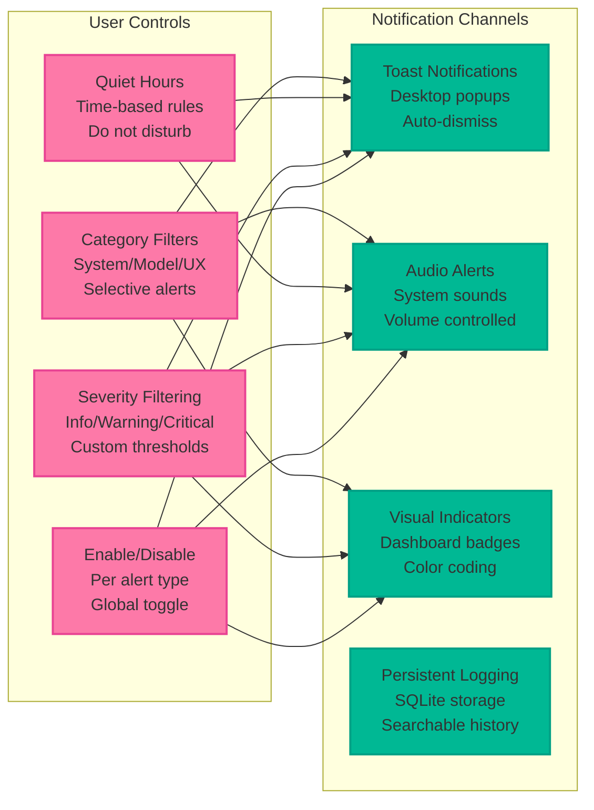

# WF-OPS-002 Alert Flow Diagram

## Overview
This diagram illustrates the complete alert processing flow from metric evaluation through local notification delivery, emphasizing user control, local-only operation, and integration with the 60Hz performance constraints.

## Alert Flow Diagram



## Alert Processing Sequence



## Alert Rule DSL Examples

### 1. Frame Budget Violation Alert
```json
{
  "id": "rule.frame_budget_breach",
  "version": "1.0",
  "name": "Frame Budget Breach",
  "description": "Detects sustained frame timing violations",
  "enabled": true,
  "severity": "warning",
  "conditions": {
    "when_all": [
      {
        "metric": "ui.frame_time_ms.p95",
        "operator": ">",
        "value": 16.67,
        "window": "10s"
      },
      {
        "metric": "ui.dropped_frames",
        "operator": ">",
        "value": 2,
        "window": "10s"
      }
    ]
  },
  "actions": [
    {
      "type": "notify.toast",
      "level": "warning",
      "message": "Frame budget exceeded - UI performance degraded",
      "duration_ms": 5000
    },
    {
      "type": "suggest.mitigation",
      "target": "performance.reduce_quality",
      "message": "Consider reducing visual quality or model load"
    },
    {
      "type": "log.audit",
      "category": "performance",
      "details": "sustained_frame_budget_breach"
    }
  ],
  "debounce": {
    "cooldown_ms": 30000,
    "max_frequency": "1_per_minute"
  },
  "privacy": "local_only",
  "user_configurable": true
}
```

### 2. Model Performance Degradation Alert
```json
{
  "id": "rule.model_performance_drop",
  "version": "1.0",
  "name": "Model Performance Drop",
  "description": "Detects significant drops in model throughput",
  "enabled": true,
  "severity": "info",
  "conditions": {
    "when_any": [
      {
        "metric": "model.tokens_per_second",
        "operator": "<",
        "value": 10.0,
        "window": "30s",
        "baseline": "5m_avg"
      },
      {
        "metric": "model.ttft_ms",
        "operator": ">",
        "value": 500,
        "window": "30s"
      }
    ]
  },
  "actions": [
    {
      "type": "notify.dashboard",
      "panel": "model_performance",
      "highlight": "throughput_chart"
    },
    {
      "type": "suggest.diagnostic",
      "message": "Run model diagnostics to identify bottlenecks",
      "action": "diagnostics.run_model_check"
    }
  ],
  "debounce": {
    "cooldown_ms": 60000,
    "escalation": {
      "after_count": 3,
      "upgrade_to": "warning"
    }
  },
  "privacy": "local_only",
  "user_configurable": true
}
```

### 3. System Resource Pressure Alert
```json
{
  "id": "rule.resource_pressure",
  "version": "1.0",
  "name": "System Resource Pressure",
  "description": "Multi-resource pressure detection with escalation",
  "enabled": true,
  "severity": "warning",
  "conditions": {
    "when_all": [
      {
        "metric": "system.cpu_percent",
        "operator": ">",
        "value": 85,
        "window": "15s"
      },
      {
        "metric": "system.memory_percent",
        "operator": ">",
        "value": 90,
        "window": "15s"
      }
    ],
    "when_any": [
      {
        "metric": "system.gpu_utilization",
        "operator": ">",
        "value": 95,
        "window": "10s"
      },
      {
        "metric": "ui.frame_time_ms.avg",
        "operator": ">",
        "value": 20,
        "window": "10s"
      }
    ]
  },
  "actions": [
    {
      "type": "notify.toast",
      "level": "warning",
      "message": "High system resource usage detected",
      "duration_ms": 8000
    },
    {
      "type": "notify.sound",
      "sound": "system_warning",
      "volume": 0.7
    },
    {
      "type": "suggest.mitigation",
      "target": "system.reduce_load",
      "message": "Consider pausing non-critical tasks",
      "actions": [
        "models.pause_background",
        "ui.reduce_effects",
        "monitoring.reduce_frequency"
      ]
    },
    {
      "type": "signal.backup",
      "message": "defer_backup_high_load",
      "duration_ms": 300000
    }
  ],
  "debounce": {
    "cooldown_ms": 120000,
    "escalation": {
      "after_duration_ms": 300000,
      "upgrade_to": "critical"
    }
  },
  "privacy": "local_only",
  "user_configurable": true
}
```

## Alert State Management



## Notification Delivery System

### Local-Only Notification Types


## Performance Constraints

### Alert Processing Budget
- **Rule Evaluation**: ≤2ms per metric update
- **State Management**: ≤1ms per alert state change
- **Notification Delivery**: ≤5ms per notification
- **Total Alert Overhead**: ≤1% of system CPU

### Memory Usage Limits
- **Rule Storage**: ≤10MB for all active rules
- **Alert History**: ≤50MB with automatic rotation
- **State Tracking**: ≤5MB for active alert states

### Scalability Constraints
- **Maximum Rules**: 1000 active rules per system
- **Alert Frequency**: Maximum 10 alerts per second
- **History Retention**: 30 days default, user configurable

## Integration with WF-OPS-003 Backup System

### Backup Health Signals
```javascript
// Alert engine signals to backup system
const backupSignals = {
  // System health indicators
  system_healthy: cpu < 60 && memory < 80 && fps > 58,
  
  // Safe backup windows
  safe_backup_window: !activeAlerts.some(a => 
    a.severity === 'critical' || a.category === 'performance'
  ),
  
  // Defer backup recommendations
  defer_backup: {
    high_load: cpu > 85 || memory > 90,
    performance_issues: fps < 55 || frame_time > 18,
    active_critical_alerts: criticalAlerts.length > 0
  }
};
```

## Privacy and Security

### Local-Only Operation
- **No External Calls**: All notifications delivered locally
- **Data Retention**: User-controlled alert history retention
- **Privacy Compliance**: No PII in alert messages by default

### User Control
- **Granular Permissions**: Per-alert-type enable/disable
- **Transparency**: Clear indication of what triggers alerts
- **Reversibility**: All alert settings user-modifiable

---

*This alert flow diagram is part of the WF-OPS-002 asset collection and demonstrates the complete local-first alert processing system.*
