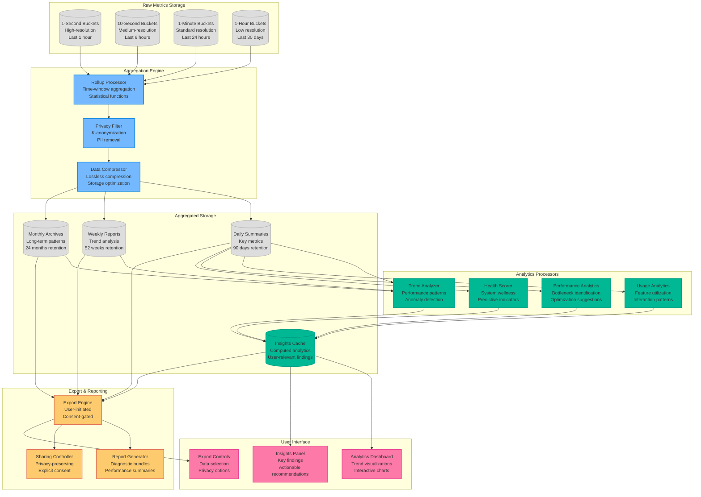
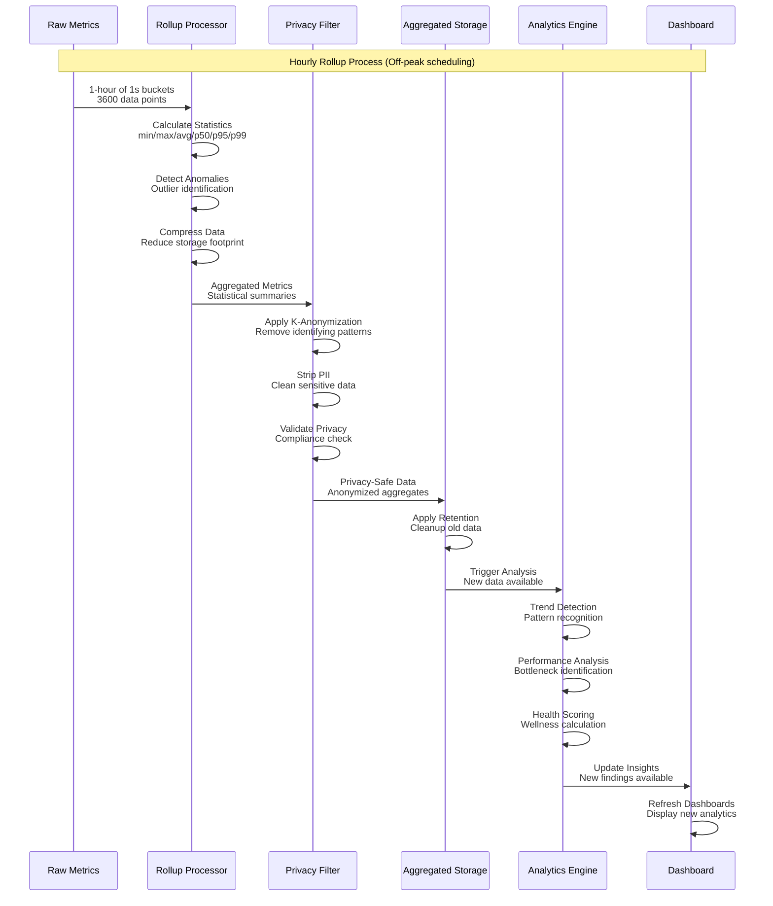
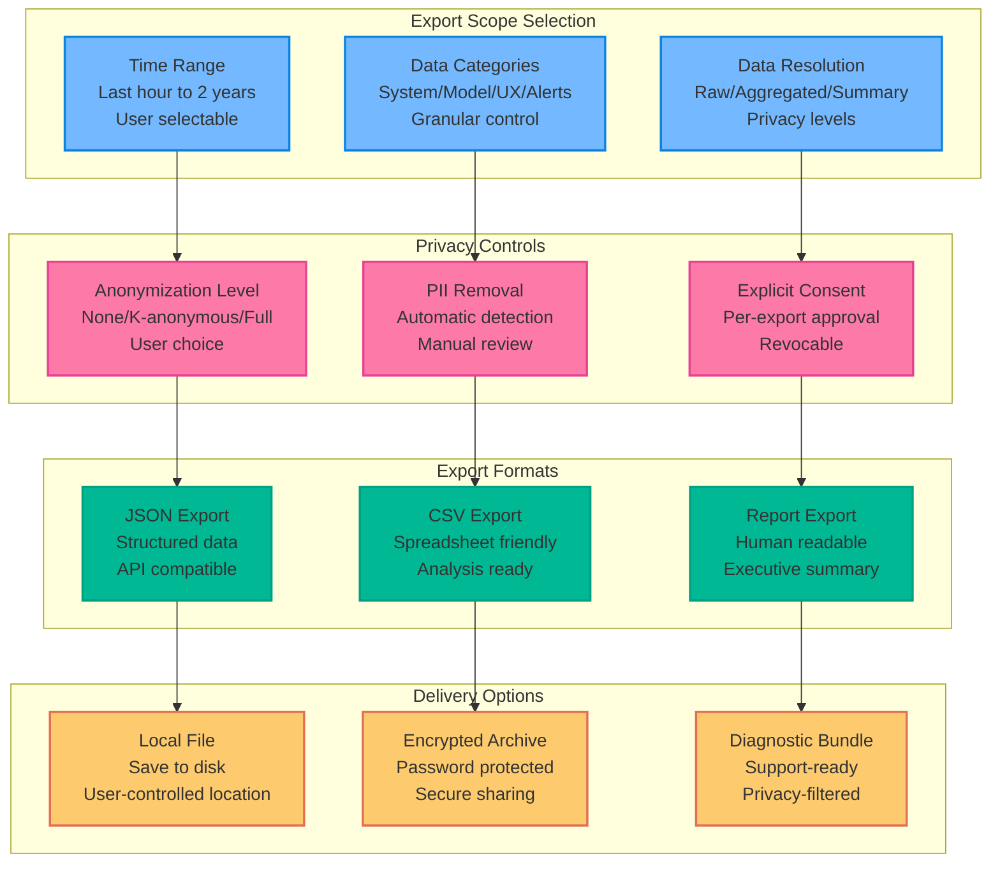

# WF-OPS-002 Analytics Rollups Diagram

## Overview
This diagram illustrates the privacy-preserving analytics and data rollup system that aggregates monitoring metrics into meaningful insights while maintaining local-first operation and user privacy controls.

## Analytics Rollups Architecture



## Rollup Processing Pipeline



## Statistical Aggregation Functions

### Time-Series Rollup Functions
```javascript
// Rollup aggregation functions
const rollupFunctions = {
  // Basic statistics
  min: (values) => Math.min(...values),
  max: (values) => Math.max(...values),
  avg: (values) => values.reduce((a, b) => a + b) / values.length,
  sum: (values) => values.reduce((a, b) => a + b, 0),
  count: (values) => values.length,
  
  // Percentiles
  p50: (values) => percentile(values, 0.5),
  p95: (values) => percentile(values, 0.95),
  p99: (values) => percentile(values, 0.99),
  
  // Variability
  stddev: (values) => standardDeviation(values),
  variance: (values) => variance(values),
  
  // Trend indicators
  slope: (values, timestamps) => linearRegression(values, timestamps).slope,
  correlation: (x, y) => pearsonCorrelation(x, y),
  
  // Performance-specific
  frame_budget_compliance: (frameTimes) => 
    frameTimes.filter(t => t <= 16.67).length / frameTimes.length,
  
  energy_efficiency: (tokens, energy) => 
    tokens.reduce((a, b) => a + b) / energy.reduce((a, b) => a + b)
};
```

### Privacy-Preserving Aggregation

```mermaid
flowchart LR
    subgraph "Raw Data"
        INDIVIDUAL[Individual Metrics<br/>User-identifiable<br/>High precision]
    end
    
    subgraph "K-Anonymization"
        GROUP[Group by Ranges<br/>Bucket similar values<br/>k ≥ 5 minimum]
        SUPPRESS[Suppress Outliers<br/>Remove unique values<br/>Protect privacy]
    end
    
    subgraph "Statistical Aggregation"
        STATS[Calculate Statistics<br/>Mean, median, percentiles<br/>No individual traces]
        PATTERNS[Extract Patterns<br/>Trends and correlations<br/>Population-level only]
    end
    
    subgraph "Privacy-Safe Output"
        ANONYMOUS[Anonymous Aggregates<br/>No re-identification<br/>Statistical utility preserved]
    end
    
    INDIVIDUAL --> GROUP
    GROUP --> SUPPRESS
    SUPPRESS --> STATS
    STATS --> PATTERNS
    PATTERNS --> ANONYMOUS
    
    classDef raw fill:#ff6b6b,stroke:#d63031,stroke-width:2px
    classDef privacy fill:#74b9ff,stroke:#0984e3,stroke-width:2px
    classDef safe fill:#00b894,stroke:#00a085,stroke-width:2px
    
    class INDIVIDUAL raw
    class GROUP,SUPPRESS,STATS,PATTERNS privacy
    class ANONYMOUS safe
```


## Analytics Insight Generation

### Performance Trend Analysis
```json
{
  "insight_id": "perf_trend_001",
  "type": "performance_trend",
  "generated_at": "2024-08-19T12:00:00Z",
  "time_range": "7_days",
  "category": "model_performance",
  "findings": {
    "tokens_per_second": {
      "trend": "declining",
      "change_percent": -12.5,
      "significance": 0.95,
      "pattern": "gradual_degradation"
    },
    "memory_usage": {
      "trend": "increasing",
      "change_percent": 8.3,
      "significance": 0.87,
      "pattern": "memory_leak_suspected"
    }
  },
  "recommendations": [
    {
      "action": "investigate_memory_usage",
      "priority": "high",
      "description": "Memory usage trending upward, potential leak"
    },
    {
      "action": "model_performance_analysis",
      "priority": "medium",
      "description": "Token generation rate declining over time"
    }
  ],
  "confidence": 0.91,
  "privacy_level": "anonymous_aggregate"
}
```

### Usage Pattern Analytics
```json
{
  "insight_id": "usage_pattern_002",
  "type": "usage_analytics",
  "generated_at": "2024-08-19T12:00:00Z",
  "time_range": "30_days",
  "category": "feature_utilization",
  "findings": {
    "peak_usage_hours": [9, 10, 11, 14, 15, 16],
    "feature_adoption": {
      "monitoring_dashboard": 0.85,
      "alert_customization": 0.32,
      "export_functionality": 0.08
    },
    "performance_correlation": {
      "high_usage_periods": {
        "avg_cpu": 67.2,
        "avg_memory": 78.5,
        "avg_fps": 59.1
      },
      "low_usage_periods": {
        "avg_cpu": 23.4,
        "avg_memory": 45.2,
        "avg_fps": 60.0
      }
    }
  },
  "recommendations": [
    {
      "action": "optimize_peak_hours",
      "priority": "medium",
      "description": "Consider resource optimization during peak usage"
    },
    {
      "action": "improve_alert_discoverability",
      "priority": "low",
      "description": "Low adoption of alert customization features"
    }
  ],
  "confidence": 0.88,
  "privacy_level": "k_anonymous_5"
}
```

## Data Retention and Lifecycle

```mermaid
gantt
    title Data Retention Lifecycle
    dateFormat X
    axisFormat %d days
    
    section High Resolution
    1-second buckets    :0, 1
    10-second buckets   :0, 1
    
    section Medium Resolution  
    1-minute buckets    :1, 7
    5-minute buckets    :7, 30
    
    section Low Resolution
    1-hour buckets      :30, 365
    Daily summaries     :365, 730
    
    section Long-term Archives
    Weekly reports      :730, 1095
    Monthly archives    :1095, 1460
```



### Retention Policy Configuration
```json
{
  "retention_policies": {
    "high_frequency": {
      "1_second": "1_hour",
      "10_second": "6_hours",
      "1_minute": "24_hours"
    },
    "medium_frequency": {
      "5_minute": "7_days",
      "15_minute": "30_days",
      "1_hour": "90_days"
    },
    "low_frequency": {
      "daily": "2_years",
      "weekly": "3_years",
      "monthly": "5_years"
    },
    "analytics": {
      "insights": "1_year",
      "trends": "2_years",
      "patterns": "indefinite_anonymous"
    }
  },
  "cleanup_schedule": "daily_at_02:00",
  "compression": {
    "enabled": true,
    "algorithm": "lz4",
    "threshold_age": "7_days"
  },
  "user_configurable": true
}
```

## Export and Sharing Controls

### Privacy-Preserving Export Options


## Performance and Storage Optimization

### Rollup Processing Performance
- **Batch Processing**: Process rollups during low-activity periods
- **Incremental Updates**: Only process new data since last rollup
- **Memory Efficiency**: Stream processing for large datasets
- **CPU Budget**: Limit rollup processing to ≤10% CPU usage

### Storage Efficiency Metrics
```javascript
const storageMetrics = {
  // Compression ratios by data type
  raw_metrics: {
    uncompressed_mb: 1024,
    compressed_mb: 256,
    compression_ratio: 4.0
  },
  
  // Retention effectiveness
  data_lifecycle: {
    total_collected_gb: 50.2,
    current_storage_gb: 12.8,
    retention_efficiency: 0.745
  },
  
  // Query performance
  query_performance: {
    avg_query_time_ms: 45,
    cache_hit_rate: 0.87,
    index_efficiency: 0.92
  }
};
```

## Integration with Monitoring Dashboard

### Real-time Analytics Display
- **Trend Indicators**: Show performance trends in real-time
- **Insight Notifications**: Surface important findings automatically
- **Interactive Exploration**: Drill-down from summaries to raw data
- **Comparative Analysis**: Compare current vs. historical performance

### User Experience Considerations
- **Progressive Disclosure**: Show summaries first, details on demand
- **Contextual Help**: Explain analytics findings in user-friendly terms
- **Actionable Insights**: Provide specific recommendations with each finding
- **Privacy Transparency**: Clear indication of data processing and retention

---

*This analytics rollups diagram is part of the WF-OPS-002 asset collection and demonstrates the privacy-preserving analytics and data aggregation system for local-first monitoring.*
