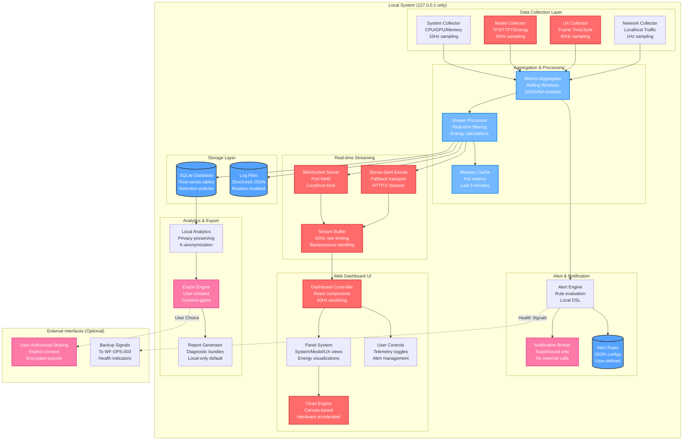

# WF-OPS-002 Monitoring Architecture Diagram

## Overview
This diagram illustrates the complete local-first monitoring architecture for WIRTHFORGE, showing how system, model, and UX metrics flow through collectors, aggregators, and real-time dashboards while maintaining 60Hz performance and strict localhost-only operation.

## Architecture Diagram

## Key Architectural Principles

### 1. Local-First Operation
- **No External Dependencies**: All monitoring operates on localhost (127.0.0.1)
- **Offline Capable**: Full functionality without internet connectivity
- **Data Sovereignty**: All metrics stored locally by default

### 2. Performance Constraints
- **60Hz UI Rendering**: Dashboard maintains 60 FPS with 16.67ms frame budget
- **Non-Blocking Collection**: Collectors never impact main application performance
- **Efficient Aggregation**: Rolling windows prevent unbounded memory growth

### 3. Energy-Truth Visualization
- **Real Metrics Mapping**: Energy ribbons width = actual throughput
- **Token Velocity**: Particle speed maps to measured token/second rates
- **Entropy Visualization**: Particle density reflects actual entropy calculations

### 4. Privacy & Security
- **Telemetry Controls**: User toggles for all data collection
- **Local Notifications**: No external alert services
- **Consent-Gated Exports**: Explicit approval for any data sharing

## Component Details

### Data Collection Layer
- **System Collector**: Uses `psutil` and OS APIs for CPU/GPU/memory metrics
- **Model Collector**: Hooks into AI model runtime for performance metrics
- **UX Collector**: Monitors frame timing and interaction latency
- **Network Collector**: Tracks localhost-only network activity

### Aggregation & Processing
- **Metrics Aggregator**: Combines streams into time-windowed buckets
- **Stream Processor**: Real-time filtering and energy calculations
- **Memory Cache**: Hot metrics for immediate dashboard updates

### Storage Layer
- **SQLite Database**: Time-series tables with automatic retention
- **Log Files**: Structured JSON logs with rotation policies

### Alert & Notification
- **Alert Engine**: Evaluates user-defined rules against metric streams
- **Notification Broker**: Local-only notifications (toast, sound)
- **Alert Rules**: JSON-based DSL for flexible alert conditions

### Real-time Streaming
- **WebSocket Server**: Primary real-time transport on port 9445
- **Server-Sent Events**: HTTP/2 fallback for streaming
- **Stream Buffer**: Rate limiting and backpressure handling

### Web Dashboard UI
- **Dashboard Controller**: React-based component system
- **Panel System**: Modular views for different metric categories
- **Chart Engine**: Hardware-accelerated canvas rendering
- **User Controls**: Telemetry and alert management interface

### Analytics & Export
- **Local Analytics**: Privacy-preserving aggregations
- **Export Engine**: User-initiated data exports
- **Report Generator**: Diagnostic bundle creation

## Integration Points

### WF-OPS-001 Dependencies
- Uses localhost HTTPS server and SQLite database
- Leverages certificate infrastructure for secure WebSockets
- Integrates with service management for collector lifecycle

### WF-OPS-003 Integration
- Provides backup health signals and readiness indicators
- Monitors system load for safe backup windows
- Alerts on storage and performance issues

### WF-UX-006 Performance Optimization
- Consumes UX performance targets and jank budgets
- Provides real-time performance feedback for optimization
- Integrates with frame timing measurement systems

## Security Considerations

### Network Isolation
- All services bind to 127.0.0.1 only
- No external network connections in core monitoring
- Optional sharing requires explicit user consent

### Data Protection
- Metrics stored with user-controlled retention
- No PII or sensitive content in default exports
- Encryption for any external data sharing

### Access Control
- Web interface requires localhost access
- No remote monitoring capabilities
- User controls for all telemetry collection

## Performance Guarantees

### Real-time Constraints
- Dashboard rendering: ≥58 FPS average
- Frame budget: ≤16.67ms per frame (95th percentile)
- Stream latency: ≤100ms end-to-end

### Resource Efficiency
- Collector overhead: ≤2% CPU usage
- Memory footprint: ≤100MB for full monitoring stack
- Storage growth: Configurable retention with automatic cleanup

### Scalability Limits
- Metrics throughput: Up to 10,000 metrics/second
- Concurrent dashboard users: Up to 5 simultaneous connections
- Historical data: Configurable retention (default 30 days)

---

*This architecture diagram is part of the WF-OPS-002 asset collection and demonstrates the complete local-first monitoring system design.*
