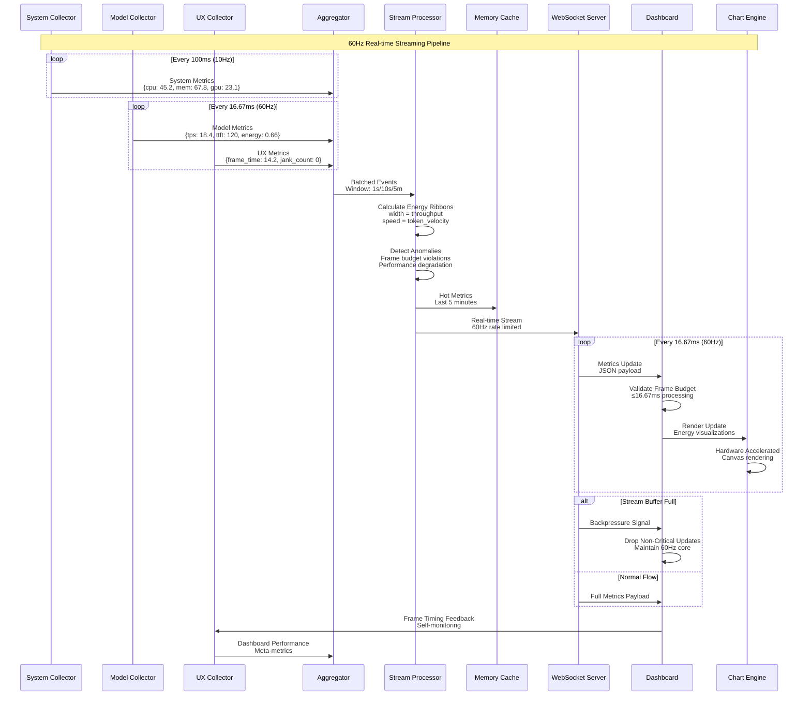
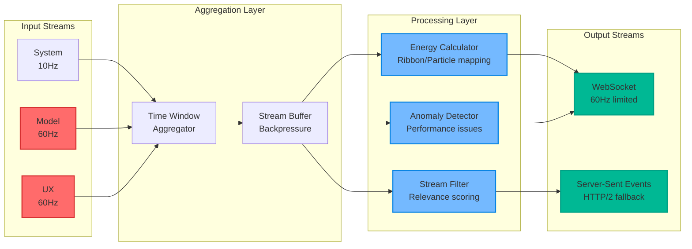
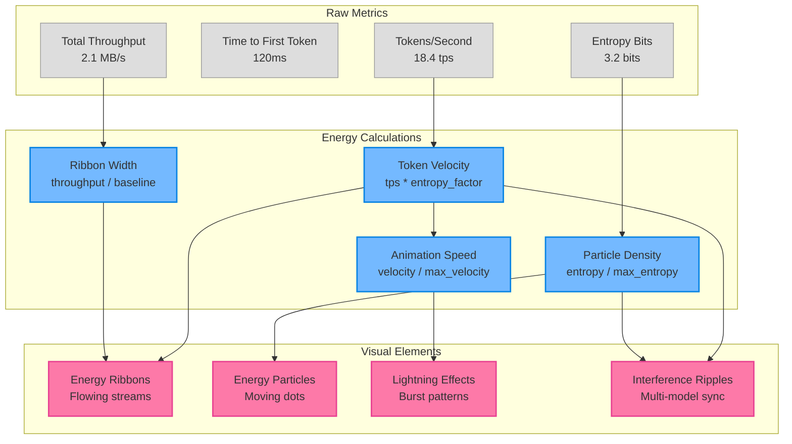
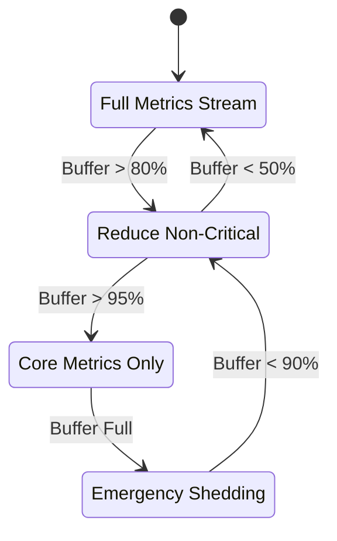

# WF-OPS-002 Streaming Pipeline Diagram

## Overview
This diagram details the real-time streaming pipeline that delivers metrics from collectors to dashboards at 60Hz while maintaining performance constraints and energy-truth visualization principles.

## Streaming Pipeline Diagram



## Pipeline Flow Details

### 1. Multi-Frequency Collection

```mermaid
gantt
    title Collector Sampling Frequencies
    dateFormat X
    axisFormat %L ms
    
    section System (10Hz)
    CPU/Memory/GPU    :0, 100
    Network I/O       :0, 100
    Disk Usage        :0, 100
    
    section Model (60Hz) 
    Token Rate        :0, 16
    TTFT Timing       :0, 16
    Energy Calc       :0, 16
    
    section UX (60Hz)
    Frame Timing      :0, 16
    Input Latency     :0, 16
    Jank Detection    :0, 16
```


### 2. Stream Processing Pipeline


### 3. Energy-Truth Visualization Mapping


## Performance Constraints & Guarantees

### Frame Budget Enforcement
```javascript
// Pseudo-code for frame budget enforcement
class StreamProcessor {
    processMetrics(metrics, frameStartTime) {
        const FRAME_BUDGET_MS = 16.67;
        const processed = [];
        
        for (const metric of metrics) {
            const elapsed = performance.now() - frameStartTime;
            if (elapsed > FRAME_BUDGET_MS * 0.8) {
                // Defer remaining metrics to next frame
                this.deferredQueue.push(...metrics.slice(processed.length));
                break;
            }
            processed.push(this.processMetric(metric));
        }
        
        return processed;
    }
}
```

### Backpressure Handling


## Stream Message Formats

### System Metrics Stream
```json
{
  "timestamp": 1724049600123,
  "source": "system",
  "type": "metrics",
  "data": {
    "cpu_percent": 45.2,
    "memory_percent": 67.8,
    "gpu_utilization": 23.1,
    "gpu_memory_mb": 2048,
    "disk_io_read_mb": 12.4,
    "disk_io_write_mb": 8.7,
    "network_bytes_in": 1024,
    "network_bytes_out": 512
  },
  "window": "10s_avg",
  "frame_budget_used_ms": 2.1
}
```

### Model Performance Stream
```json
{
  "timestamp": 1724049600140,
  "source": "model:llama7b",
  "type": "performance",
  "data": {
    "tokens_per_second": 18.4,
    "ttft_ms": 120,
    "queue_wait_ms": 45,
    "cache_hit_rate": 0.85,
    "batch_size": 4,
    "energy_normalized": 0.66,
    "entropy_bits": 3.2,
    "gpu_utilization": 74.0,
    "vram_used_mb": 5221
  },
  "energy_visual": {
    "ribbon_width": 0.73,
    "particle_density": 0.64,
    "animation_speed": 0.82,
    "lightning_intensity": 0.45
  },
  "frame_budget_used_ms": 1.8
}
```

### UX Performance Stream
```json
{
  "timestamp": 1724049600156,
  "source": "ui",
  "type": "performance",
  "data": {
    "frame_time_ms": 14.2,
    "dropped_frames": 0,
    "input_latency_ms": 8.5,
    "paint_time_ms": 3.2,
    "layout_time_ms": 2.1,
    "jank_budget_used": 0.85,
    "interaction_score": 0.95
  },
  "alerts": {
    "frame_budget_breach": false,
    "sustained_jank": false,
    "input_lag_warning": false
  },
  "frame_budget_used_ms": 0.9
}
```

## Quality Assurance

### Stream Integrity Checks
- **Timestamp Ordering**: Enforce chronological message delivery
- **Frame Budget Compliance**: Monitor processing time per message
- **Data Completeness**: Validate required fields in each stream
- **Rate Limiting**: Enforce 60Hz maximum for high-frequency streams

### Performance Monitoring
- **End-to-End Latency**: Collector → Dashboard ≤ 100ms
- **Stream Throughput**: Support up to 10,000 metrics/second
- **Memory Usage**: Stream buffers ≤ 50MB total
- **CPU Overhead**: Stream processing ≤ 5% CPU usage

### Error Handling
- **Connection Drops**: Automatic WebSocket reconnection
- **Buffer Overflow**: Graceful metric shedding
- **Processing Errors**: Isolate and log without stream interruption
- **Performance Degradation**: Automatic quality reduction

---

*This streaming pipeline diagram is part of the WF-OPS-002 asset collection and demonstrates the real-time data flow architecture for local-first monitoring.*
