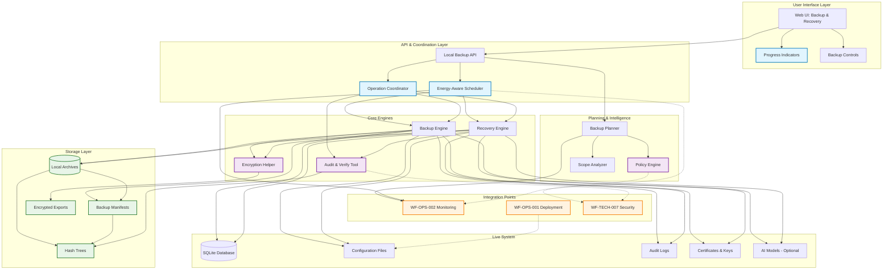

# WF-OPS-003 Backup Architecture

## Local-First Backup & Recovery System Architecture

## Key Architecture Principles

### 1. Local-First Design
- **Primary Storage**: All backups stored locally by default
- **Optional Export**: Encrypted exports only with explicit user consent
- **No External Dependencies**: Operates entirely offline

### 2. Performance Preservation
- **Frame Budget Respect**: Maintains 60Hz UI responsiveness (≤16.67ms)
- **Energy-Aware Scheduling**: Coordinates with monitoring for safe backup windows
- **Throttling Capability**: Pauses operations when system under load

### 3. Security & Privacy
- **Content Addressing**: SHA-256 hashing for integrity verification
- **Immutable Audit Trail**: Cryptographic proof of backup integrity
- **Encryption by Choice**: User-controlled encryption for exports

### 4. Integration Points
- **WF-OPS-002**: Monitoring signals for scheduling and health reporting
- **WF-OPS-001**: File layout and service management integration
- **WF-TECH-007**: Security policies and encryption standards

### 5. Data Flow Patterns
- **Backup Flow**: Live System → Planner → Engine → Local Storage
- **Recovery Flow**: Local Storage → Recovery Engine → Live System
- **Audit Flow**: All operations → Audit Tool → Hash Trees
- **Export Flow**: Local Storage → Encryption → User-Controlled Export
