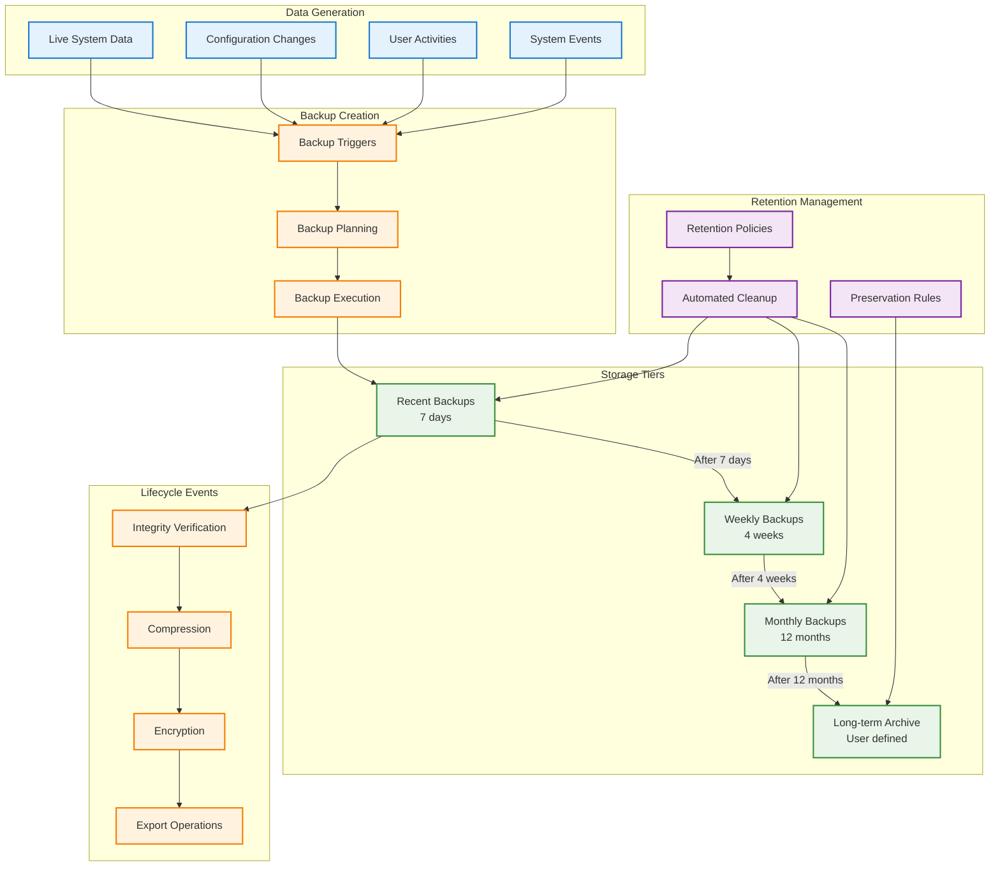
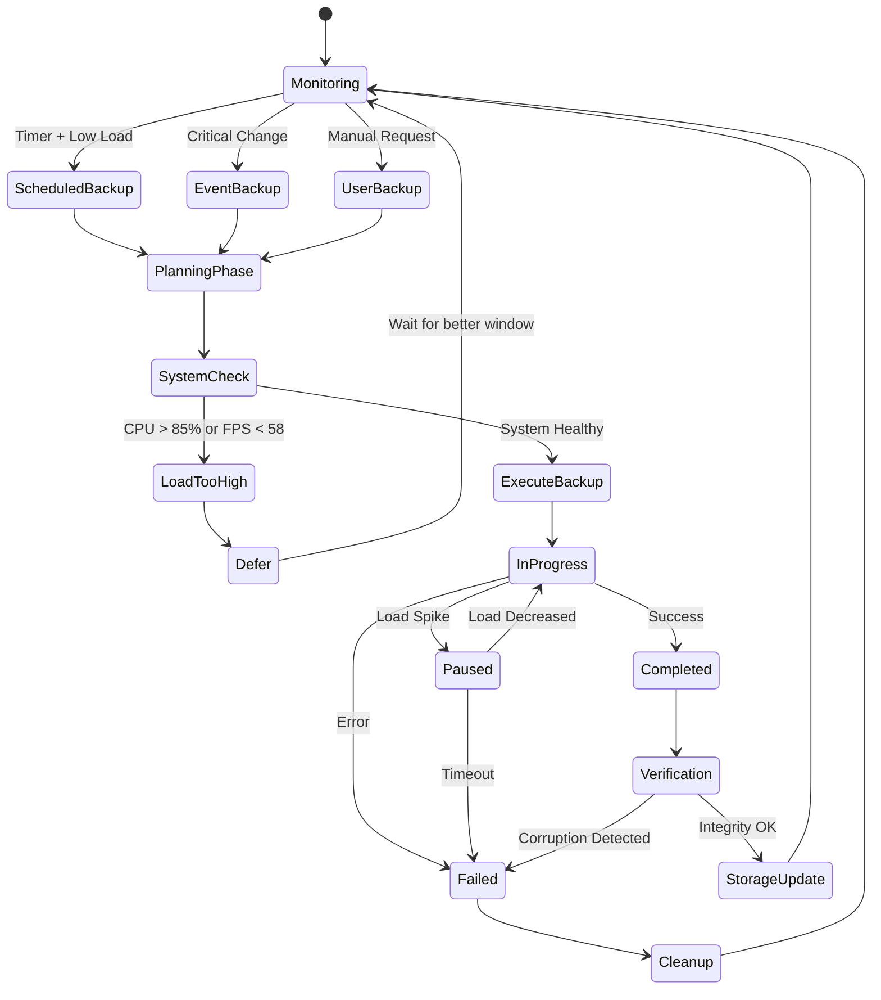

# WF-OPS-003 Data Lifecycle

## Backup Data Lifecycle Management



## Backup Triggers & Scheduling



## Data Retention Policies

```mermaid
graph TD
    subgraph "Retention Rules"
        COUNT[Count-Based<br/>Keep last N backups]
        TIME[Time-Based<br/>Keep for X days/months]
        SIZE[Size-Based<br/>Keep within storage limit]
        PRESERVE[Preservation<br/>Never delete tagged backups]
    end
    
    subgraph "Backup Categories"
        FULL[Full Backups]
        INCR[Incremental Backups]
        DIFF[Differential Backups]
        SNAP[Snapshots]
    end
    
    subgraph "Retention Tiers"
        DAILY[Daily: 7 backups]
        WEEKLY[Weekly: 4 backups]
        MONTHLY[Monthly: 12 backups]
        YEARLY[Yearly: Indefinite]
    end
    
    subgraph "Cleanup Process"
        SCAN[Scan Backups]
        EVAL[Evaluate Retention]
        CONFIRM[User Confirmation]
        DELETE[Safe Deletion]
        AUDIT_LOG[Audit Logging]
    end
    
    %% Policy Application
    COUNT --> FULL
    COUNT --> INCR
    TIME --> DIFF
    SIZE --> SNAP
    PRESERVE --> YEARLY
    
    %% Tier Assignment
    FULL --> DAILY
    INCR --> DAILY
    DIFF --> WEEKLY
    SNAP --> MONTHLY
    
    %% Cleanup Flow
    SCAN --> EVAL
    EVAL --> CONFIRM
    CONFIRM --> DELETE
    DELETE --> AUDIT_LOG
    
    %% Safety Rules
    PRESERVE -.-> DELETE : Block Deletion
    CONFIRM -.-> DELETE : User Approval Required
    
    classDef policy fill:#f3e5f5,stroke:#7b1fa2,stroke-width:2px
    classDef backup fill:#e3f2fd,stroke:#1976d2,stroke-width:2px
    classDef tier fill:#e8f5e8,stroke:#388e3c,stroke-width:2px
    classDef process fill:#fff3e0,stroke:#f57c00,stroke-width:2px
    
    class COUNT,TIME,SIZE,PRESERVE policy
    class FULL,INCR,DIFF,SNAP backup
    class DAILY,WEEKLY,MONTHLY,YEARLY tier
    class SCAN,EVAL,CONFIRM,DELETE,AUDIT_LOG process
```

## Energy-Aware Lifecycle Management

### 1. Backup Timing Optimization
- **Low Load Windows**: Schedule during CPU < 60%, FPS ≥ 58
- **Energy Monitoring**: Coordinate with WF-OPS-002 for optimal timing
- **User Activity**: Defer during active user sessions

### 2. Progressive Processing
- **Chunked Operations**: Process files in small chunks to maintain frame budget
- **Pause/Resume**: Automatic pause when system load increases
- **Background Processing**: Low-priority background operations

### 3. Storage Optimization
- **Compression Scheduling**: Compress older backups during idle periods
- **Deduplication**: Content-addressed storage reduces redundancy
- **Cleanup Timing**: Run cleanup only during healthy system windows

### 4. Export Lifecycle
- **On-Demand Export**: Generate encrypted exports only when requested
- **Temporary Storage**: Clean up export files after user download
- **Consent Tracking**: Maintain audit trail of export permissions
