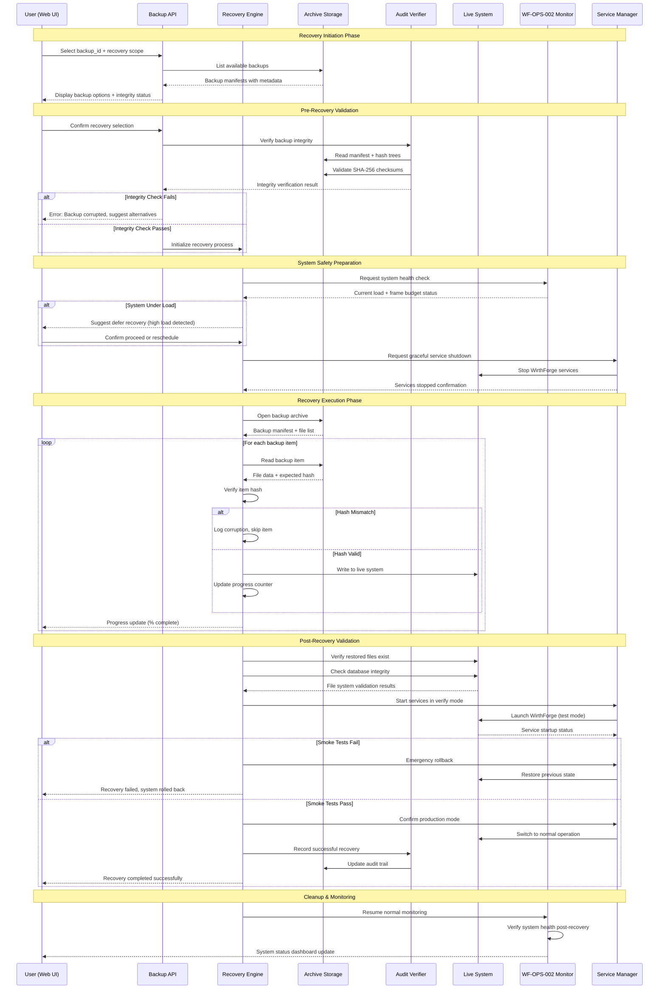
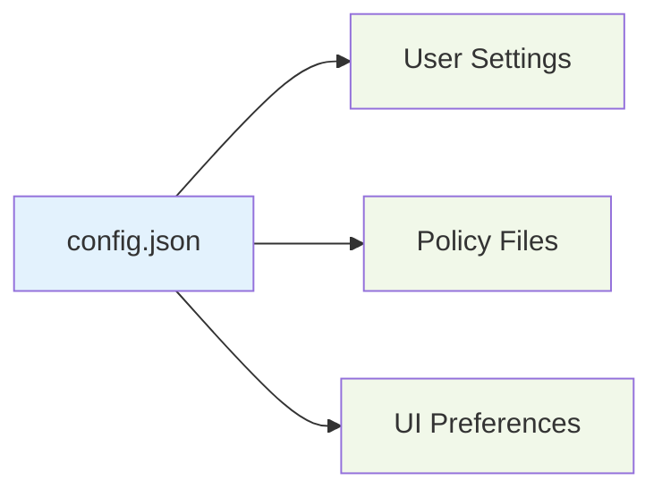
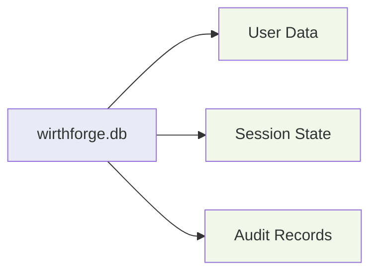
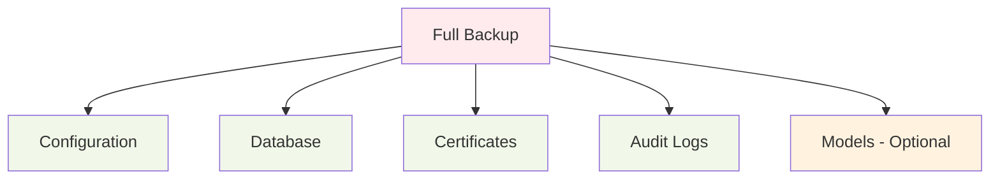

# WF-OPS-003 Recovery Sequence

## Backup Recovery Flow with Safety Checks

## Recovery Scope Options

### 1. Configuration Only

### 2. Database Only

### 3. Full System Recovery

## Safety Mechanisms

### 1. Pre-Recovery Checks
- Backup integrity verification (SHA-256)
- System load assessment
- Service dependency validation
- Disk space availability

### 2. During Recovery
- Progressive hash validation
- Atomic file operations
- Progress tracking with rollback points
- Frame budget monitoring

### 3. Post-Recovery Validation
- Service startup verification
- Database consistency checks
- Configuration validation
- Smoke test execution

### 4. Emergency Rollback
- Automatic rollback on smoke test failure
- Manual rollback option during recovery
- Previous state preservation
- Audit trail of rollback events
