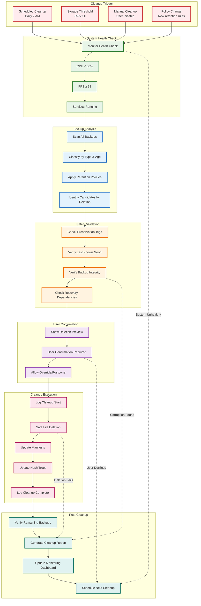
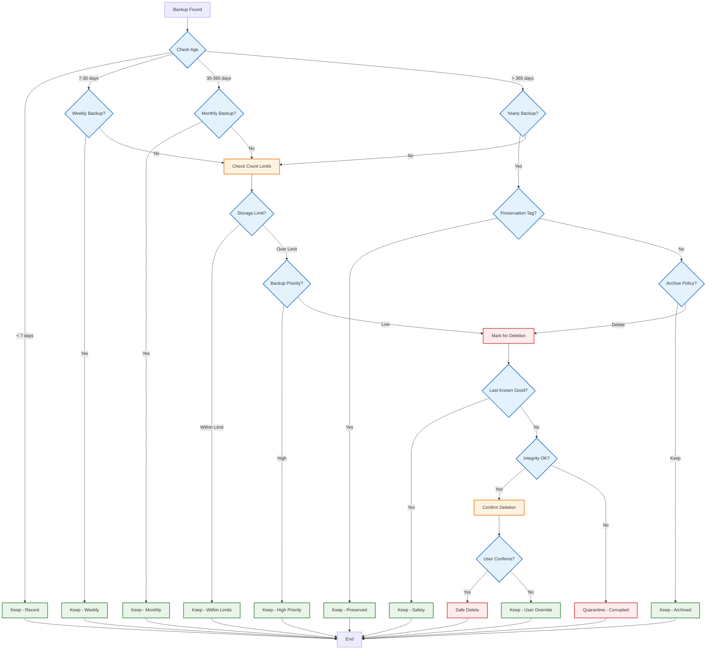
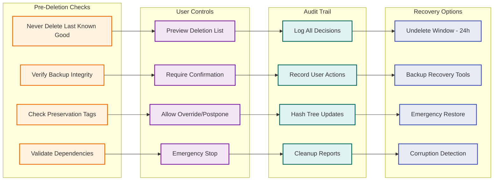

# WF-OPS-003 Retention & Cleanup Flow

## Automated Backup Retention & Cleanup Process

## Retention Policy Decision Tree

## Cleanup Safety Mechanisms

## Performance-Aware Cleanup

### 1. Energy-Aware Scheduling
- **Low Load Windows**: Run cleanup during CPU < 60%, FPS ≥ 58
- **Monitoring Integration**: Coordinate with WF-OPS-002 for optimal timing
- **Pause/Resume**: Automatic pause when system load increases

### 2. Frame Budget Preservation
- **Chunked Processing**: Process deletions in small batches
- **Progress Tracking**: Real-time progress with frame budget monitoring
- **Background Operations**: Low-priority cleanup operations

### 3. Storage Optimization
- **Incremental Cleanup**: Process backups incrementally
- **Deferred Operations**: Defer heavy operations to idle periods
- **Memory Management**: Efficient memory usage during large cleanups

### 4. User Experience
- **Non-Blocking UI**: Cleanup runs without blocking user interface
- **Progress Indicators**: Visual feedback with energy-aware animations
- **Cancellation Support**: Allow user to stop cleanup operations
