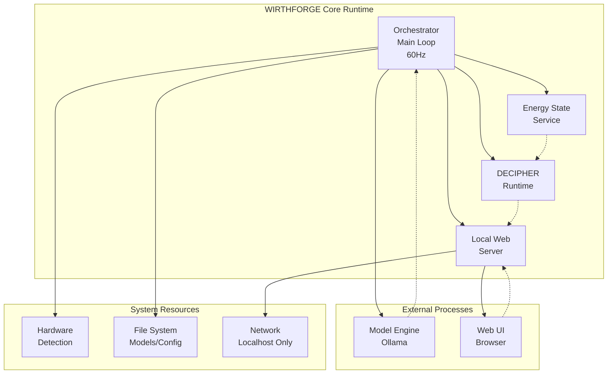

# WF-TECH-001-PROCESS-GRAPH: Main Orchestrator Components

## Process Graph: Core Runtime Architecture

## Component Descriptions

- **Orchestrator**: Central 60Hz control loop managing all system components
- **Energy State Service**: Real-time energy metrics and state management
- **DECIPHER Runtime**: Token→energy mapping and compilation
- **Local Web Server**: FastAPI server serving browser-based UI
- **Model Engine**: Ollama process for local AI inference
- **Web UI**: Browser-based interface for user interaction
- **Hardware Detection**: Auto-detection of CPU/GPU/RAM capabilities
- **File System**: Local storage for models, config, and logs
- **Network**: Localhost-only networking for security
