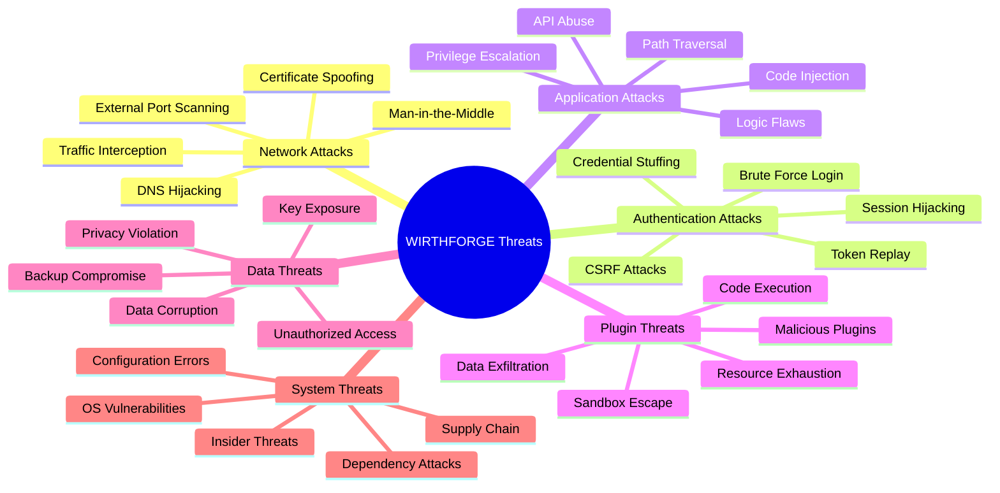
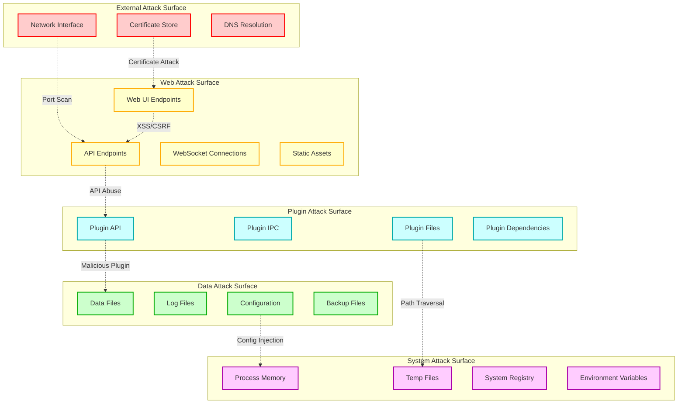
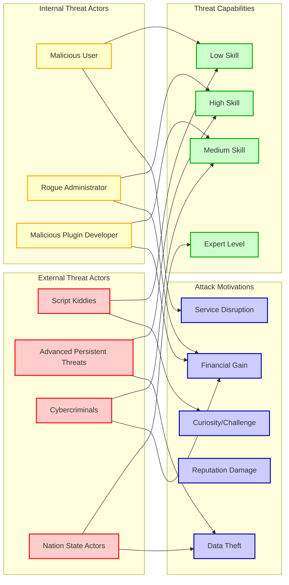
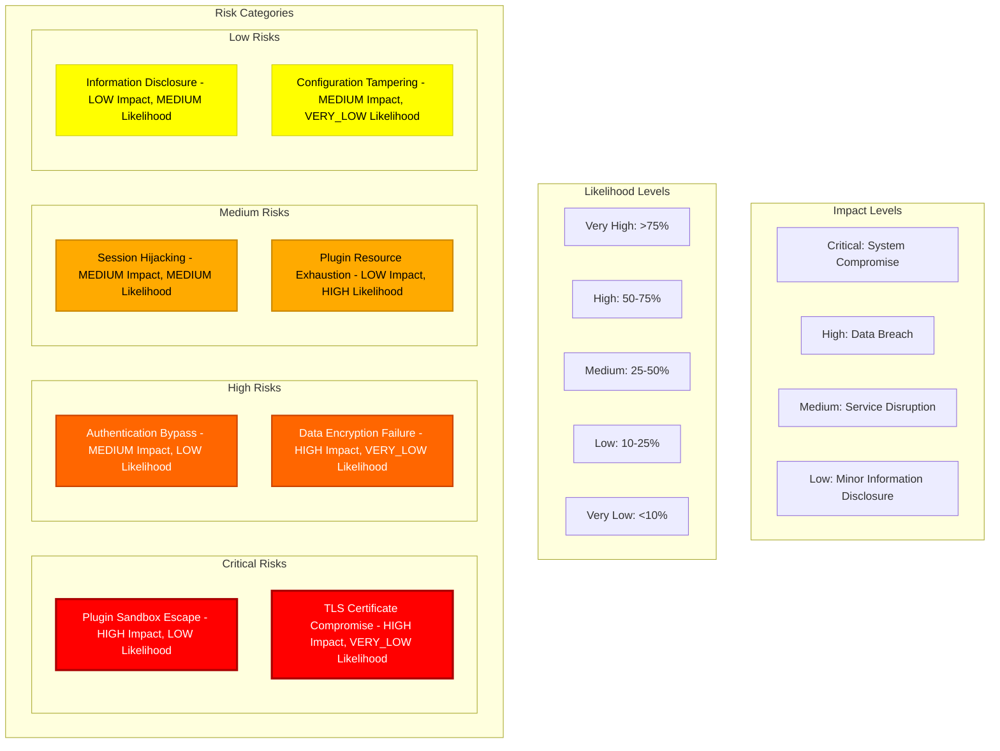

# WF-TECH-006 Threat Model
## WIRTHFORGE Security & Privacy Threat Analysis

### Threat Landscape Overview



### Attack Surface Analysis



### Threat Actor Analysis



### Detailed Threat Scenarios

```mermaid
sequenceDiagram
    participant Attacker as External Attacker
    participant Network as Network Layer
    participant Auth as Authentication
    participant App as Application
    participant Plugin as Plugin System
    participant Data as Data Layer
    
    Note over Attacker,Data: Scenario 1: Network Penetration Attack
    
    Attacker->>Network: Port scan 127.0.0.1
    Network-->>Attacker: Ports 8145, 8146 open
    
    Attacker->>Network: Attempt external connection
    Network-->>Attacker: Connection refused (localhost only)
    
    Attacker->>Network: DNS hijacking attempt
    Network->>Auth: Malicious certificate presented
    Auth-->>Network: Certificate validation failed
    
    Note over Attacker,Data: Attack blocked at network layer
    
    ---
    
    Note over Attacker,Data: Scenario 2: Authentication Bypass Attack
    
    Attacker->>Auth: Brute force login attempts
    Auth->>Auth: Rate limiting triggered
    Auth-->>Attacker: 429 Too Many Requests
    
    Attacker->>Auth: Session token replay
    Auth->>Auth: Token validation failed
    Auth-->>Attacker: 401 Unauthorized
    
    Attacker->>App: CSRF attack attempt
    App->>Auth: CSRF token validation
    Auth-->>App: Invalid CSRF token
    App-->>Attacker: 403 Forbidden
    
    Note over Attacker,Data: Attack blocked at authentication layer
    
    ---
    
    Note over Attacker,Data: Scenario 3: Malicious Plugin Attack
    
    Attacker->>Plugin: Submit malicious plugin
    Plugin->>Plugin: Manifest validation
    Plugin-->>Attacker: Validation failed (dangerous permissions)
    
    alt Plugin bypasses validation
        Plugin->>App: Plugin loaded in sandbox
        Plugin->>Plugin: Attempt network access
        Plugin-->>Plugin: Network blocked by sandbox
        
        Plugin->>Plugin: Attempt file system access
        Plugin-->>Plugin: Filesystem restricted to temp directory
        
        Plugin->>Data: Attempt data exfiltration
        Data->>Plugin: Access denied (insufficient permissions)
        
        Plugin->>Plugin: Resource exhaustion attempt
        Plugin->>Plugin: Memory/CPU limits enforced
        Plugin-->>App: Plugin terminated due to resource violation
    end
    
    Note over Attacker,Data: Attack contained by sandbox isolation
```

### Risk Assessment Matrix



### Threat Mitigation Mapping

```mermaid
graph TD
    subgraph "Network Threats"
        NT1[Port Scanning]
        NT2[Man-in-the-Middle]
        NT3[Certificate Attacks]
        NT4[Traffic Interception]
    end
    
    subgraph "Authentication Threats"
        AT1[Brute Force]
        AT2[Session Hijacking]
        AT3[CSRF Attacks]
        AT4[Token Replay]
    end
    
    subgraph "Application Threats"
        APT1[Code Injection]
        APT2[Path Traversal]
        APT3[Privilege Escalation]
        APT4[API Abuse]
    end
    
    subgraph "Plugin Threats"
        PT1[Malicious Plugins]
        PT2[Sandbox Escape]
        PT3[Resource Exhaustion]
        PT4[Data Exfiltration]
    end
    
    subgraph "Mitigations"
        subgraph "Network Controls"
            NC1[Localhost-only Binding]
            NC2[TLS Encryption]
            NC3[Certificate Validation]
            NC4[Firewall Rules]
        end
        
        subgraph "Authentication Controls"
            AC1[Rate Limiting]
            AC2[HTTP-only Cookies]
            AC3[CSRF Tokens]
            AC4[Session Validation]
        end
        
        subgraph "Application Controls"
            APC1[Input Validation]
            APC2[Path Restrictions]
            APC3[Least Privilege]
            APC4[API Authorization]
        end
        
        subgraph "Sandbox Controls"
            SC1[Process Isolation]
            SC2[Resource Limits]
            SC3[Permission Validation]
            SC4[IPC Restrictions]
        end
    end
    
    %% Threat to mitigation mappings
    NT1 --> NC1
    NT1 --> NC4
    NT2 --> NC2
    NT3 --> NC3
    NT4 --> NC2
    
    AT1 --> AC1
    AT2 --> AC2
    AT3 --> AC3
    AT4 --> AC4
    
    APT1 --> APC1
    APT2 --> APC2
    APT3 --> APC3
    APT4 --> APC4
    
    PT1 --> SC3
    PT2 --> SC1
    PT3 --> SC2
    PT4 --> SC4
    
    classDef threat fill:#ffcccc,stroke:#ff0000,stroke-width:2px
    classDef mitigation fill:#ccffcc,stroke:#00aa00,stroke-width:2px
    
    class NT1,NT2,NT3,NT4,AT1,AT2,AT3,AT4,APT1,APT2,APT3,APT4,PT1,PT2,PT3,PT4 threat
    class NC1,NC2,NC3,NC4,AC1,AC2,AC3,AC4,APC1,APC2,APC3,APC4,SC1,SC2,SC3,SC4 mitigation
```



## Specific Threat Scenarios

### T1: External Network Penetration
- **Description**: Attacker attempts to connect to WIRTHFORGE services from external network
- **Attack Vector**: Port scanning, connection attempts to 8145/8146
- **Impact**: Service compromise, data access
- **Likelihood**: Low (localhost-only binding)
- **Mitigations**: Firewall rules, localhost binding enforcement, connection monitoring

### T2: TLS Certificate Compromise
- **Description**: Attacker obtains or spoofs TLS certificates
- **Attack Vector**: Certificate theft, CA compromise, DNS hijacking
- **Impact**: Man-in-the-middle attacks, credential theft
- **Likelihood**: Very Low (self-signed, local-only)
- **Mitigations**: Certificate pinning, validation checks, secure storage

### T3: Authentication Bypass
- **Description**: Attacker bypasses authentication mechanisms
- **Attack Vector**: Brute force, session hijacking, token replay
- **Impact**: Unauthorized access to application
- **Likelihood**: Low (multiple layers of protection)
- **Mitigations**: Rate limiting, secure cookies, CSRF protection, session validation

### T4: Plugin Sandbox Escape
- **Description**: Malicious plugin escapes sandbox restrictions
- **Attack Vector**: Process injection, privilege escalation, resource abuse
- **Impact**: System compromise, data access
- **Likelihood**: Low (multiple isolation layers)
- **Mitigations**: Process isolation, resource limits, permission validation, monitoring

### T5: Data Exfiltration
- **Description**: Unauthorized access and theft of user data
- **Attack Vector**: Plugin abuse, API exploitation, file system access
- **Impact**: Privacy violation, data breach
- **Likelihood**: Medium (plugins have limited data access)
- **Mitigations**: Encryption at rest, access controls, audit logging, data minimization

### T6: Supply Chain Attack
- **Description**: Compromise through malicious dependencies or plugins
- **Attack Vector**: Malicious packages, plugin store compromise
- **Impact**: Code execution, backdoor installation
- **Likelihood**: Medium (plugin ecosystem risks)
- **Mitigations**: Plugin validation, dependency scanning, sandbox isolation

### T7: Configuration Tampering
- **Description**: Unauthorized modification of security configuration
- **Attack Vector**: File system access, privilege escalation
- **Impact**: Security control bypass
- **Likelihood**: Very Low (protected configuration)
- **Mitigations**: File permissions, configuration validation, change detection

### T8: Resource Exhaustion (DoS)
- **Description**: Denial of service through resource consumption
- **Attack Vector**: Plugin resource abuse, API flooding
- **Impact**: Service unavailability
- **Likelihood**: High (plugins can consume resources)
- **Mitigations**: Resource limits, rate limiting, monitoring, automatic termination

## Threat Model Validation

### Security Testing Requirements
1. **Penetration Testing**: External and internal network security assessment
2. **Authentication Testing**: Session management and access control validation
3. **Plugin Security Testing**: Sandbox escape attempts and resource abuse
4. **Data Protection Testing**: Encryption and access control verification
5. **Configuration Security**: Security setting validation and tamper detection

### Monitoring and Detection
1. **Network Monitoring**: Connection attempts, certificate validation failures
2. **Authentication Monitoring**: Failed logins, session anomalies, rate limit violations
3. **Plugin Monitoring**: Resource usage, permission violations, sandbox escapes
4. **Data Access Monitoring**: Unauthorized access attempts, encryption failures
5. **System Monitoring**: Configuration changes, privilege escalations

### Incident Response
1. **Detection**: Automated alerting for security events
2. **Analysis**: Threat classification and impact assessment
3. **Containment**: Automatic blocking and isolation
4. **Eradication**: Threat removal and system hardening
5. **Recovery**: Service restoration and monitoring enhancement
6. **Lessons Learned**: Threat model updates and control improvements
