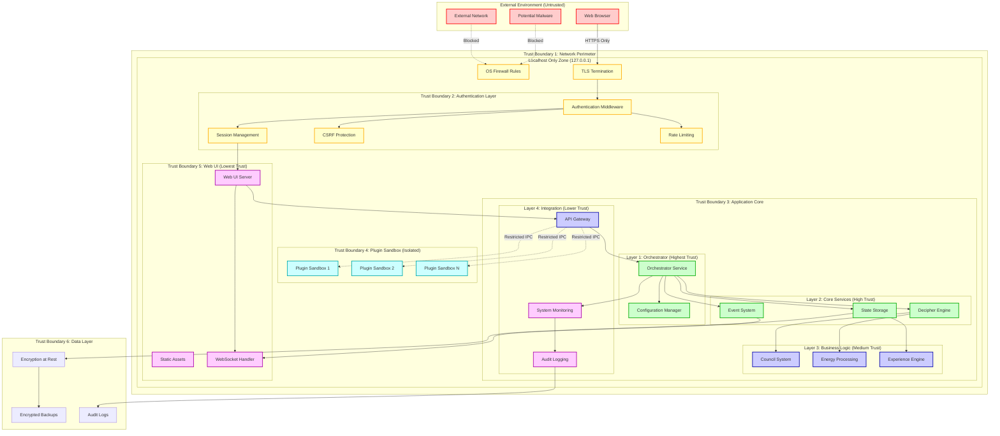
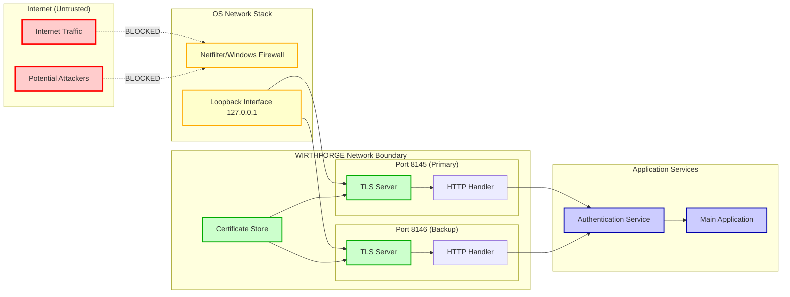
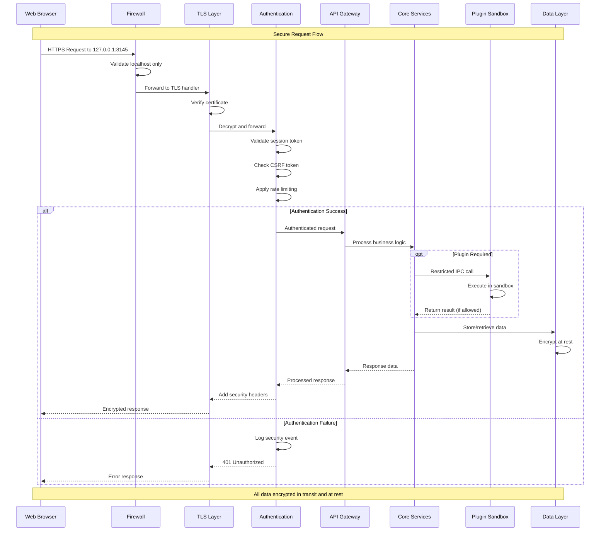
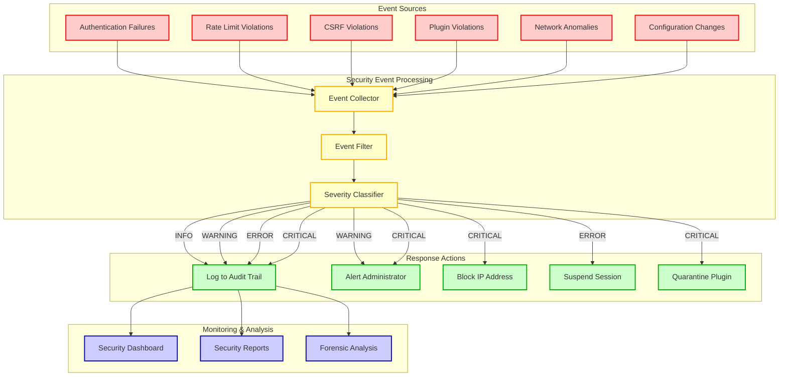

# WF-TECH-006 Trust Boundary Diagrams
## WIRTHFORGE Security & Privacy Architecture

### Trust Boundary Overview

### Network Security Boundaries

### Plugin Sandbox Architecture

```mermaid
graph TB
    subgraph "Host System (Untrusted for Plugins)"
        HOST_FS[Host Filesystem]
        HOST_NET[Host Network]
        HOST_PROC[Host Processes]
    end
    
    subgraph "WIRTHFORGE Core (Trusted)"
        PLUGIN_MGR[Plugin Manager]
        SANDBOX_MGR[Sandbox Manager]
        IPC_BROKER[IPC Broker]
        RESOURCE_MON[Resource Monitor]
    end
    
    subgraph "Plugin Sandbox 1"
        subgraph "Process Isolation"
            PROC1[Isolated Process]
            ENV1[Restricted Environment]
        end
        
        subgraph "Resource Limits"
            MEM1[Memory Limit: 128MB]
            CPU1[CPU Limit: 20%]
            TIME1[Time Limit: 5min]
        end
        
        subgraph "Filesystem Isolation"
            TEMP1[Temp Directory Only]
            CHROOT1[Chroot Jail]
        end
        
        subgraph "Network Isolation"
            NO_NET1[No Network Access]
        end
        
        PLUGIN1[Plugin Code]
    end
    
    subgraph "Plugin Sandbox 2"
        subgraph "Process Isolation"
            PROC2[Isolated Process]
            ENV2[Restricted Environment]
        end
        
        subgraph "Resource Limits"
            MEM2[Memory Limit: 64MB]
            CPU2[CPU Limit: 10%]
            TIME2[Time Limit: 2min]
        end
        
        subgraph "Filesystem Isolation"
            TEMP2[Temp Directory Only]
            CHROOT2[Chroot Jail]
        end
        
        subgraph "Network Isolation"
            NO_NET2[No Network Access]
        end
        
        PLUGIN2[Plugin Code]
    end
    
    %% Blocked access to host resources
    PLUGIN1 -.->|BLOCKED| HOST_FS
    PLUGIN1 -.->|BLOCKED| HOST_NET
    PLUGIN1 -.->|BLOCKED| HOST_PROC
    
    PLUGIN2 -.->|BLOCKED| HOST_FS
    PLUGIN2 -.->|BLOCKED| HOST_NET
    PLUGIN2 -.->|BLOCKED| HOST_PROC
    
    %% Controlled access through sandbox manager
    PLUGIN_MGR --> SANDBOX_MGR
    SANDBOX_MGR --> PROC1
    SANDBOX_MGR --> PROC2
    
    %% IPC communication (restricted)
    PLUGIN1 <-.->|Restricted IPC| IPC_BROKER
    PLUGIN2 <-.->|Restricted IPC| IPC_BROKER
    IPC_BROKER --> PLUGIN_MGR
    
    %% Resource monitoring
    RESOURCE_MON --> MEM1
    RESOURCE_MON --> CPU1
    RESOURCE_MON --> MEM2
    RESOURCE_MON --> CPU2
    
    classDef untrusted fill:#ffcccc,stroke:#ff0000,stroke-width:2px
    classDef trusted fill:#ccffcc,stroke:#00aa00,stroke-width:2px
    classDef isolated fill:#ccffff,stroke:#00aaaa,stroke-width:2px
    classDef limits fill:#ffffcc,stroke:#ffaa00,stroke-width:2px
    
    class HOST_FS,HOST_NET,HOST_PROC untrusted
    class PLUGIN_MGR,SANDBOX_MGR,IPC_BROKER,RESOURCE_MON trusted
    class PROC1,ENV1,PROC2,ENV2,PLUGIN1,PLUGIN2 isolated
    class MEM1,CPU1,TIME1,MEM2,CPU2,TIME2 limits
```

### Data Flow Security Model

### Security Event Flow

## Trust Boundary Enforcement

### Layer 1: Network Perimeter
- **Enforcement**: OS-level firewall rules, localhost-only binding
- **Controls**: Port restrictions, TLS encryption, certificate validation
- **Monitoring**: Connection attempts, certificate expiry, network anomalies

### Layer 2: Authentication Boundary  
- **Enforcement**: Session token validation, CSRF protection, rate limiting
- **Controls**: HTTP-only cookies, secure headers, timing attack prevention
- **Monitoring**: Failed authentication attempts, session anomalies, brute force detection

### Layer 3: Application Core
- **Enforcement**: Service-to-service authentication, API authorization
- **Controls**: Least privilege access, input validation, output encoding
- **Monitoring**: Service interactions, data access patterns, privilege escalation attempts

### Layer 4: Plugin Sandbox
- **Enforcement**: Process isolation, resource limits, import restrictions
- **Controls**: Filesystem sandboxing, network blocking, IPC restrictions
- **Monitoring**: Resource usage, permission violations, escape attempts

### Layer 5: Data Protection
- **Enforcement**: Encryption at rest, secure key management, access logging
- **Controls**: Data minimization, retention policies, backup encryption
- **Monitoring**: Data access patterns, encryption key usage, backup integrity

## Security Assumptions

1. **Host OS Security**: The underlying operating system provides basic process isolation and memory protection
2. **TLS Implementation**: The TLS library correctly implements cryptographic protocols
3. **Python Runtime**: The Python interpreter provides basic module import controls
4. **Localhost Trust**: Traffic on 127.0.0.1 originates from the local machine
5. **Certificate Store**: The local certificate store is protected from unauthorized modification

## Threat Model Integration

These trust boundaries are designed to defend against the threats identified in the WF-TECH-006 threat model:
- **External Network Attacks**: Blocked by network perimeter controls
- **Cross-Site Attacks**: Mitigated by authentication boundary controls  
- **Plugin Malware**: Contained by sandbox isolation controls
- **Data Exfiltration**: Prevented by data protection controls
- **Privilege Escalation**: Limited by application core access controls
