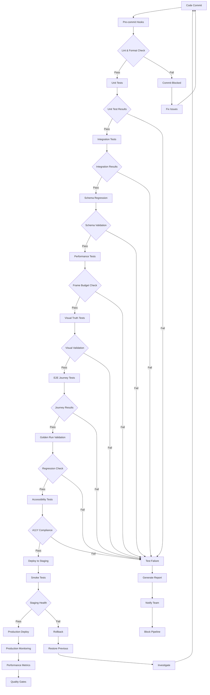

# WF-TECH-007 QA Pipeline Architecture

## Pipeline Stages

### 1. Pre-commit Stage
- **Linting**: ESLint, Pylint, TypeScript checks
- **Formatting**: Prettier, Black, autopep8
- **Security**: Basic vulnerability scanning
- **Duration**: < 30 seconds

### 2. Unit Testing Stage
- **Framework Tests**: Core logic validation
- **Energy Oracle**: Calculation accuracy
- **Mock Integration**: Component isolation
- **Coverage**: Minimum 85% code coverage
- **Duration**: < 2 minutes

### 3. Integration Testing Stage
- **WebSocket Communication**: Real-time data flow
- **Core-UI Sync**: State synchronization
- **Multi-session**: Concurrent user handling
- **Duration**: < 5 minutes

### 4. Schema Regression Stage
- **Backward Compatibility**: API contract validation
- **Breaking Changes**: Detection and blocking
- **Data Migration**: Schema evolution testing
- **Duration**: < 1 minute

### 5. Performance Testing Stage
- **Frame Budget**: 16.67ms enforcement
- **Memory Usage**: Leak detection
- **Load Testing**: Concurrent user simulation
- **Duration**: < 10 minutes

### 6. Visual Truth Testing Stage
- **Energy Accuracy**: ±5% tolerance validation
- **Animation Smoothness**: 60 FPS verification
- **Color Accuracy**: Accessibility compliance
- **Duration**: < 8 minutes

### 7. E2E Journey Testing Stage
- **User Workflows**: Complete journey validation
- **Error Recovery**: Resilience testing
- **Accessibility**: WCAG 2.2 AA compliance
- **Duration**: < 15 minutes

### 8. Golden Run Validation Stage
- **Deterministic Replay**: Regression detection
- **Bit-for-bit Comparison**: Output validation
- **Timing Accuracy**: Performance consistency
- **Duration**: < 5 minutes

### 9. Deployment Stage
- **Staging Deploy**: Automated deployment
- **Smoke Tests**: Basic functionality check
- **Health Monitoring**: System status validation
- **Duration**: < 3 minutes

### 10. Production Stage
- **Blue-Green Deploy**: Zero-downtime deployment
- **Canary Release**: Gradual rollout
- **Monitoring**: Real-time metrics
- **Rollback**: Automated failure recovery
