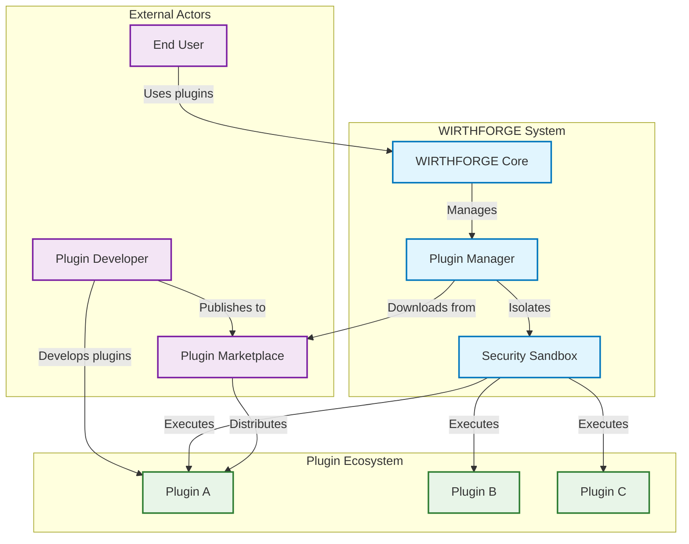
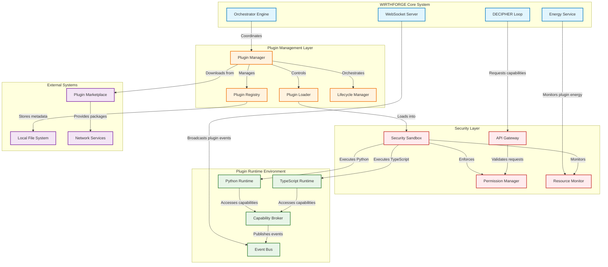
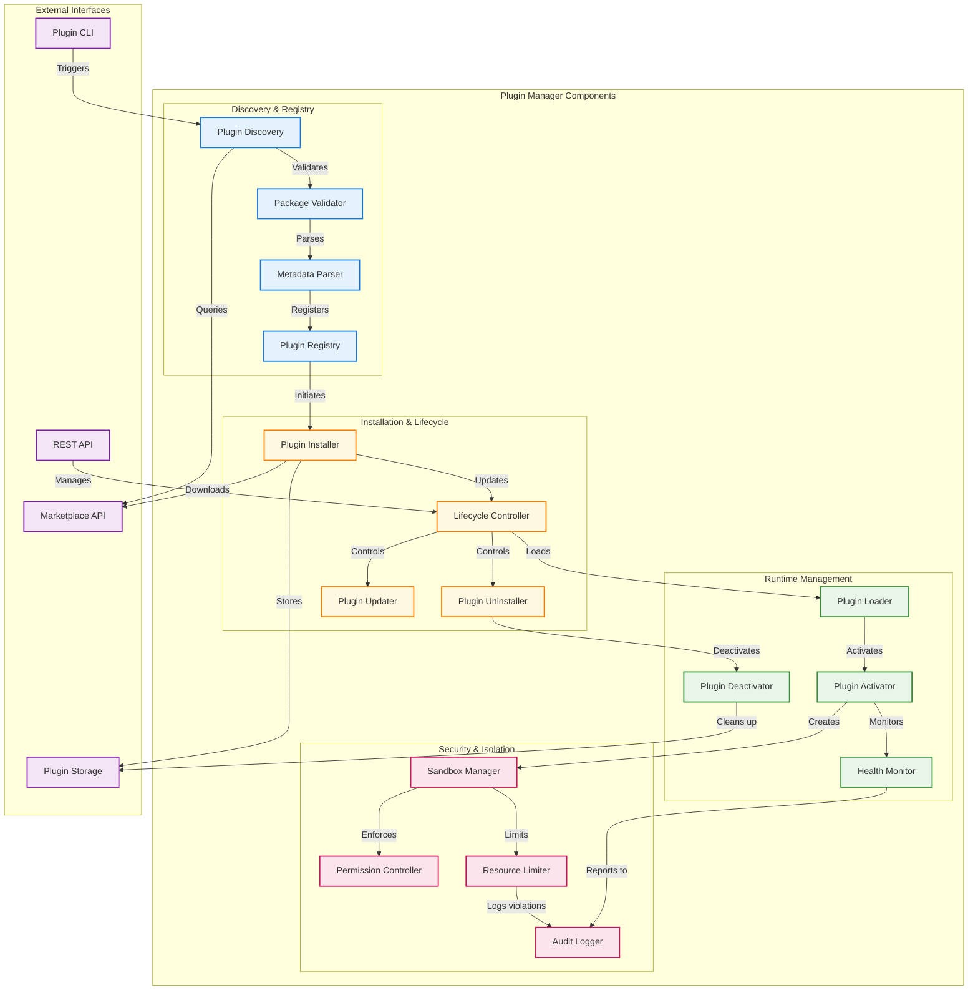
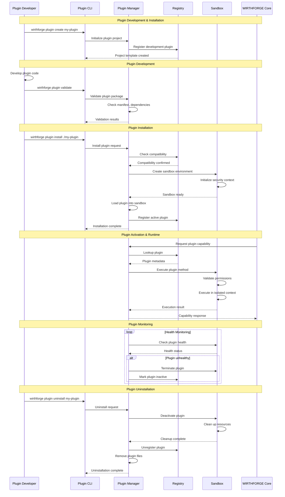
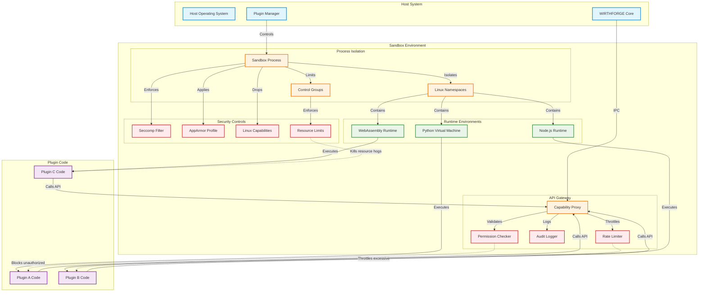
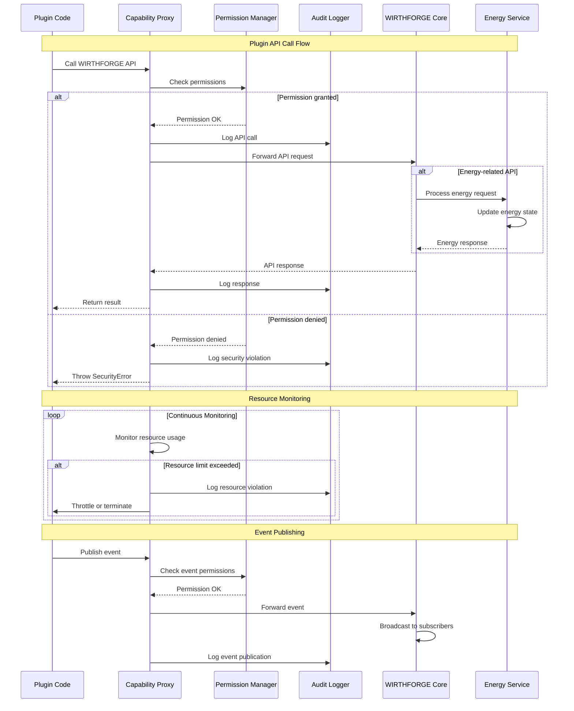

# WF-TECH-008 Plugin Architecture Diagrams

This document contains comprehensive architecture diagrams for the WIRTHFORGE Plugin System, including C4 model diagrams, sequence flows, and component interactions.

## System Context Diagram (C4 Level 1)



## Container Diagram (C4 Level 2)



## Component Diagram (C4 Level 3) - Plugin Manager



## Plugin Lifecycle Sequence Diagram



## Security Sandbox Architecture



## Plugin API Integration Flow



## Plugin Marketplace Integration

```mermaid
graph TB
    subgraph "Plugin Marketplace"
        MARKETPLACE_API[Marketplace API]
        PACKAGE_STORE[Package Storage]
        METADATA_DB[Metadata Database]
        SIGNING_SVC[Package Signing Service]
        REVIEW_SYS[Review System]
    end
    
    subgraph "WIRTHFORGE Client"
        PLUGIN_MGR[Plugin Manager]
        PKG_VALIDATOR[Package Validator]
        SIG_VERIFIER[Signature Verifier]
        LOCAL_REGISTRY[Local Registry]
        INSTALLER[Plugin Installer]
    end
    
    subgraph "Developer Tools"
        PLUGIN_CLI[Plugin CLI]
        BUILD_TOOLS[Build Tools]
        PUBLISHER[Package Publisher]
        SIGNING_CLIENT[Signing Client]
    end
    
    %% Publishing flow
    PLUGIN_CLI -->|Build package| BUILD_TOOLS
    BUILD_TOOLS -->|Sign package| SIGNING_CLIENT
    SIGNING_CLIENT -->|Request signature| SIGNING_SVC
    SIGNING_SVC -->|Return signed package| SIGNING_CLIENT
    SIGNING_CLIENT -->|Publish| PUBLISHER
    PUBLISHER -->|Upload| MARKETPLACE_API
    MARKETPLACE_API -->|Store| PACKAGE_STORE
    MARKETPLACE_API -->|Index| METADATA_DB
    MARKETPLACE_API -->|Queue for review| REVIEW_SYS
    
    %% Discovery flow
    PLUGIN_MGR -->|Search plugins| MARKETPLACE_API
    MARKETPLACE_API -->|Query| METADATA_DB
    METADATA_DB -->|Return results| MARKETPLACE_API
    MARKETPLACE_API -->|Return metadata| PLUGIN_MGR
    
    %% Installation flow
    PLUGIN_MGR -->|Download package| MARKETPLACE_API
    MARKETPLACE_API -->|Serve package| PACKAGE_STORE
    PACKAGE_STORE -->|Return package| PLUGIN_MGR
    PLUGIN_MGR -->|Validate| PKG_VALIDATOR
    PKG_VALIDATOR -->|Verify signature| SIG_VERIFIER
    SIG_VERIFIER -->|Check against| SIGNING_SVC
    
    alt Validation successful
        PKG_VALIDATOR -->|Install| INSTALLER
        INSTALLER -->|Register| LOCAL_REGISTRY
    else Validation failed
        PKG_VALIDATOR -->|Reject| PLUGIN_MGR
    end
    
    classDef marketplace fill:#e3f2fd,stroke:#1976d2,stroke-width:2px
    classDef client fill:#e8f5e8,stroke:#388e3c,stroke-width:2px
    classDef developer fill:#fff8e1,stroke:#f57c00,stroke-width:2px
    
    class MARKETPLACE_API,PACKAGE_STORE,METADATA_DB,SIGNING_SVC,REVIEW_SYS marketplace
    class PLUGIN_MGR,PKG_VALIDATOR,SIG_VERIFIER,LOCAL_REGISTRY,INSTALLER client
    class PLUGIN_CLI,BUILD_TOOLS,PUBLISHER,SIGNING_CLIENT developer
```

## Resource Management & Monitoring

```mermaid
graph TB
    subgraph "Resource Monitoring System"
        subgraph "Metrics Collection"
            CPU_MONITOR[CPU Monitor]
            MEM_MONITOR[Memory Monitor]
            IO_MONITOR[I/O Monitor]
            NET_MONITOR[Network Monitor]
            ENERGY_MONITOR[Energy Monitor]
        end
        
        subgraph "Resource Controllers"
            CPU_LIMITER[CPU Limiter]
            MEM_LIMITER[Memory Limiter]
            IO_LIMITER[I/O Limiter]
            NET_LIMITER[Network Limiter]
            ENERGY_BUDGET[Energy Budget]
        end
        
        subgraph "Policy Engine"
            POLICY_MGR[Policy Manager]
            THRESHOLD_MGR[Threshold Manager]
            ACTION_ENGINE[Action Engine]
            ALERT_MGR[Alert Manager]
        end
    end
    
    subgraph "Plugin Sandboxes"
        SANDBOX_A[Plugin A Sandbox]
        SANDBOX_B[Plugin B Sandbox]
        SANDBOX_C[Plugin C Sandbox]
    end
    
    subgraph "WIRTHFORGE Core"
        ORCHESTRATOR[Orchestrator]
        ENERGY_SVC[Energy Service]
        METRICS_SVC[Metrics Service]
    end
    
    %% Monitoring connections
    SANDBOX_A -->|Reports metrics| CPU_MONITOR
    SANDBOX_A -->|Reports metrics| MEM_MONITOR
    SANDBOX_A -->|Reports metrics| IO_MONITOR
    SANDBOX_A -->|Reports metrics| NET_MONITOR
    SANDBOX_A -->|Reports metrics| ENERGY_MONITOR
    
    SANDBOX_B -->|Reports metrics| CPU_MONITOR
    SANDBOX_C -->|Reports metrics| CPU_MONITOR
    
    %% Resource control
    CPU_LIMITER -->|Throttles| SANDBOX_A
    MEM_LIMITER -->|Limits| SANDBOX_B
    IO_LIMITER -->|Throttles| SANDBOX_C
    NET_LIMITER -->|Blocks| SANDBOX_A
    ENERGY_BUDGET -->|Suspends| SANDBOX_B
    
    %% Policy enforcement
    CPU_MONITOR -->|Feeds data| POLICY_MGR
    MEM_MONITOR -->|Feeds data| POLICY_MGR
    IO_MONITOR -->|Feeds data| POLICY_MGR
    NET_MONITOR -->|Feeds data| POLICY_MGR
    ENERGY_MONITOR -->|Feeds data| POLICY_MGR
    
    POLICY_MGR -->|Configures| THRESHOLD_MGR
    THRESHOLD_MGR -->|Triggers| ACTION_ENGINE
    ACTION_ENGINE -->|Controls| CPU_LIMITER
    ACTION_ENGINE -->|Controls| MEM_LIMITER
    ACTION_ENGINE -->|Controls| IO_LIMITER
    ACTION_ENGINE -->|Controls| NET_LIMITER
    ACTION_ENGINE -->|Controls| ENERGY_BUDGET
    
    ACTION_ENGINE -->|Sends alerts| ALERT_MGR
    ALERT_MGR -->|Notifies| ORCHESTRATOR
    
    %% Integration with core
    ENERGY_MONITOR -->|Reports to| ENERGY_SVC
    CPU_MONITOR -->|Reports to| METRICS_SVC
    MEM_MONITOR -->|Reports to| METRICS_SVC
    
    classDef monitoring fill:#e3f2fd,stroke:#1976d2,stroke-width:2px
    classDef control fill:#ffebee,stroke:#c62828,stroke-width:2px
    classDef policy fill:#fff8e1,stroke:#f57c00,stroke-width:2px
    classDef sandbox fill:#e8f5e8,stroke:#388e3c,stroke-width:2px
    classDef core fill:#f3e5f5,stroke:#7b1fa2,stroke-width:2px
    
    class CPU_MONITOR,MEM_MONITOR,IO_MONITOR,NET_MONITOR,ENERGY_MONITOR monitoring
    class CPU_LIMITER,MEM_LIMITER,IO_LIMITER,NET_LIMITER,ENERGY_BUDGET control
    class POLICY_MGR,THRESHOLD_MGR,ACTION_ENGINE,ALERT_MGR policy
    class SANDBOX_A,SANDBOX_B,SANDBOX_C sandbox
    class ORCHESTRATOR,ENERGY_SVC,METRICS_SVC core
```



---

## Summary

These diagrams provide comprehensive architectural views of the WIRTHFORGE Plugin System:

1. **System Context**: High-level view of plugin ecosystem
2. **Container Diagram**: Detailed system components and their relationships
3. **Component Diagram**: Internal structure of the Plugin Manager
4. **Lifecycle Sequence**: Plugin installation and runtime flow
5. **Security Architecture**: Sandbox isolation and security controls
6. **API Integration**: Plugin-to-core communication flow
7. **Marketplace Integration**: Plugin distribution and installation
8. **Resource Management**: Monitoring and resource control system

Each diagram follows C4 model principles and provides clear visualization of component interactions, security boundaries, and data flows within the plugin architecture.
