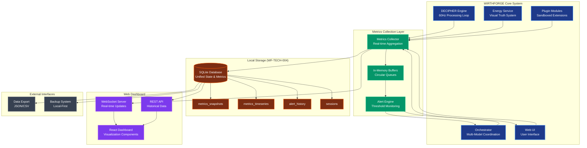
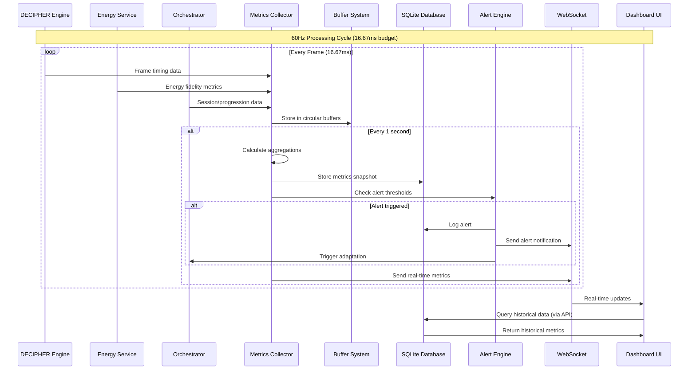
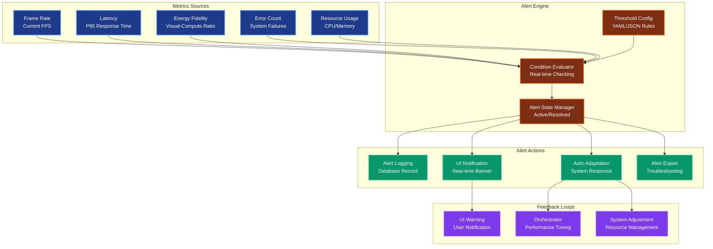
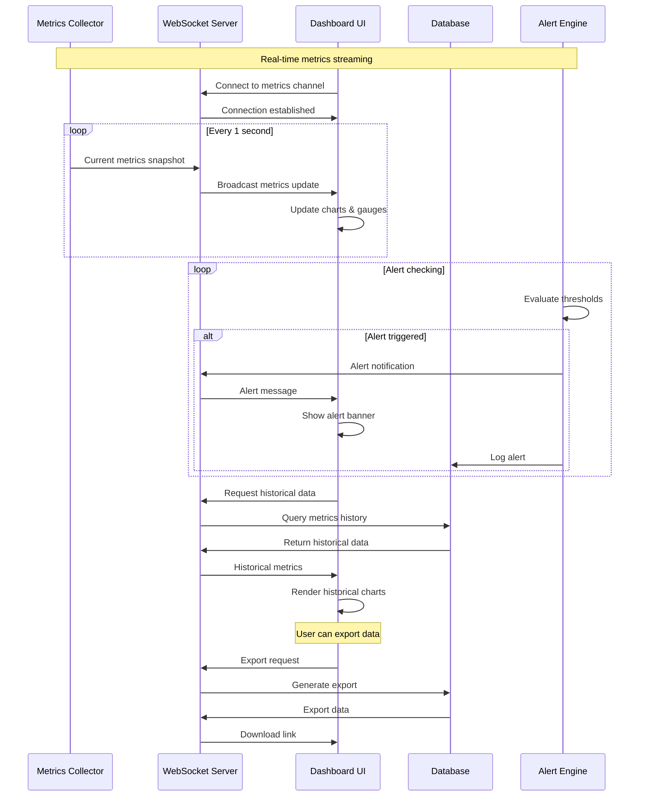
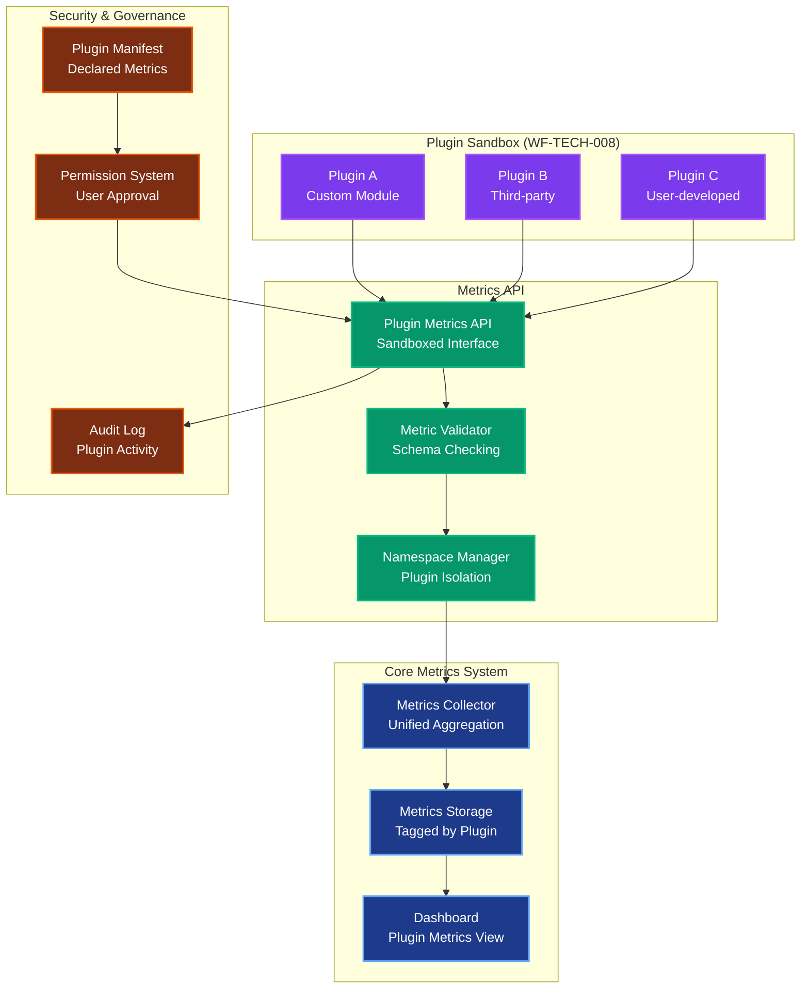
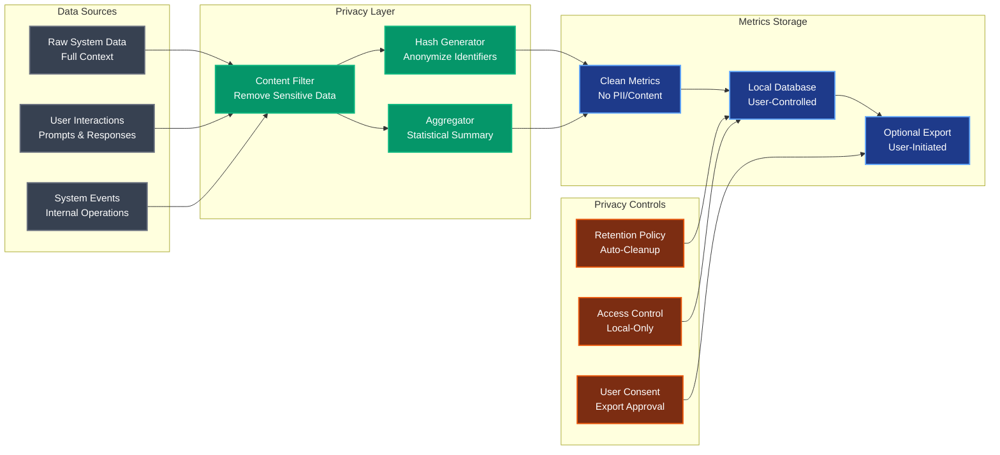
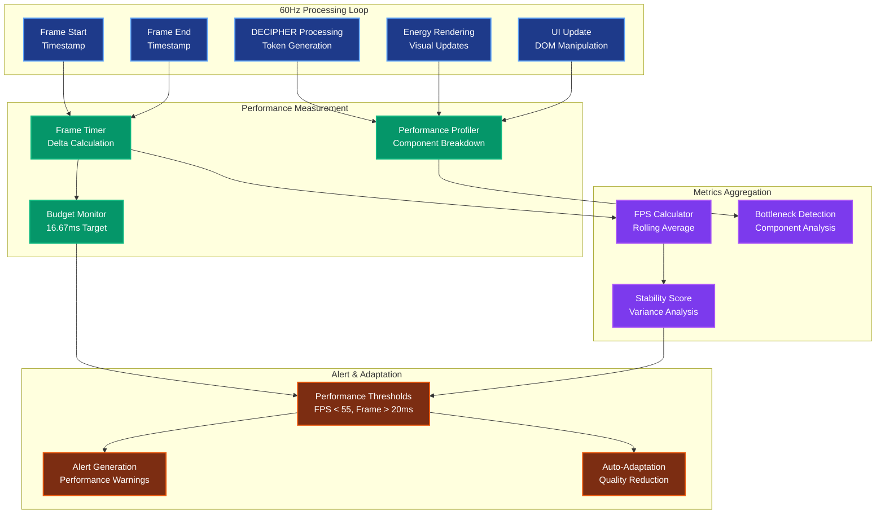

# WF-TECH-009 Data Flow Diagrams

## Overview
Comprehensive data flow diagrams showing metrics collection, storage, and visualization pipeline in WIRTHFORGE's local-core architecture.

## 1. High-Level Metrics Architecture



## 2. Detailed Metrics Collection Flow



## 3. Energy Fidelity Measurement Pipeline

```mermaid
graph LR
    subgraph "Energy Truth System (WF-FND-002)"
        TOKENS[Token Processing<br/>Computational Events]
        ENERGY_CALC[Energy Unit Calculation<br/>EU = f(tokens, complexity)]
        VISUAL_ENGINE[Visual Engine<br/>Particle Rendering]
        PARTICLES[Energy Particles<br/>Visual Representation]
    end
    
    subgraph "Fidelity Measurement"
        COUNTER[Particle Counter<br/>Real-time Tracking]
        TIMER[Visual Lag Timer<br/>Render Delay]
        CALCULATOR[Fidelity Calculator<br/>Ratio Computation]
    end
    
    subgraph "Metrics Storage"
        FIDELITY_BUFFER[Fidelity Buffer<br/>60-second window]
        COHERENCE[Coherence Score<br/>Stability Metric]
        SNAPSHOT[Fidelity Snapshot<br/>Database Record]
    end
    
    TOKENS --> ENERGY_CALC
    ENERGY_CALC --> VISUAL_ENGINE
    VISUAL_ENGINE --> PARTICLES
    
    PARTICLES --> COUNTER
    VISUAL_ENGINE --> TIMER
    ENERGY_CALC --> CALCULATOR
    COUNTER --> CALCULATOR
    TIMER --> CALCULATOR
    
    CALCULATOR --> FIDELITY_BUFFER
    FIDELITY_BUFFER --> COHERENCE
    COHERENCE --> SNAPSHOT
    
    %% Styling
    classDef energy fill:#059669,stroke:#10b981,stroke-width:2px,color:#fff
    classDef measurement fill:#7c2d12,stroke:#ea580c,stroke-width:2px,color:#fff
    classDef storage fill:#1e3a8a,stroke:#60a5fa,stroke-width:2px,color:#fff
    
    class TOKENS,ENERGY_CALC,VISUAL_ENGINE,PARTICLES energy
    class COUNTER,TIMER,CALCULATOR measurement
    class FIDELITY_BUFFER,COHERENCE,SNAPSHOT storage
```

## 4. Alert System Data Flow



## 5. WebSocket Real-Time Communication



## 6. Plugin Metrics Integration



## 7. Privacy-Preserving Data Flow



## 8. Performance Monitoring Data Pipeline



These diagrams provide comprehensive visualization of the metrics data flow throughout the WIRTHFORGE system, from collection through storage to real-time dashboard presentation, while maintaining local-first principles and privacy protection.
