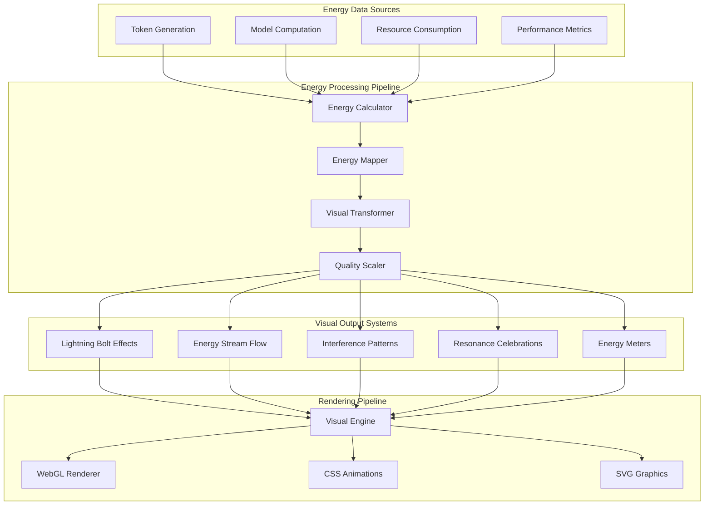
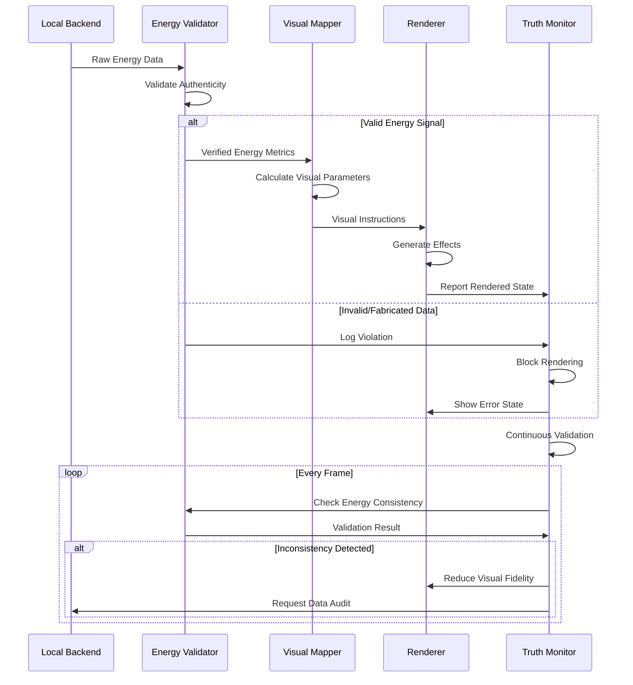
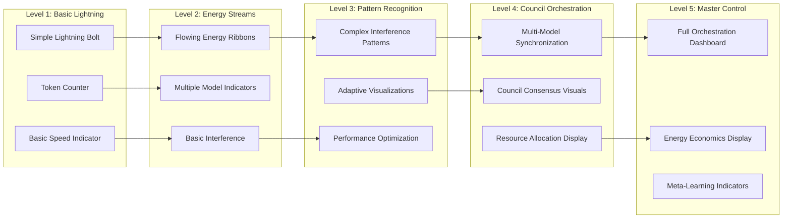

# WF-UX-001 Energy Mapping & Visualization Pipeline

**Document ID**: WF-UX-001  
**Version**: 1.0.0  
**Last Updated**: 2024-01-15  
**Category**: Energy Visualization Architecture

## Energy-to-Visual Mapping Pipeline

## Energy Truth Validation Flow

## Progressive Level Visual Complexity

