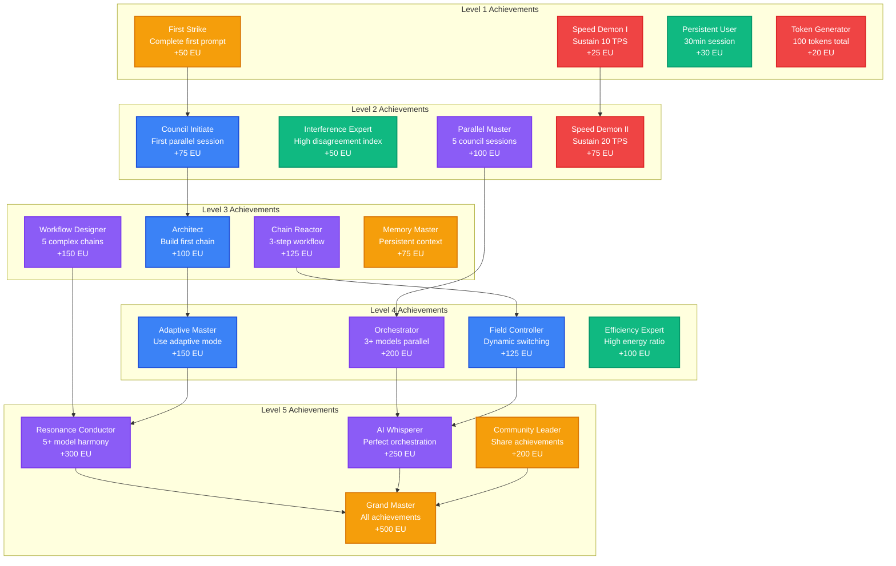
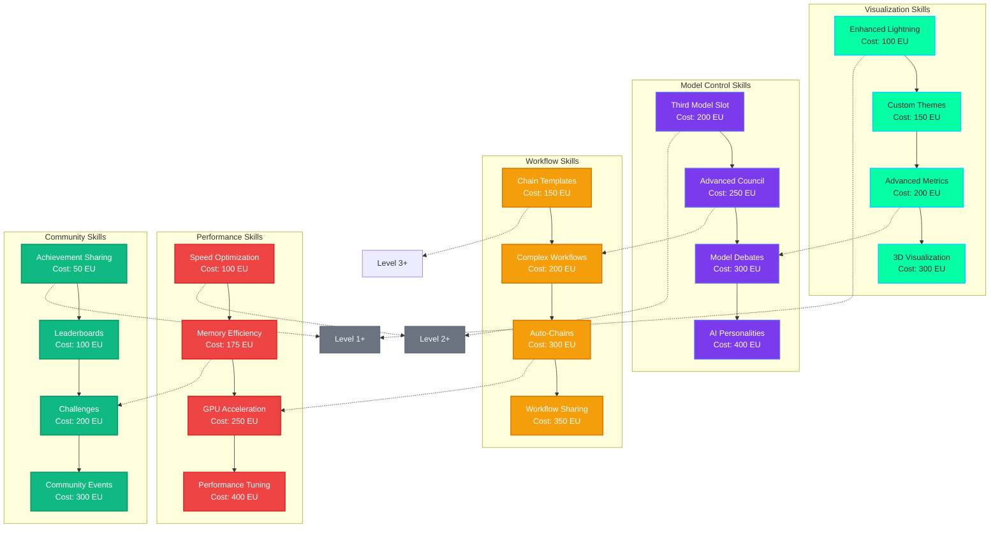
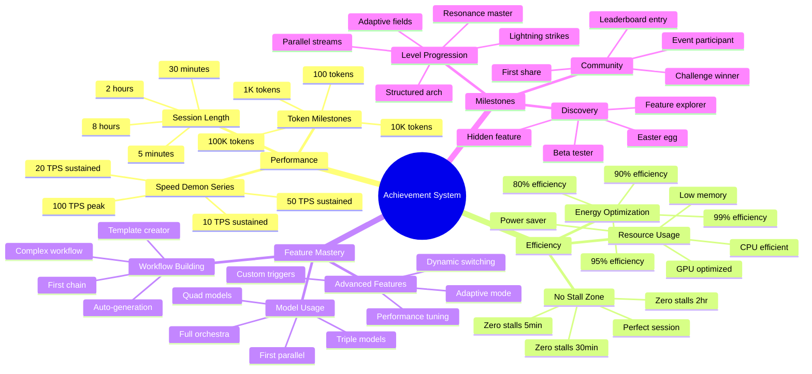
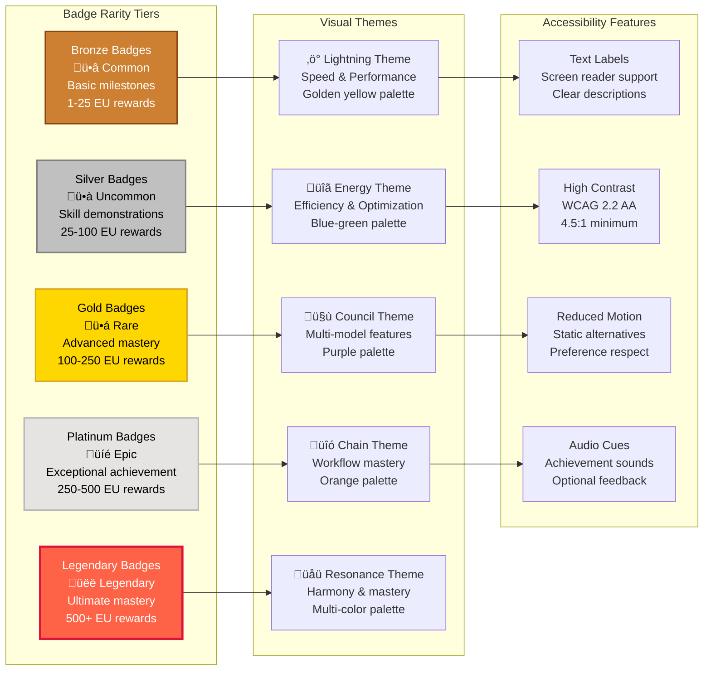

# WF-UX-002 Achievement Tree & Skill System

## Achievement Hierarchy and Dependencies

```mermaid
graph TD
    subgraph "Level 1 Achievements"
        FS[First Strike<br/>Complete first prompt<br/>+50 EU]
        SD1[Speed Demon I<br/>Sustain 10 TPS<br/>+25 EU]
        PU[Persistent User<br/>30min session<br/>+30 EU]
        TG[Token Generator<br/>100 tokens total<br/>+20 EU]
    end
    
    subgraph "Level 2 Achievements"
        CI[Council Initiate<br/>First parallel session<br/>+75 EU]
        IE[Interference Expert<br/>High disagreement index<br/>+50 EU]
        PM[Parallel Master<br/>5 council sessions<br/>+100 EU]
        SD2[Speed Demon II<br/>Sustain 20 TPS<br/>+75 EU]
    end
    
    subgraph "Level 3 Achievements"
        AR[Architect<br/>Build first chain<br/>+100 EU]
        CR[Chain Reactor<br/>3-step workflow<br/>+125 EU]
        WD[Workflow Designer<br/>5 complex chains<br/>+150 EU]
        MM[Memory Master<br/>Persistent context<br/>+75 EU]
    end
    
    subgraph "Level 4 Achievements"
        AM[Adaptive Master<br/>Use adaptive mode<br/>+150 EU]
        FC[Field Controller<br/>Dynamic switching<br/>+125 EU]
        OR[Orchestrator<br/>3+ models parallel<br/>+200 EU]
        EE[Efficiency Expert<br/>High energy ratio<br/>+100 EU]
    end
    
    subgraph "Level 5 Achievements"
        RC[Resonance Conductor<br/>5+ model harmony<br/>+300 EU]
        AW[AI Whisperer<br/>Perfect orchestration<br/>+250 EU]
        CL[Community Leader<br/>Share achievements<br/>+200 EU]
        GM[Grand Master<br/>All achievements<br/>+500 EU]
    end
    
    %% Achievement Dependencies
    FS --> CI
    SD1 --> SD2
    CI --> AR
    PM --> OR
    AR --> AM
    CR --> FC
    WD --> RC
    OR --> AW
    AM --> RC
    FC --> AW
    RC --> GM
    AW --> GM
    CL --> GM
    
    %% Badge Categories
    classDef performance fill:#ef4444,stroke:#dc2626,stroke-width:2px,color:#ffffff
    classDef efficiency fill:#10b981,stroke:#059669,stroke-width:2px,color:#ffffff
    classDef feature fill:#3b82f6,stroke:#1d4ed8,stroke-width:2px,color:#ffffff
    classDef mastery fill:#8b5cf6,stroke:#7c3aed,stroke-width:2px,color:#ffffff
    classDef milestone fill:#f59e0b,stroke:#d97706,stroke-width:2px,color:#ffffff
    
    class SD1,SD2,TG performance
    class PU,EE,IE efficiency
    class CI,AR,AM,FC feature
    class PM,CR,WD,OR,RC,AW mastery
    class FS,MM,CL,GM milestone
```

## Skill Tree Progression

```mermaid
graph TB
    subgraph "Visualization Skills"
        V1[Enhanced Lightning<br/>Cost: 100 EU] --> V2[Custom Themes<br/>Cost: 150 EU]
        V2 --> V3[Advanced Metrics<br/>Cost: 200 EU]
        V3 --> V4[3D Visualization<br/>Cost: 300 EU]
    end
    
    subgraph "Model Control Skills"
        M1[Third Model Slot<br/>Cost: 200 EU] --> M2[Advanced Council<br/>Cost: 250 EU]
        M2 --> M3[Model Debates<br/>Cost: 300 EU]
        M3 --> M4[AI Personalities<br/>Cost: 400 EU]
    end
    
    subgraph "Workflow Skills"
        W1[Chain Templates<br/>Cost: 150 EU] --> W2[Complex Workflows<br/>Cost: 200 EU]
        W2 --> W3[Auto-Chains<br/>Cost: 300 EU]
        W3 --> W4[Workflow Sharing<br/>Cost: 350 EU]
    end
    
    subgraph "Performance Skills"
        P1[Speed Optimization<br/>Cost: 100 EU] --> P2[Memory Efficiency<br/>Cost: 175 EU]
        P2 --> P3[GPU Acceleration<br/>Cost: 250 EU]
        P3 --> P4[Performance Tuning<br/>Cost: 400 EU]
    end
    
    subgraph "Community Skills"
        C1[Achievement Sharing<br/>Cost: 50 EU] --> C2[Leaderboards<br/>Cost: 100 EU]
        C2 --> C3[Challenges<br/>Cost: 200 EU]
        C3 --> C4[Community Events<br/>Cost: 300 EU]
    end
    
    %% Cross-tree Dependencies
    V3 -.-> M3
    M2 -.-> W2
    W3 -.-> P3
    P2 -.-> C3
    
    %% Level Gates
    V1 -.-> L1[Level 1+]
    M1 -.-> L2[Level 2+]
    W1 -.-> L3[Level 3+]
    P1 -.-> L2[Level 2+]
    C1 -.-> L1[Level 1+]
    
    classDef visual fill:#06ffa5,stroke:#00d4ff,stroke-width:2px,color:#1f2937
    classDef model fill:#7c3aed,stroke:#6366f1,stroke-width:2px,color:#ffffff
    classDef workflow fill:#f59e0b,stroke:#d97706,stroke-width:2px,color:#ffffff
    classDef performance fill:#ef4444,stroke:#dc2626,stroke-width:2px,color:#ffffff
    classDef community fill:#10b981,stroke:#059669,stroke-width:2px,color:#ffffff
    classDef gate fill:#6b7280,stroke:#4b5563,stroke-width:1px,color:#f9fafb
    
    class V1,V2,V3,V4 visual
    class M1,M2,M3,M4 model
    class W1,W2,W3,W4 workflow
    class P1,P2,P3,P4 performance
    class C1,C2,C3,C4 community
    class L1,L2 gate
```

## Achievement Categories and Metrics

```mermaid
mindmap
  root((Achievement System))
    Performance
      Speed Demon Series
        10 TPS sustained
        20 TPS sustained
        50 TPS sustained
        100 TPS peak
      Token Milestones
        100 tokens
        1K tokens
        10K tokens
        100K tokens
      Session Length
        5 minutes
        30 minutes
        2 hours
        8 hours
    
    Efficiency
      Energy Optimization
        80% efficiency
        90% efficiency
        95% efficiency
        99% efficiency
      No Stall Zone
        Zero stalls 5min
        Zero stalls 30min
        Zero stalls 2hr
        Perfect session
      Resource Usage
        Low memory
        CPU efficient
        GPU optimized
        Power saver
    
    Feature Mastery
      Model Usage
        First parallel
        Triple models
        Quad models
        Full orchestra
      Workflow Building
        First chain
        Complex workflow
        Auto-generation
        Template creator
      Advanced Features
        Adaptive mode
        Dynamic switching
        Performance tuning
        Custom triggers
    
    Milestones
      Level Progression
        Lightning strikes
        Parallel streams
        Structured arch
        Adaptive fields
        Resonance master
      Community
        First share
        Leaderboard entry
        Challenge winner
        Event participant
      Discovery
        Feature explorer
        Hidden feature
        Easter egg
        Beta tester
```

## Badge Rarity and Visual Design

```mermaid
graph LR
    subgraph "Badge Rarity Tiers"
        Bronze[Bronze Badges<br/>ü•â Common<br/>Basic milestones<br/>1-25 EU rewards]
        Silver[Silver Badges<br/>ü•à Uncommon<br/>Skill demonstrations<br/>25-100 EU rewards]
        Gold[Gold Badges<br/>ü•á Rare<br/>Advanced mastery<br/>100-250 EU rewards]
        Platinum[Platinum Badges<br/>üíé Epic<br/>Exceptional achievement<br/>250-500 EU rewards]
        Legendary[Legendary Badges<br/>üëë Legendary<br/>Ultimate mastery<br/>500+ EU rewards]
    end
    
    subgraph "Visual Themes"
        Lightning[‚ö° Lightning Theme<br/>Speed & Performance<br/>Golden yellow palette]
        Energy[üîã Energy Theme<br/>Efficiency & Optimization<br/>Blue-green palette]
        Council[🤝 Council Theme<br/>Multi-model features<br/>Purple palette]
        Chain[üîó Chain Theme<br/>Workflow mastery<br/>Orange palette]
        Resonance[üåü Resonance Theme<br/>Harmony & mastery<br/>Multi-color palette]
    end
    
    subgraph "Accessibility Features"
        Text[Text Labels<br/>Screen reader support<br/>Clear descriptions]
        Contrast[High Contrast<br/>WCAG 2.2 AA<br/>4.5:1 minimum]
        Motion[Reduced Motion<br/>Static alternatives<br/>Preference respect]
        Audio[Audio Cues<br/>Achievement sounds<br/>Optional feedback]
    end
    
    Bronze --> Lightning
    Silver --> Energy
    Gold --> Council
    Platinum --> Chain
    Legendary --> Resonance
    
    Lightning --> Text
    Energy --> Contrast
    Council --> Motion
    Chain --> Audio
    
    classDef bronze fill:#cd7f32,stroke:#8b4513,stroke-width:2px,color:#ffffff
    classDef silver fill:#c0c0c0,stroke:#808080,stroke-width:2px,color:#000000
    classDef gold fill:#ffd700,stroke:#daa520,stroke-width:2px,color:#000000
    classDef platinum fill:#e5e4e2,stroke:#b8b8b8,stroke-width:2px,color:#000000
    classDef legendary fill:#ff6347,stroke:#dc143c,stroke-width:3px,color:#ffffff
    
    class Bronze bronze
    class Silver silver
    class Gold gold
    class Platinum platinum
    class Legendary legendary
```
