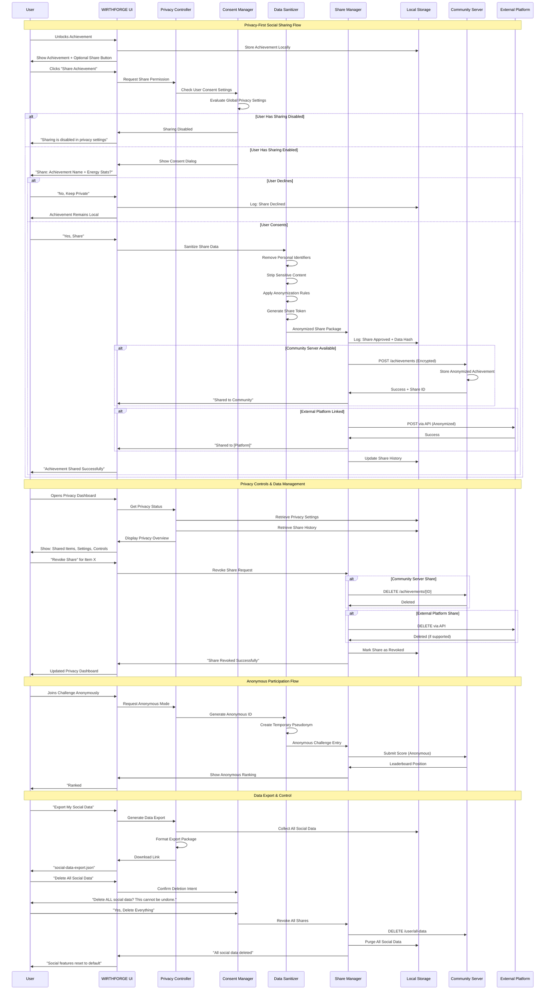

# WF-UX-008 Privacy Flow Diagram

## Privacy-Preserving Social Interaction Flow

## Privacy Flow Overview

This sequence diagram illustrates the comprehensive privacy-preserving mechanisms in WF-UX-008's social features:

### **Core Privacy Principles**

1. **Explicit Consent**: Every data sharing action requires user confirmation
2. **Local-First Storage**: All data is stored locally before any network transmission
3. **Data Sanitization**: Personal identifiers are stripped before sharing
4. **User Control**: Users can review, revoke, and delete shared data at any time
5. **Anonymous Options**: Users can participate without revealing identity

### **Privacy Protection Layers**

#### **Layer 1: Consent Management**
- Global privacy settings control default behavior
- Contextual consent dialogs for each sharing action
- Clear description of what data will be shared
- Easy opt-out at any point

#### **Layer 2: Data Sanitization**
- Automatic removal of personal identifiers
- Content filtering for sensitive information
- Anonymization of user data before transmission
- Generation of temporary sharing tokens

#### **Layer 3: User Control**
- Complete visibility into shared data
- Ability to revoke shares at any time
- Data export functionality for transparency
- Complete data deletion option

### **Key Privacy Features**

#### **Achievement Sharing**
- User explicitly chooses what to share
- Only achievement metadata shared, not personal data
- Anonymous sharing options available
- Local logging of all sharing decisions

#### **Challenge Participation**
- Anonymous participation with pseudonyms
- Only performance metrics shared, not personal info
- User controls visibility of participation
- Local validation of submitted data

#### **Data Management**
- Complete audit trail of shared data
- Export functionality for user transparency
- Granular deletion controls
- Local-first data storage with optional cloud sync

### **Privacy Safeguards**

1. **No Silent Sharing**: All data sharing requires explicit user action
2. **Minimal Data**: Only necessary data is shared for functionality
3. **Encryption**: All network communications are encrypted
4. **Anonymization**: Personal identifiers removed before transmission
5. **User Ownership**: Users maintain complete control over their data
6. **Transparency**: Clear visibility into what data is shared and where

This privacy flow ensures that WIRTHFORGE's social features enhance user engagement while maintaining the highest standards of privacy protection and user control.
