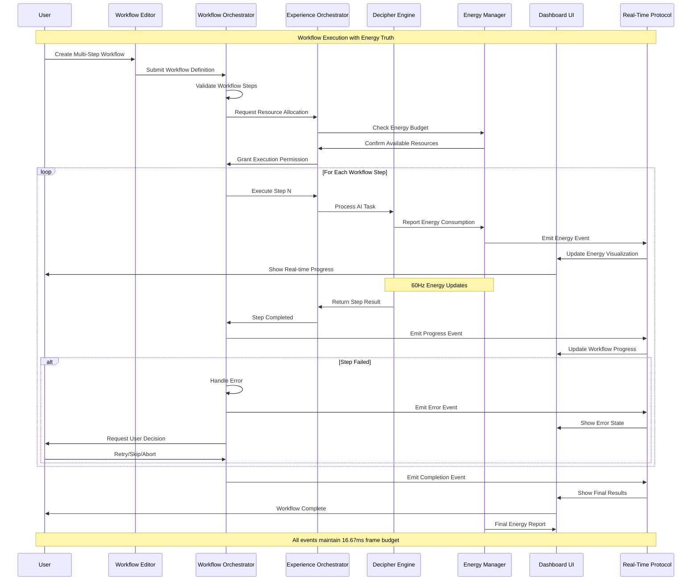
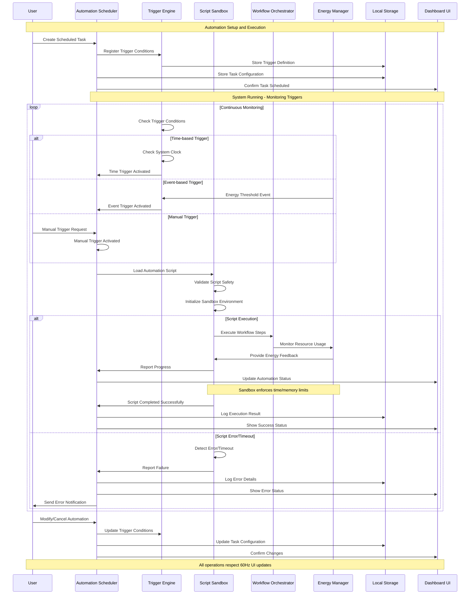
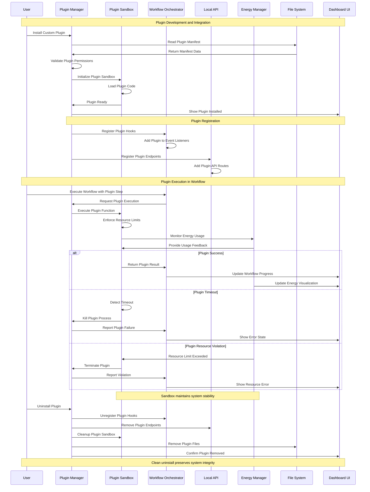

# WF-UX-009 Automation Sequence Diagrams

## Workflow Execution Sequence
This diagram shows the detailed sequence of events when executing an advanced workflow, including energy monitoring and 60Hz performance compliance.



## Automation Scheduler Sequence
This shows how scheduled tasks and automation triggers work within the system.



## Plugin Integration Sequence
This diagram shows how custom plugins integrate with the workflow system.



## Batch Processing Sequence
This shows how large batch operations are handled while maintaining system responsiveness.

```mermaid
sequenceDiagram
    participant U as User
    participant BP as Batch Processor
    participant WO as Workflow Orchestrator
    participant QM as Queue Manager
    participant DE as Decipher Engine
    participant EM as Energy Manager
    participant UI as Dashboard UI
    participant BG as Background Worker
    
    Note over U,BG: Large Batch Operation Processing
    
    U->>BP: Submit Batch Job (1000 items)
    BP->>QM: Create Processing Queue
    QM->>QM: Split into Chunks (10 items each)
    BP->>WO: Initialize Batch Workflow
    WO->>UI: Show Batch Started
    
    Note over BP,UI: Chunk-based Processing for 60Hz Compliance
    
    loop Process Each Chunk
        QM->>BG: Process Next Chunk
        BG->>DE: Execute AI Tasks (10 items)
        DE->>EM: Report Chunk Energy Usage
        EM->>UI: Update Energy Visualization
        
        Note over BG,EM: Background processing preserves UI responsiveness
        
        BG->>QM: Chunk Completed
        QM->>BP: Update Progress (10/1000)
        BP->>UI: Update Progress Bar
        UI->>U: Show Real-time Progress
        
        alt Frame Budget Check
            EM->>EM: Check Frame Time
            EM->>QM: Adjust Chunk Size if Needed
            Note over EM,QM: Dynamic chunk sizing maintains 60Hz
        end
        
        alt User Pause Request
            U->>BP: Pause Batch Job
            BP->>QM: Pause Queue Processing
            QM->>BG: Complete Current Chunk
            BG->>BP: Chunk Finished - Paused
            BP->>UI: Show Paused State
        end
        
        alt User Cancel Request
            U->>BP: Cancel Batch Job
            BP->>QM: Stop Queue Processing
            QM->>BG: Terminate Current Chunk
            BG->>BP: Processing Cancelled
            BP->>UI: Show Cancelled State
            break Cancel Processing
        end
    end
    
    QM->>BP: All Chunks Completed
    BP->>WO: Batch Workflow Complete
    WO->>EM: Generate Final Energy Report
    EM->>UI: Show Energy Summary
    BP->>UI: Show Batch Results
    UI->>U: Batch Job Complete
    
    Note over U,BG: Batch processing maintains system responsiveness throughout
```

## Key Automation Principles

### **60Hz Performance Compliance**
- All automation respects 16.67ms frame budget
- Heavy operations are time-sliced across frames
- UI updates maintain smooth 60Hz refresh rate
- Background workers handle intensive processing

### **Resource Management**
- Script sandbox enforces memory and CPU limits
- Plugin execution is monitored and bounded
- Energy consumption is tracked in real-time
- System resources are protected from runaway processes

### **Error Handling and Recovery**
- Graceful degradation when components fail
- User notification for automation errors
- Automatic retry mechanisms where appropriate
- Clean recovery without system corruption

### **Event-Driven Architecture**
- All automation uses consistent event patterns
- Real-time protocol ensures reliable communication
- Energy events provide continuous feedback
- Plugin integration follows standard event flows

### **Security and Isolation**
- Sandboxed execution for all user code
- Permission-based access control for plugins
- Resource limits prevent system impact
- Local-only operation maintains privacy

This automation architecture ensures that advanced workflows can execute complex operations while maintaining WIRTHFORGE's core principles of energy-truth visualization, local-first operation, and 60Hz responsiveness.
