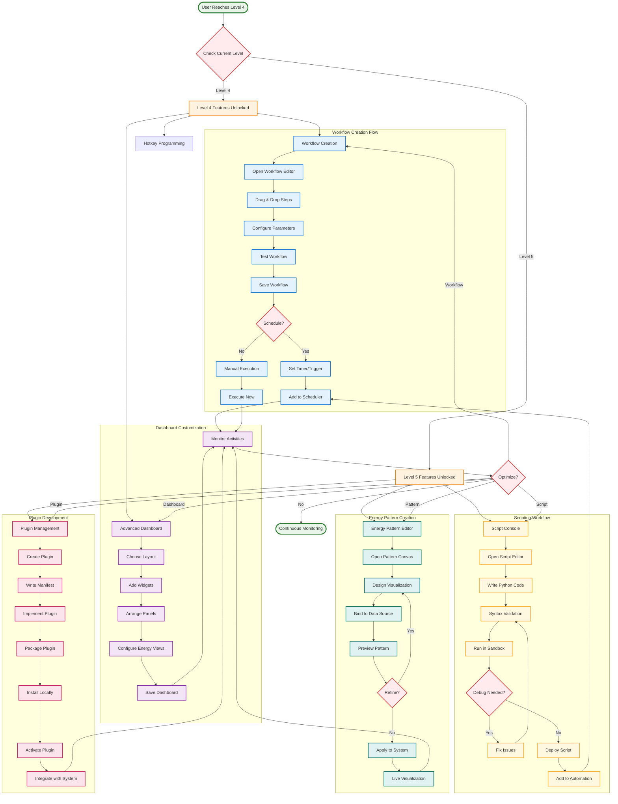
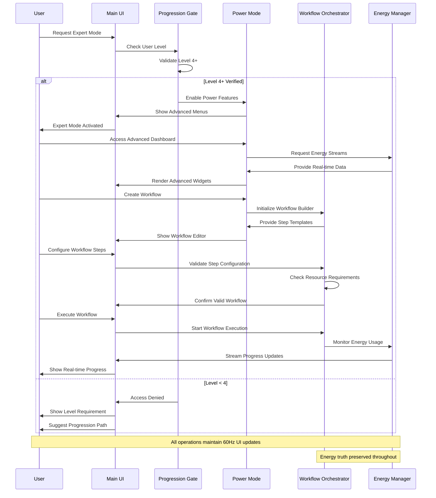
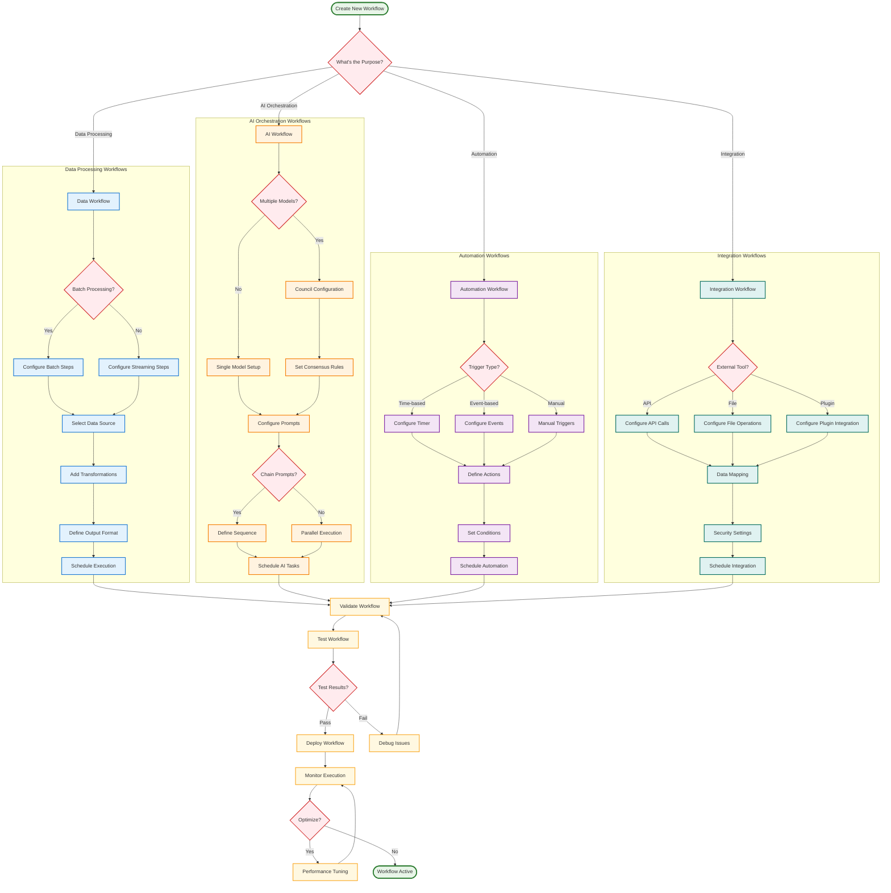

# WF-UX-009 Power User Flow Diagrams

## Advanced User Journey Flow
This diagram shows the complete user journey for power users accessing advanced workflow features, from initial unlock through expert-level automation.

## Expert Mode Activation Flow
This sequence shows how users transition between normal and expert modes.

## Workflow Creation Decision Tree
This diagram shows the decision-making process for creating different types of workflows.

## Key User Experience Principles

### **Progressive Disclosure**
- Features unlock based on user progression level
- Expert mode provides additional interface complexity
- Beginners see simplified views by default
- Advanced features are clearly marked and gated

### **Workflow Flexibility**
- Multiple workflow types support different use cases
- Visual editor for non-technical users
- Script console for advanced automation
- Template library for common patterns

### **Real-time Feedback**
- All workflows provide live progress updates
- Energy visualization shows computational cost
- Error states are clearly communicated
- Performance metrics are always visible

### **Local-First Operation**
- All workflows execute on user's device
- No cloud dependencies for core functionality
- External integrations use localhost APIs
- Data privacy maintained throughout process

This flow design ensures that power users can efficiently create, manage, and optimize advanced workflows while maintaining WIRTHFORGE's core principles of energy-truth, local-first operation, and 60Hz responsiveness.
