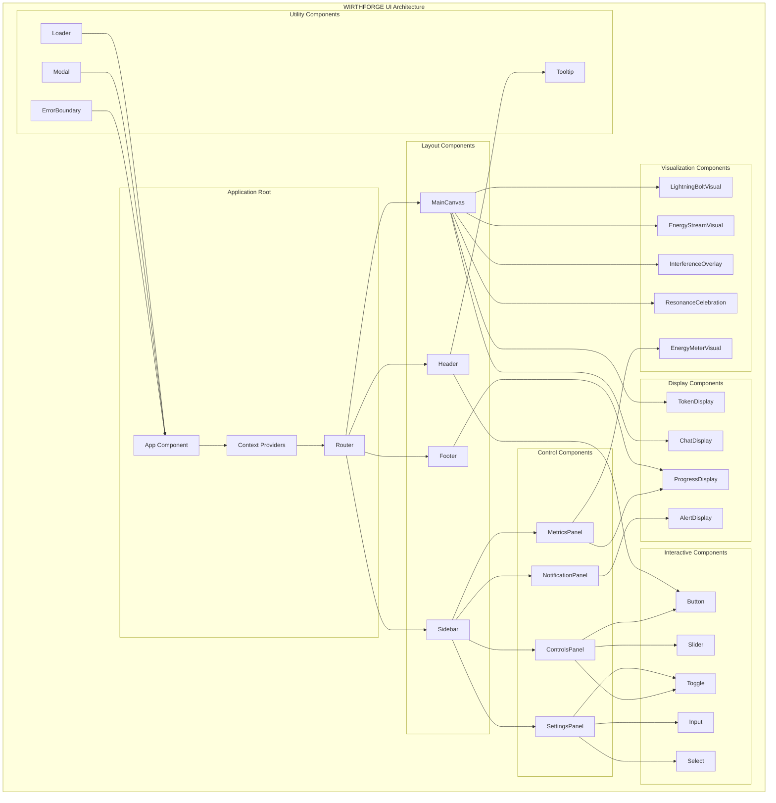
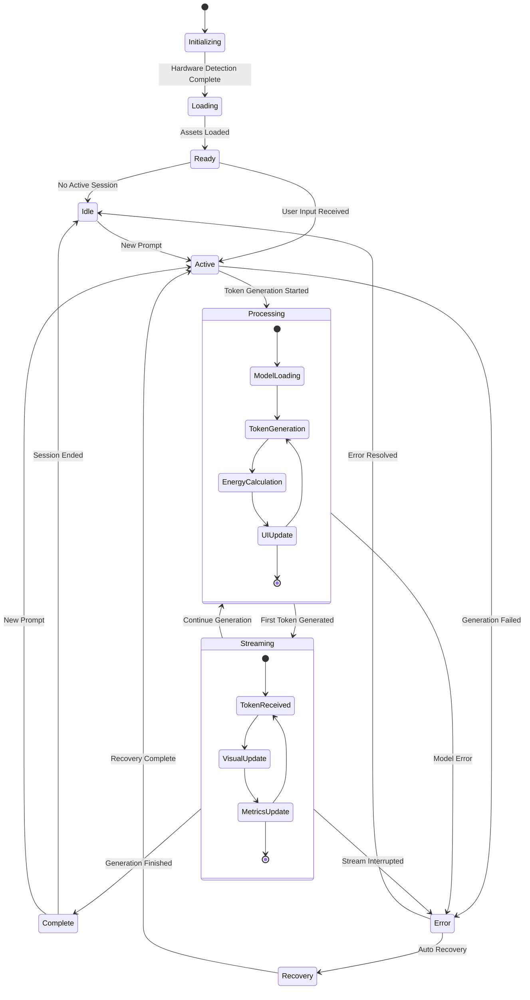
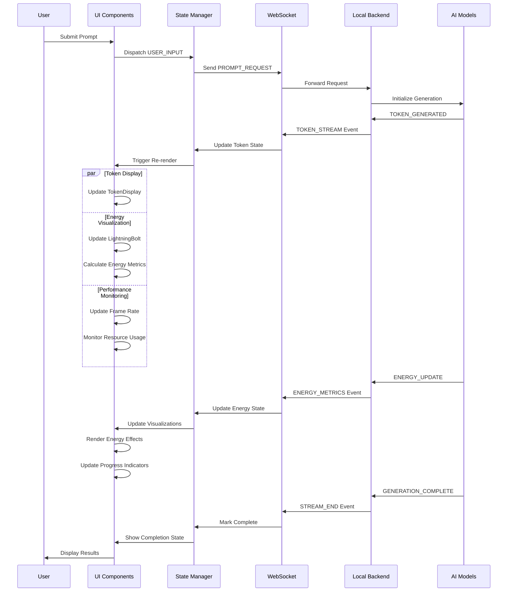

# WF-UX-001 Component Hierarchy Architecture

**Document ID**: WF-UX-001  
**Version**: 1.0.0  
**Last Updated**: 2024-01-15  
**Category**: UI Architecture Diagrams

## Component Hierarchy Overview

## State Flow Architecture

## Energy Event Flow

