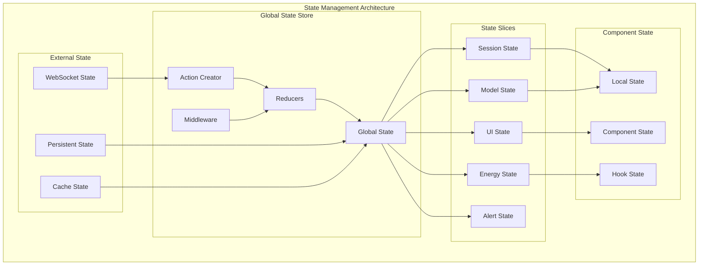
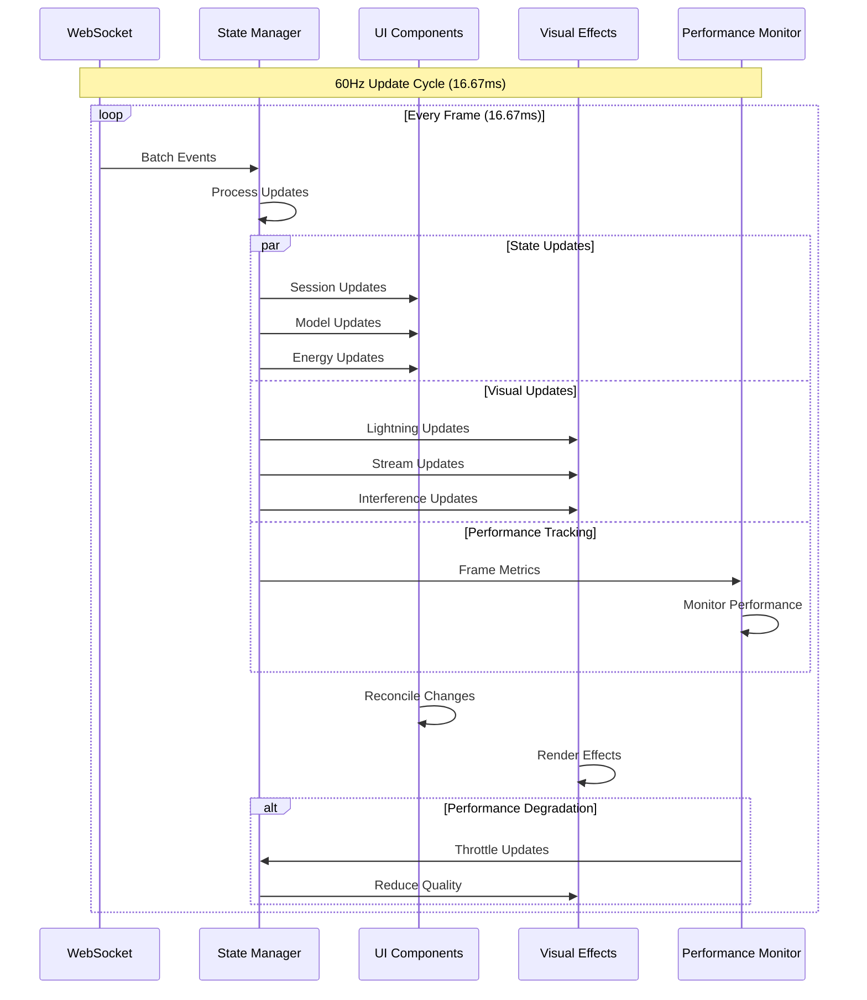
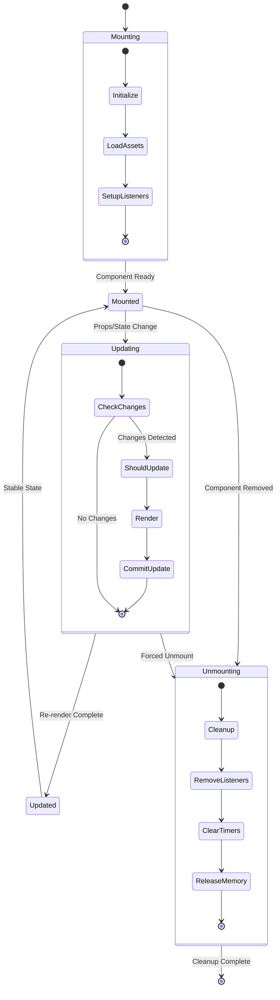

# WF-UX-001 State Flow & Data Management

**Document ID**: WF-UX-001  
**Version**: 1.0.0  
**Last Updated**: 2024-01-15  
**Category**: State Management Architecture

## Application State Flow

## Real-Time Data Synchronization

## Component Lifecycle Management

