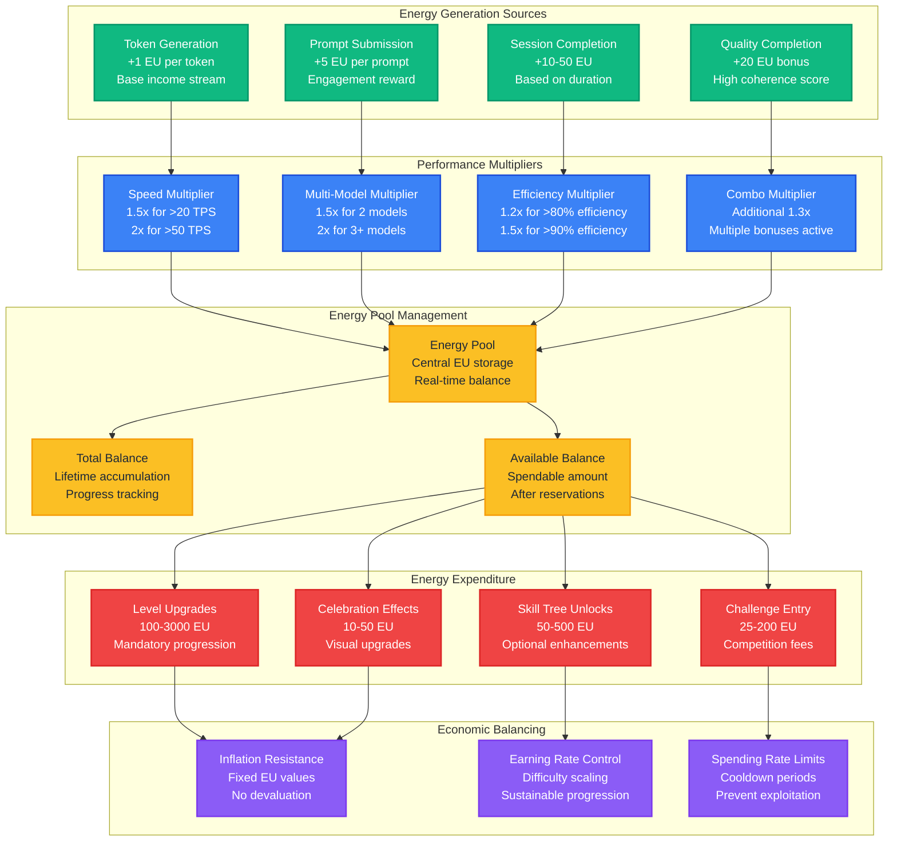
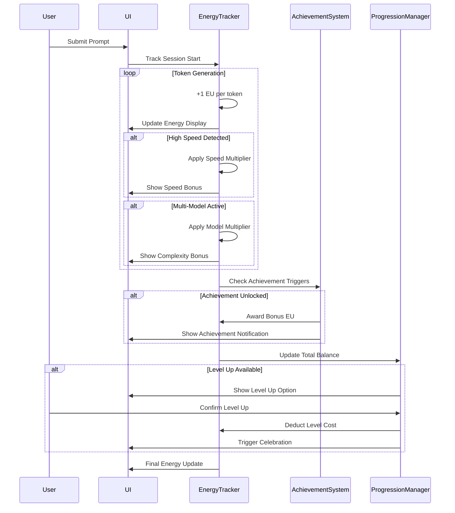

# WF-UX-002 Energy Economics Model

## Energy Flow and Economy Overview



## Level Progression Costs and Requirements

```mermaid
graph LR
    subgraph "Level 1 → 2"
        L1_Cost[100 EU Cost<br/>First Strike Achievement<br/>5 Completed Prompts]
        L1_Reward[Unlock: Dual Models<br/>Interference Visualization<br/>Council Features]
    end
    
    subgraph "Level 2 → 3"
        L2_Cost[500 EU Cost<br/>Council Member Achievement<br/>Multi-Model Session]
        L2_Reward[Unlock: Chain Editor<br/>Workflow Builder<br/>Persistent Memory]
    end
    
    subgraph "Level 3 → 4"
        L3_Cost[1000 EU Cost<br/>Architect Achievement<br/>Complex Chain Built]
        L3_Reward[Unlock: Adaptive Mode<br/>Dynamic Switching<br/>Performance Dashboard]
    end
    
    subgraph "Level 4 → 5"
        L4_Cost[2000 EU Cost<br/>Orchestrator Achievement<br/>3+ Model Mastery]
        L4_Reward[Unlock: Full Orchestra<br/>Resonance Mode<br/>Community Features]
    end
    
    subgraph "Mastery Beyond L5"
        L5_Cost[3000+ EU Investment<br/>All Achievements<br/>Community Leadership]
        L5_Reward[Prestige Badges<br/>Exclusive Challenges<br/>Beta Access]
    end
    
    L1_Cost --> L1_Reward
    L2_Cost --> L2_Reward
    L3_Cost --> L3_Reward
    L4_Cost --> L4_Reward
    L5_Cost --> L5_Reward
    
    L1_Reward -.-> L2_Cost
    L2_Reward -.-> L3_Cost
    L3_Reward -.-> L4_Cost
    L4_Reward -.-> L5_Cost
    
    classDef cost fill:#ef4444,stroke:#dc2626,stroke-width:2px,color:#ffffff
    classDef reward fill:#10b981,stroke:#059669,stroke-width:2px,color:#ffffff
    
    class L1_Cost,L2_Cost,L3_Cost,L4_Cost,L5_Cost cost
    class L1_Reward,L2_Reward,L3_Reward,L4_Reward,L5_Reward reward
```



## Skill Tree Economics

```mermaid
sankey-beta
    %% Energy sources
    Token Generation,Energy Pool,1000
    Prompt Completion,Energy Pool,500
    Achievement Rewards,Energy Pool,800
    Performance Bonuses,Energy Pool,600
    
    %% Energy allocation
    Energy Pool,Level Progression,1500
    Energy Pool,Visualization Skills,400
    Energy Pool,Model Control,500
    Energy Pool,Workflow Skills,350
    Energy Pool,Performance Skills,300
    Energy Pool,Community Skills,250
    Energy Pool,Reserve Balance,600
    
    %% Skill subcategories
    Visualization Skills,Enhanced Lightning,100
    Visualization Skills,Custom Themes,150
    Visualization Skills,3D Effects,150
    
    Model Control,Third Model Slot,200
    Model Control,Advanced Council,150
    Model Control,AI Personalities,150
    
    Workflow Skills,Chain Templates,100
    Workflow Skills,Auto-Workflows,125
    Workflow Skills,Sharing Tools,125
    
    Performance Skills,Speed Optimization,100
    Performance Skills,GPU Acceleration,100
    Performance Skills,Tuning Tools,100
    
    Community Skills,Leaderboards,75
    Community Skills,Challenges,100
    Community Skills,Events,75
```

## Economic Balancing Mechanisms

```mermaid
graph TB
    subgraph "Earning Rate Control"
        BR[Base Rate<br/>1 EU per token<br/>Consistent foundation]
        DR[Difficulty Ramp<br/>Higher levels require<br/>more EU per advancement]
        DM[Diminishing Returns<br/>Repeated actions<br/>yield less EU over time]
    end
    
    subgraph "Spending Limitations"
        CD[Cooldown Periods<br/>24hr between<br/>major purchases]
        ML[Maximum Limits<br/>Daily spending caps<br/>Prevent exploitation]
        PG[Progress Gates<br/>Achievement requirements<br/>Beyond EU cost]
    end
    
    subgraph "Value Preservation"
        FV[Fixed Values<br/>EU costs never<br/>increase arbitrarily]
        NI[No Inflation<br/>Stable economy<br/>Long-term fairness]
        RR[Retroactive Rewards<br/>Past achievements<br/>maintain value]
    end
    
    subgraph "Engagement Incentives"
        DB[Daily Bonuses<br/>Login rewards<br/>Consistent engagement]
        WB[Weekly Challenges<br/>Special objectives<br/>Bonus EU opportunities]
        SB[Streak Bonuses<br/>Consecutive usage<br/>Loyalty rewards]
    end
    
    BR --> DR
    DR --> DM
    DM --> CD
    CD --> ML
    ML --> PG
    PG --> FV
    FV --> NI
    NI --> RR
    RR --> DB
    DB --> WB
    WB --> SB
    
    classDef earning fill:#10b981,stroke:#059669,stroke-width:2px,color:#ffffff
    classDef spending fill:#ef4444,stroke:#dc2626,stroke-width:2px,color:#ffffff
    classDef preservation fill:#3b82f6,stroke:#1d4ed8,stroke-width:2px,color:#ffffff
    classDef incentive fill:#f59e0b,stroke:#d97706,stroke-width:2px,color:#ffffff
    
    class BR,DR,DM earning
    class CD,ML,PG spending
    class FV,NI,RR preservation
    class DB,WB,SB incentive
```



## Real-Time Energy Tracking


