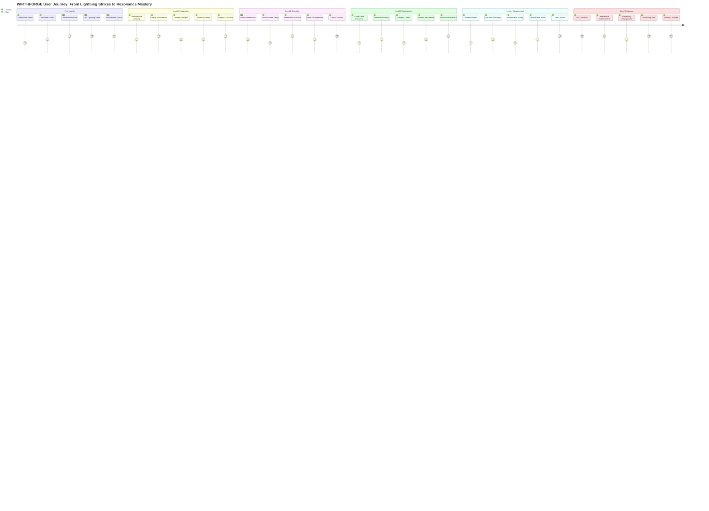
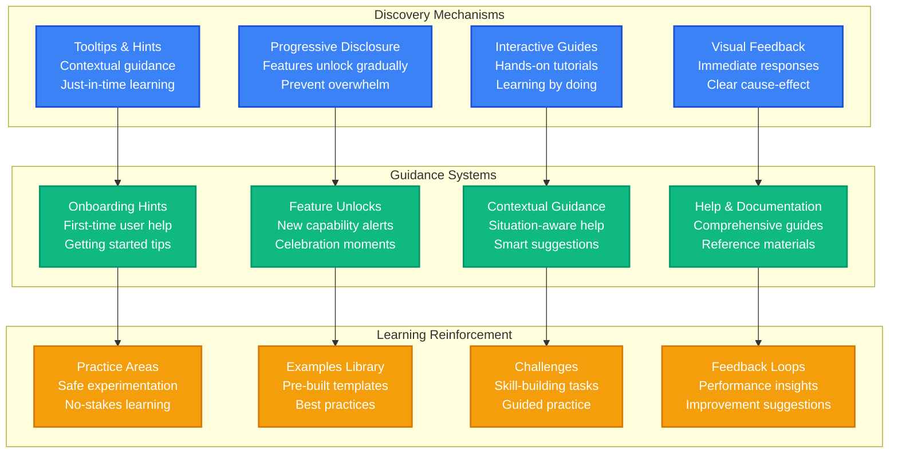
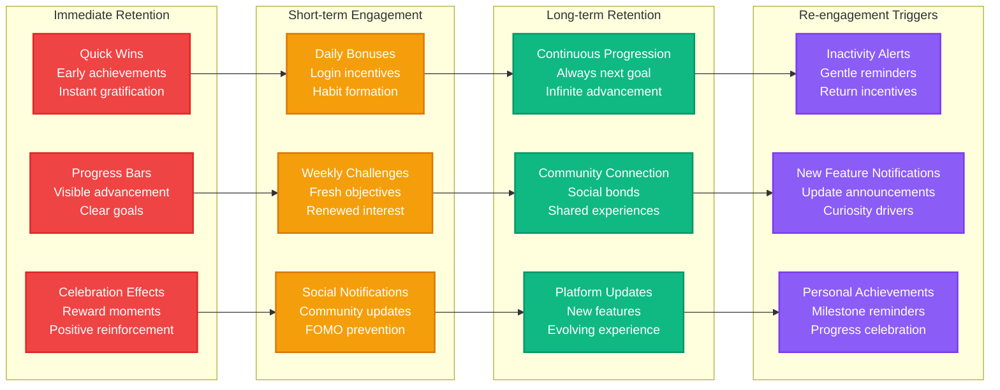
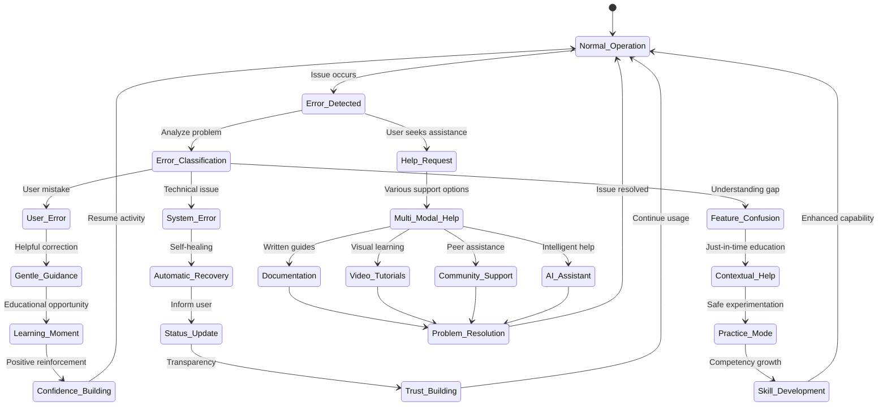
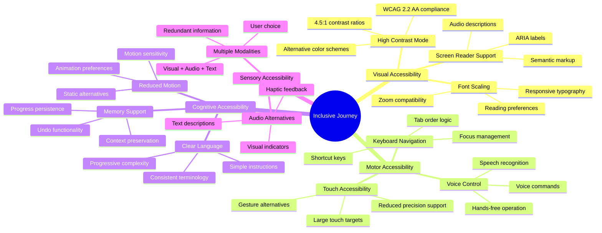

# WF-UX-002 User Journey Flow

## Complete User Journey from Onboarding to Mastery

## Onboarding Flow by Level

```mermaid
flowchart TD
    subgraph "Level 1 Onboarding"
        L1_Start[Welcome to WIRTHFORGE] --> L1_Tutorial[Interactive Tutorial]
        L1_Tutorial --> L1_FirstPrompt[Submit First Prompt]
        L1_FirstPrompt --> L1_Lightning[Watch Lightning Animation]
        L1_Lightning --> L1_Energy[Energy Points Explained]
        L1_Energy --> L1_Achievement[First Achievement Unlocked]
        L1_Achievement --> L1_Progress[Progress Bar Introduction]
        L1_Progress --> L1_Complete[Level 1 Mastery]
    end
    
    subgraph "Level 2 Onboarding"
        L2_Intro[Council Mode Available] --> L2_Demo[Dual Model Demo]
        L2_Demo --> L2_Setup[Configure Second Model]
        L2_Setup --> L2_Parallel[Run Parallel Session]
        L2_Parallel --> L2_Interference[Interference Visualization]
        L2_Interference --> L2_Compare[Compare Outputs]
        L2_Compare --> L2_Mastery[Council Mastery]
    end
    
    subgraph "Level 3 Onboarding"
        L3_Intro[Chain Editor Unlocked] --> L3_Guide[Workflow Guide]
        L3_Guide --> L3_Simple[Simple Chain Creation]
        L3_Simple --> L3_Complex[Multi-Step Workflow]
        L3_Complex --> L3_Memory[Persistent Memory Demo]
        L3_Memory --> L3_Templates[Workflow Templates]
        L3_Templates --> L3_Mastery[Architecture Mastery]
    end
    
    subgraph "Level 4 Onboarding"
        L4_Intro[Adaptive Mode Unlocked] --> L4_Conditions[Condition Setup]
        L4_Conditions --> L4_Triggers[Trigger Configuration]
        L4_Triggers --> L4_Switch[Dynamic Switching Demo]
        L4_Switch --> L4_Monitor[Performance Monitoring]
        L4_Monitor --> L4_Mastery[Adaptive Mastery]
    end
    
    subgraph "Level 5 Onboarding"
        L5_Intro[Resonance Mode Unlocked] --> L5_Orchestra[Full Orchestra Setup]
        L5_Orchestra --> L5_Harmony[Model Harmony Demo]
        L5_Harmony --> L5_Community[Community Features]
        L5_Community --> L5_Leadership[Leadership Tools]
        L5_Leadership --> L5_Mastery[Resonance Mastery]
    end
    
    L1_Complete --> L2_Intro
    L2_Mastery --> L3_Intro
    L3_Mastery --> L4_Intro
    L4_Mastery --> L5_Intro
    
    classDef level1 fill:#fbbf24,stroke:#f59e0b,stroke-width:2px,color:#1f2937
    classDef level2 fill:#60a5fa,stroke:#3b82f6,stroke-width:2px,color:#ffffff
    classDef level3 fill:#a855f7,stroke:#9333ea,stroke-width:2px,color:#ffffff
    classDef level4 fill:#10b981,stroke:#059669,stroke-width:2px,color:#ffffff
    classDef level5 fill:#f59e0b,stroke:#d97706,stroke-width:2px,color:#ffffff
    
    class L1_Start,L1_Tutorial,L1_FirstPrompt,L1_Lightning,L1_Energy,L1_Achievement,L1_Progress,L1_Complete level1
    class L2_Intro,L2_Demo,L2_Setup,L2_Parallel,L2_Interference,L2_Compare,L2_Mastery level2
    class L3_Intro,L3_Guide,L3_Simple,L3_Complex,L3_Memory,L3_Templates,L3_Mastery level3
    class L4_Intro,L4_Conditions,L4_Triggers,L4_Switch,L4_Monitor,L4_Mastery level4
    class L5_Intro,L5_Orchestra,L5_Harmony,L5_Community,L5_Leadership,L5_Mastery level5
```

## Feature Discovery Patterns

## Retention and Re-engagement Strategies

## Error Recovery and Help Systems

## Accessibility and Inclusive Design Journey

